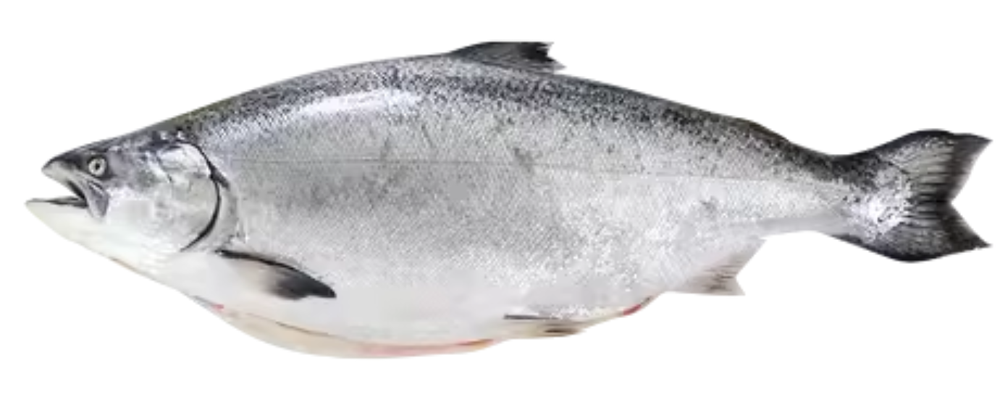
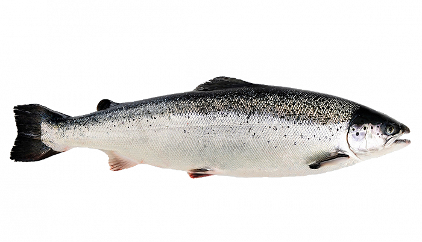
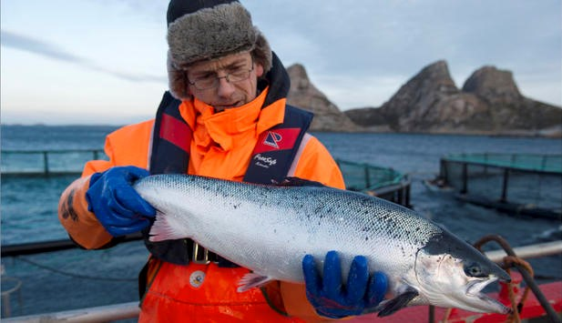
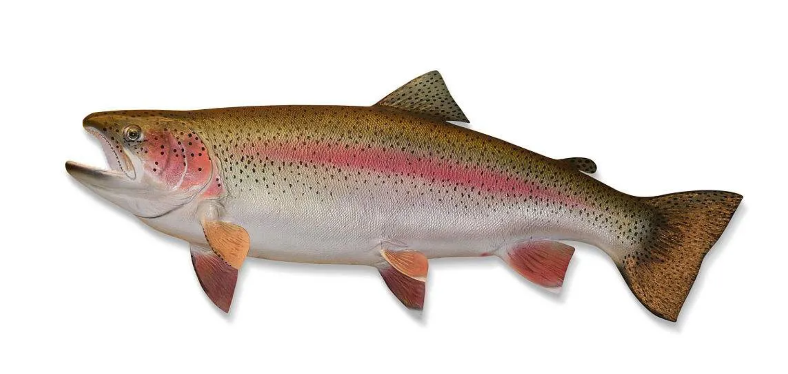

---
tags:
  - 海鲜
---

# 海鲜

## 三文鱼
鲑鱼（英语：salmon），亦音译为三文鱼（粤语发音，其实就是空耳~），是对渔业有很高商业价值的数种鲑形目鲑科鲑亚科（Salmoninae）的广盐性辐鳍鱼的通称，其中主要指栖息于北太平洋海域的六种太平洋鲑（钩吻鲑属的狗鲑、[帝王鲑](#帝王鲑)、红鲑、粉红鲑、银鲑和樱鳟/马苏鲑）和栖息于北大西洋海域的一种[大西洋鲑](#挪威三文鱼)（鳟属中唯一被称作“鲑”的物种），大多是食物链中层的肉食性掠食鱼类。

### 帝王鲑
新西兰帝王鲑全球产量不到1%

体型最大的三文鱼，鱼头较圆，鱼身偏厚。鱼身光滑，鱼鳞少，几乎没有斑点。

### 挪威三文鱼
挪威三文鱼（大西洋鲑，Salmo salar）

挪威三文鱼鱼头尖短，嘴巴像鹰嘴，鱼头至鱼身都有斑点，鱼肉纹路有规则、清晰、完整。

### 法罗三文鱼
法罗三文鱼主要分布在苏格兰、加拿大、澳大利亚以及丹麦法罗群岛等地。

### 智利三文鱼
生长于北太平洋水系，产量丰富。一般300块钱的自助餐会用到智利三文鱼。

### 虹鳟三文鱼
在中国，虹鳟三文鱼也被成为国产三文鱼，养殖于青海、成都、丹东等地，淡水养殖体内含有寄生虫，**不适合生吃**

