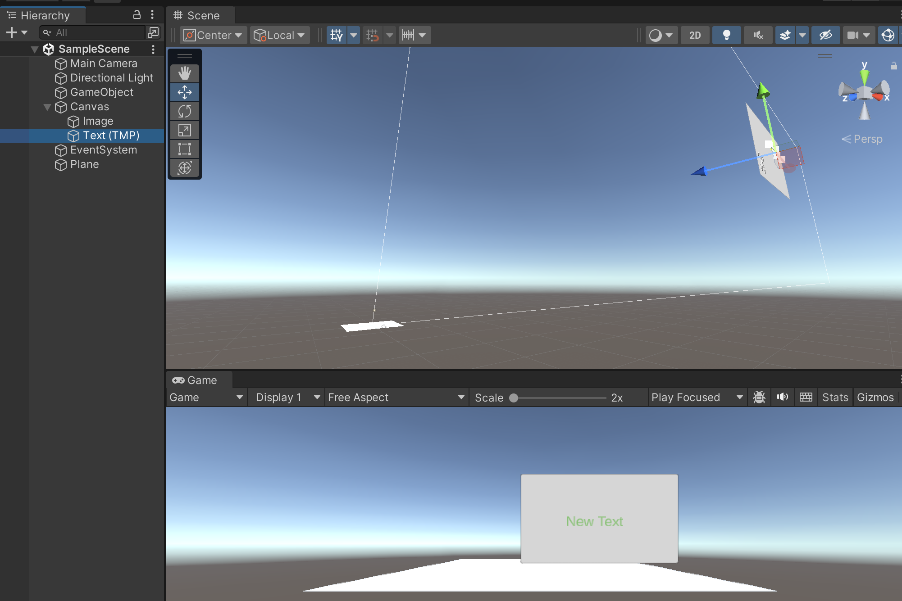

---
tags:
  - 3D
  - 游戏开发
  - Unity
---

# Unity

Unity 界面


## 安装
### Linux
```shell
sudo nala install unityhub
```

## 卸载
### Linux
```shell
sudo nala remove unityhub
sudo nala purge unityhub
sudo nala autoremove
```

## 视角

### 旋转
鼠标右键

### 平移
左右平移的方法： 鼠标右键 + A/D (同时按<kbd>Shift</kbd>可以加速)

上下平移的方法： 鼠标右键 + Q/E (同时按<kbd>Shift</kbd>可以加速)

方法2：
切换到Hand tool（快捷键<kbd>Q</kbd>）鼠标左键左右划


### 放缩（前后）
- 方法1：鼠标滚轮
- 方法2：鼠标右键 + W/A (同时按<kbd>Shift</kbd>可以加速)
- 方法3：<kbd>Alt</kbd> + 鼠标右键

## 对象

### 创建1个cube
right-click in the 【Hierarchy window】 and select 3D Object > Cube.

### 导入模型
直接把模型文件和材质贴图放到项目文件夹即可。


## 图形化编程

If this were a C# script, you would have to play, stop, edit your script, and repeat until you found the values you wanted for your cube’s rotation. In C# scripting, you can’t edit your code while it runs, but in Visual Scripting, you can!

### 基本操作

#### 搜索（Fuzzy Finder）
鼠标右键

#### 删除线
右键点线的起点

#### 创建组
<kbd>Ctrl</kbd> + 左键拖动

## C井编程
不会就问大模型，以下为一个案例(ChatGPT 3.5)：

1. Unity3D随机生成物体或模型代码
2. 我是想随机生成一个确定的模型，模型已经放入到assets/models/model6.ply中
3. 这段代码插入到哪里，请告诉我具体的操作流程，从新建一个空的scene后开始
4. 第3步，我的版本右键没有：Create Prefab
5. 双击后并没有任何反应
6. 如果我要随机生成80个呢，都是assets/models/model6.ply
7. 能够正常运行，看不见模型，hirerachy那里有clone模型出现
8. 我知道了，预制体是空的
9. 很好，现在不随机生成了，而是读取json文件摆放模型: {
    "born": [
        {
            "position": [
                4792.3254,
                -1997.1576
            ]
        },
        {
            "position": [
                -1187.0016,
                4720.441500000001
            ]
        }]}
10. 很好，现在不只摆放1个模型了，而是读取json文件的name字段判断预制体摆放模型: {
    "born": [
        {"name":"model6",
            "position": [
                4792.3254,
                -1997.1576
            ]
        },
        {"name":"model7",
            "position": [
                -1187.0016,
                4720.441500000001
            ]
        }]}
11. Prefab not found for model name:model43
12. 我想给改成实时读取这个json（间隔100ms），目前的代码：【当前代码】
13. UnityException: Tag: GeneratedModel is not defined.
ModelSpawnerFromJSON.SpawnModelsFromJSON () (at Assets/ModelSpawner.cs:35)
14. 我看之前的代码也没有这个，这个是什么
15. 但是你清除模型有用到了tag
16. 我想给我之前的代码换个文件名字，我尝试换之后的代码：【当前代码】
17. 改好啦：【当前代码】
18. 然后另外一个问题，我每次都是运行的时候才显示场景，可不可以在Inspector中加一个按钮，我点一次就读取一次json在Scene中预览出来模型
19. Assets/LoadScene.cs(85,20): error CS0122: 'LoadScene.LoadSceneFromJSON()' is inaccessible due to its protection level
20. 可以了，但是我再次点击时有一个提示：Destroy may not be called from edit mode! Use DestroyImmediate instead.
Destroying an object in edit mode destroys it permanently.
UnityEngine.Object:Destroy (UnityEngine.Object)
LoadScene:LoadSceneFromJSON () (at Assets/LoadScene.cs:38)
LoadSceneEditor:OnInspectorGUI () (at Assets/LoadScene.cs:86)
UnityEngine.GUIUtility:ProcessEvent (int,intptr,bool&)
21. 可以了，我还需要一个clear按钮
22. 这个程序很好，再Hierarchy中显示了很多Clone预制体在第一级层级下（和相机和环境光一起），显得很乱，有没有方法给它收纳到这个程序的Gameobject(AutoLayout)中

## 渲染

### 渲染管线
渲染管线(Render Pipeline)执行一系列操作来获取场景的内容，并将这些内容显示在屏幕上。概括来说，这些操作如下：
- 剔除
- 渲染
- 后期处理
不同的渲染管线具有不同的功能和性能特征，并且适用于不同的游戏、应用程序和平台。

将项目从一个渲染管线切换到另一个渲染管线可能很困难，因为不同的渲染管线使用不同的着色器输出，并且可能没有相同的特性。因此，必须要了解 Unity 提供的不同渲染管线，以便可以在开发早期为项目做出正确决定。

Universal Render Pipeline (URP)
High Definition Render Pipeline (HDRP)

### 内置渲染管线材质转URP材质

选中材质后[Edit]-[Rendering]-[Material]-[XXXXX]

### URP材质转内置渲染管线材质

选中材质后，在`Inspector`中`Shader`设为`Standard`。

### Skybox
教程：https://blog.csdn.net/Jeffxu_lib/article/details/95477352
在2023版本中，选择Windows-Render-Lighting

## UI

### Canvas
所有的UI都建立在Canvas上，Canvas创建后是一个不可变大小的对象，这个方框相当于屏幕，如果一个UI在Canvas中间，那么这个UI就在屏幕的中间，
如果一个UI超出了屏幕，那么这个UI就不会显示在画面中。

可以看到在Scene里Text离Plane很远却最终渲染在屏幕中Plane上方。

### Image
直接导入进来的图像是不能设置为UI的，要在【Inspector】中设置其【Texture Type】为Sprite。

### Text Mesh Pro
中文支持：先把一个字体文件拖进Assets来，是Aa图标的字体，然后右键-【create】-【text mesh pro】-【第一个选项】创建F图标的字体。
最简单的方法：直接下载中文字体的Unity包，然后导入package https://gitcode.com/wy-luke/Unity-TextMeshPro-Chinese-Characters-Set/tree/main/Fonts

#### C井代码
```cs
using UnityEngine;
using TMPro;

public class TMPTextExample : MonoBehaviour
{
    public TMP_Text myTMPText;

    void Start()
    {
        // 初始化并设置TMP_Text组件
        if (myTMPText != null)
        {
            myTMPText.text = "Hello, World!";
            myTMPText.color = Color.red;
            myTMPText.fontSize = 24;
        }
        else
        {
            Debug.LogError("TMP_Text component is not assigned.");
        }
    }
}
```

### InputField(TMP)

#### C井代码
```cs
using UnityEngine;
using TMPro;

public class TMPInputFieldExample : MonoBehaviour
{
    public TMP_InputField myTMPInputField;

    void Start()
    {
        // 初始化并设置TMP_InputField组件
        if (myTMPInputField != null)
        {
            myTMPInputField.text = "Enter text here...";
            myTMPInputField.characterLimit = 50;
            myTMPInputField.onValueChanged.AddListener(OnInputFieldChanged);
        }
        else
        {
            Debug.LogError("TMP_InputField component is not assigned.");
        }
    }

    void OnInputFieldChanged(string value)
    {
        Debug.Log("Input field value: " + value);
    }
}

// public TMP_InputField InputField;
// InputField.text
```

### Dropdown(TMP)

#### C井代码
```cs
using UnityEngine;
using TMPro;

public class TMPDropdownExample : MonoBehaviour
{
    public TMP_Dropdown myTMPDropdown;

    void Start()
    {
        // 初始化并设置TMP_Dropdown组件
        if (myTMPDropdown != null)
        {
            myTMPDropdown.options.Clear();
            myTMPDropdown.options.Add(new TMP_Dropdown.OptionData("Option 1"));
            myTMPDropdown.options.Add(new TMP_Dropdown.OptionData("Option 2"));
            myTMPDropdown.options.Add(new TMP_Dropdown.OptionData("Option 3"));
            myTMPDropdown.onValueChanged.AddListener(OnDropdownValueChanged);
        }
        else
        {
            Debug.LogError("TMP_Dropdown component is not assigned.");
        }
    }

    void OnDropdownValueChanged(int index)
    {
        Debug.Log("Selected option: " + myTMPDropdown.options[index].text);
    }
}
```

### Button

#### C井代码
虽然TextMeshPro本身不提供`Button`组件，但你可以结合`Button`和`TMP_Text`组件来创建带有TextMeshPro文本的按钮。在Unity脚本中，你可以这样初始化并设置`Button`组件以及其包含的`TMP_Text`组件：
```cs
using UnityEngine;
using UnityEngine.UI;
using TMPro;

public class TMPButtonExample : MonoBehaviour
{
    public Button myButton;
    public TMP_Text buttonText;

    void Start()
    {
        // 初始化并设置Button组件
        if (myButton != null)
        {
            myButton.onClick.AddListener(OnButtonClick);
        }
        else
        {
            Debug.LogError("Button component is not assigned.");
        }

        // 初始化并设置TMP_Text组件
        if (buttonText != null)
        {
            buttonText.text = "Click Me!";
            buttonText.color = Color.white;
        }
        else
        {
            Debug.LogError("TMP_Text component for button is not assigned.");
        }
    }

    void OnButtonClick()
    {
        Debug.Log("Button was clicked!");
    }
}
```

### Slider

#### C井代码
虽然TextMeshPro本身不提供`Slider`组件，但你可以结合`Slider`和`TMP_Text`组件来创建带有TextMeshPro文本的滑块。
在Unity脚本中，你可以这样初始化并设置`Slider`组件以及其包含的`TMP_Text`组件：
```cs
using UnityEngine;
using UnityEngine.UI;
using TMPro;

public class TMPSliderExample : MonoBehaviour
{
    public Slider mySlider;
    public TMP_Text sliderValueText;

    void Start()
    {
        // 初始化并设置Slider组件
        if (mySlider != null)
        {
            mySlider.minValue = 0;
            mySlider.maxValue = 100;
            mySlider.value = 50;
            mySlider.onValueChanged.AddListener(OnSliderValueChanged);
        }
        else
        {
            Debug.LogError("Slider component is not assigned.");
        }

        // 初始化并设置TMP_Text组件
        if (sliderValueText != null)
        {
            sliderValueText.text = mySlider.value.ToString();
            sliderValueText.color = Color.white;
        }
        else
        {
            Debug.LogError("TMP_Text component for slider is not assigned.");
        }
    }

    void OnSliderValueChanged(float value)
    {
        sliderValueText.text = value.ToString();
        Debug.Log("Slider value: " + value);
    }
}

```

### 点击展开功能

https://blog.csdn.net/weixin_44001286/article/details/137739299

### 初始化UI对象对应的代码
```cs
public TMP_Text myTMPText;
public TMP_InputField myTMPInputField;
public TMP_Dropdown myTMPDropdown;
public Button myButton;
public Slider mySlider;
```

## 材质
### 高度图
https://juejin.cn/post/7109778061574275109

目前只有HDRP的材质支持直接使用高度图

## 其它

### Asset Store
网页端: https://assetstore.unity.com/

使用：

打开【Window】-【Asset Store】后会告诉你，Asset Store已经被移除。并说明了如何下载购买的assets，在【Window】-【Package Manager】中
选择【My Assets】(+号右边那个下拉菜单)，然后等一会加载完就有了。

### Websocket
1. 安装 WebSocketSharp：
下载 WebSocketSharp DLL 文件：`WebSocketSharp.dll` (可以在 https://www.nuget.org/ 中搜索)
将 `WebSocketSharp.dll` 文件放入 Unity 项目的 Assets/Plugins 文件夹中。

2. 编写 WebSocket 客户端脚本：
创建一个名为 `WebSocketClient.cs` 的脚本，并将其附加到一个空的 GameObject 上。
```cs
using UnityEngine;
using WebSocketSharp;
using TMPro;

public class WebSocketClient : MonoBehaviour
{
    private WebSocket ws;
    public TMP_InputField InputField;
    public TMP_Text OutputText;

    void Start()
    {
        ws = new WebSocket("ws://localhost:5000/echo");

        ws.OnOpen += (sender, e) =>
        {
            Debug.Log("WebSocket connection opened");
        };

        ws.OnMessage += (sender, e) =>
        {
            Debug.Log("WebSocket message received: " + e.Data);
            UpdateOutputText(e.Data);
        };

        ws.OnClose += (sender, e) =>
        {
            Debug.Log("WebSocket connection closed");
        };

        ws.OnError += (sender, e) =>
        {
            Debug.LogError("WebSocket error: " + e.Message);
        };

        ws.Connect();
    }

    void UpdateOutputText(string message)
    {
        // Update the UI text in the main thread
        UnityMainThreadDispatcher.Instance().Enqueue(() =>
        {
            OutputText.text += "\n" + message;
        });
    }

    public void SendMessage()
    {
        if (ws != null && ws.IsAlive)
        {
            string message = InputField.text;
            ws.Send(message);
        }
    }

    void OnDestroy()
    {
        if (ws != null)
        {
            ws.Close();
            ws = null;
        }
    }
}
```

3. 设置 Unity 主线程调度器：
Unity 不允许在非主线程中直接修改 UI 元素，因此需要一个调度器来将更新操作切换回主线程。可以使用 `UnityMainThreadDispatcher` 脚本，下面是如何实现的示例：

创建一个名为 `UnityMainThreadDispatcher.cs` 的脚本：
```cs
using System;
using System.Collections;
using System.Collections.Generic;
using UnityEngine;

public class UnityMainThreadDispatcher : MonoBehaviour
{
    private static readonly Queue<Action> _executionQueue = new Queue<Action>();

    private static UnityMainThreadDispatcher _instance = null;

    public static UnityMainThreadDispatcher Instance()
    {
        if (!_instance)
        {
            throw new Exception("UnityMainThreadDispatcher not initialized.");
        }
        return _instance;
    }

    void Awake()
    {
        if (_instance == null)
        {
            _instance = this;
            DontDestroyOnLoad(gameObject);
        }
        else
        {
            Destroy(gameObject);
        }
    }

    public void Enqueue(IEnumerator action)
    {
        lock (_executionQueue)
        {
            _executionQueue.Enqueue(() =>
            {
                StartCoroutine(action);
            });
        }
    }

    public void Enqueue(Action action)
    {
        Enqueue(ActionWrapper(action));
    }

    IEnumerator ActionWrapper(Action action)
    {
        action();
        yield return null;
    }

    void Update()
    {
        lock (_executionQueue)
        {
            while (_executionQueue.Count > 0)
            {
                _executionQueue.Dequeue().Invoke();
            }
        }
    }
}
```
- 在 Unity 编辑器中创建一个空的 GameObject 并将 `UnityMainThreadDispatcher` 脚本附加到该对象上。

## Project
### WFC 2019
项目地址：https://selfsame.itch.io/unitywfc

使用方法，打开任意1个Scene，Hierarchy找到map，然后在Inspector中点RUN，然后点generate

改变场景尺寸：修改Inspector中的Width和Depth


按钮功能
在`SimpleTiledWFC.cs`中，通过TileSetEditor设置generate和RUN按钮

规则定义：
规则由map里的xml变量指向的文件控制，不是由canvas直接控制。但是可以修改万canvas后编译附带的【tiles】对象（或其他名字），然后点neigjbor那个按钮，就会自动修改xml。这样map就可以重新生成新规则的布局。

修改canvas:
选中canvas后，可以直接点上面的单元，然后在Inspector里有操作说明，比如按b换笔刷（模型），按x点击模型是清除模型。

让单元变大：改canvas和【tiles】（或其他名字）的grid_size，在此之前要清除所有的模型。生成时也要修改map的gridsize

## 常见问题

- Insecure connection not allowed: [Edit] - [Project Settings] - [Player] 中设定`Allow downloads over HTTP*`为`Always allowed`。

- UnauthorizedAccessException: Access to the path XXX is denied.
  1. Modify Save Path: Use a path within the application's sandboxed environment, such as `Application.persistentDataPath` which Unity guarantees to be writable.

- 找不到Newtonsoft:

  Step 1: Download JSON.NET DLL
  1. Download the Newtonsoft.Json DLL:
     - Visit the [Newtonsoft.Json GitHub Releases page](https://github.com/JamesNK/Newtonsoft.Json/releases).
     - Download the latest stable release `.zip` file.
     - Extract the `.zip` file to a location on your computer.

  2. Locate the DLL file:
     - Inside the extracted folder, navigate to the `Bin` directory.
     - Find the `Newtonsoft.Json.dll` file.

  Step 2: Add the DLL to Your Unity Project
  1. Create a Plugins folder:
     - In your Unity project, create a folder named Plugins (if it doesn't already exist) inside the `Assets` directory.
  2. Copy the DLL:
     - Copy the `Newtonsoft.Json.dll` file to the Assets/Plugins folder.
