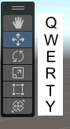
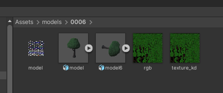
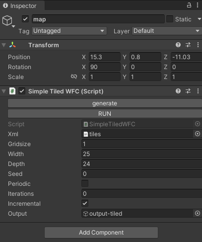

---
tags:
  - 3D
  - 游戏开发
  - Unity
---

# Unity

Unity 界面

## 视角

### 旋转
鼠标右键

### 平移
左右平移的方法： 鼠标右键 + A/D (同时按shift可以加速)
上下平移的方法： 鼠标右键 + Q/E (同时按shift可以加速)

方法2：
切换到Hand tool（快捷键Q）鼠标左键左右划

### 放缩（前后）
- 方法1：鼠标滚轮
- 方法2：鼠标右键 + W/A (同时按shift可以加速)
- 方法3：Alt + 鼠标右键

## 对象

### 创建1个cube
right-click in the 【Hierarchy window】 and select 3D Object > Cube.

### 导入模型
直接把模型文件和材质贴图放到项目文件夹即可。

## 图形化编程

If this were a C# script, you would have to play, stop, edit your script, and repeat until you found the values you wanted for your cube’s rotation. In C# scripting, you can’t edit your code while it runs, but in Visual Scripting, you can!

### 基本操作

#### 搜索（Fuzzy Finder）
鼠标右键

#### 删除线
右键点线的起点

## C井编程
不会就问大模型，以下为一个案例(ChatGPT 3.5)：

1. Unity3D随机生成物体或模型代码
2. 我是想随机生成一个确定的模型，模型已经放入到assets/models/model6.ply中
3. 这段代码插入到哪里，请告诉我具体的操作流程，从新建一个空的scene后开始
4. 第3步，我的版本右键没有：Create Prefab
5. 双击后并没有任何反应
6. 如果我要随机生成80个呢，都是assets/models/model6.ply
7. 能够正常运行，看不见模型，hirerachy那里有clone模型出现
8. 我知道了，预制体是空的
9. 很好，现在不随机生成了，而是读取json文件摆放模型: {
    "born": [
        {
            "position": [
                4792.3254,
                -1997.1576
            ]
        },
        {
            "position": [
                -1187.0016,
                4720.441500000001
            ]
        }]}
10. 很好，现在不只摆放1个模型了，而是读取json文件的name字段判断预制体摆放模型: {
    "born": [
        {"name":"model6",
            "position": [
                4792.3254,
                -1997.1576
            ]
        },
        {"name":"model7",
            "position": [
                -1187.0016,
                4720.441500000001
            ]
        }]}
11. Prefab not found for model name:model43
12. 我想给改成实时读取这个json（间隔100ms），目前的代码：【当前代码】
13. UnityException: Tag: GeneratedModel is not defined.
ModelSpawnerFromJSON.SpawnModelsFromJSON () (at Assets/ModelSpawner.cs:35)
14. 我看之前的代码也没有这个，这个是什么
15. 但是你清除模型有用到了tag
16. 我想给我之前的代码换个文件名字，我尝试换之后的代码：【当前代码】
17. 改好啦：【当前代码】
18. 然后另外一个问题，我每次都是运行的时候才显示场景，可不可以在Inspector中加一个按钮，我点一次就读取一次json在Scene中预览出来模型
19. Assets/LoadScene.cs(85,20): error CS0122: 'LoadScene.LoadSceneFromJSON()' is inaccessible due to its protection level
20. 可以了，但是我再次点击时有一个提示：Destroy may not be called from edit mode! Use DestroyImmediate instead.
Destroying an object in edit mode destroys it permanently.
UnityEngine.Object:Destroy (UnityEngine.Object)
LoadScene:LoadSceneFromJSON () (at Assets/LoadScene.cs:38)
LoadSceneEditor:OnInspectorGUI () (at Assets/LoadScene.cs:86)
UnityEngine.GUIUtility:ProcessEvent (int,intptr,bool&)
21. 可以了，我还需要一个clear按钮
22. 这个程序很好，再Hierarchy中显示了很多Clone预制体在第一级层级下（和相机和环境光一起），显得很乱，有没有方法给它收纳到这个程序的Gameobject(AutoLayout)中

## 渲染

### 渲染管线
渲染管线(Render Pipeline)执行一系列操作来获取场景的内容，并将这些内容显示在屏幕上。概括来说，这些操作如下：
- 剔除
- 渲染
- 后期处理
不同的渲染管线具有不同的功能和性能特征，并且适用于不同的游戏、应用程序和平台。

将项目从一个渲染管线切换到另一个渲染管线可能很困难，因为不同的渲染管线使用不同的着色器输出，并且可能没有相同的特性。因此，必须要了解 Unity 提供的不同渲染管线，以便可以在开发早期为项目做出正确决定。

Universal Render Pipeline (URP)
High Definition Render Pipeline (HDRP)

### Skybox
教程：https://blog.csdn.net/Jeffxu_lib/article/details/95477352
在2023版本中，选择Windows-Render-Lighting

## 其它

### Asset Store
网页端: https://assetstore.unity.com/

使用：

打开【Window】-【Asset Store】后会告诉你，Asset Store已经被移除。并说明了如何下载购买的assets，在【Window】-【Package Manager】中
选择【My Assets】(+号右边那个下拉菜单)，然后等一会加载完就有了。

## Project
### WFC 2019
项目地址：https://selfsame.itch.io/unitywfc

使用方法，打开任意1个Scene，Hierarchy找到map，然后在Inspector中点RUN，然后点generate

改变场景尺寸：修改Inspector中的Width和Depth

按钮功能
在`SimpleTiledWFC.cs`中，通过TileSetEditor设置generate和RUN按钮

规则定义：
规则由map里的xml变量指向的文件控制，不是由canvas直接控制。但是可以修改万canvas后编译附带的【tiles】对象（或其他名字），然后点neigjbor那个按钮，就会自动修改xml。这样map就可以重新生成新规则的布局。

修改canvas:
选中canvas后，可以直接点上面的单元，然后在Inspector里有操作说明，比如按b换笔刷（模型），按x点击模型是清除模型。

让单元变大：改canvas和【tiles】（或其他名字）的grid_size，在此之前要清除所有的模型。生成时也要修改map的gridsize
