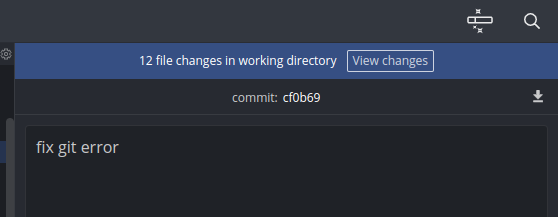

---
tags:
  - Linux
---

# git

## 分支操作
### 查看当前 Git 仓库位于哪个分支
```shell
git branch
```

### 切换分支
```shell
git checkout <分支名>
```

## Git配置Clash代理
```shell
git config --global http.proxy http://127.0.0.1:7890
git config --global https.proxy https://127.0.0.1:7890
git config --global --unset http.proxy
git config --global --unset https.proxy
```

## 同步克隆的仓库到最新
```shell
git pull origin main # master
```

## 修改名字
```shell
git config --global user.email "you@example.com"
git config --global user.name "Your Name"
```

## 回退到指定commit
```shell
git reset --hard <commit_hash>
```
- `<commit_hash>`是目标提交的哈希值（可以是前几位，确保唯一即可），在GitKraken中，可以直接点击具体的版本后查看。
- `--hard`表示强制回退，工作目录和暂存区的更改都会被丢弃。


