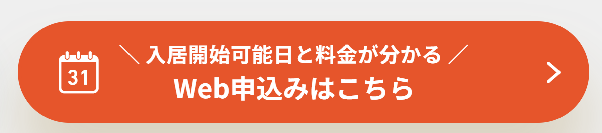
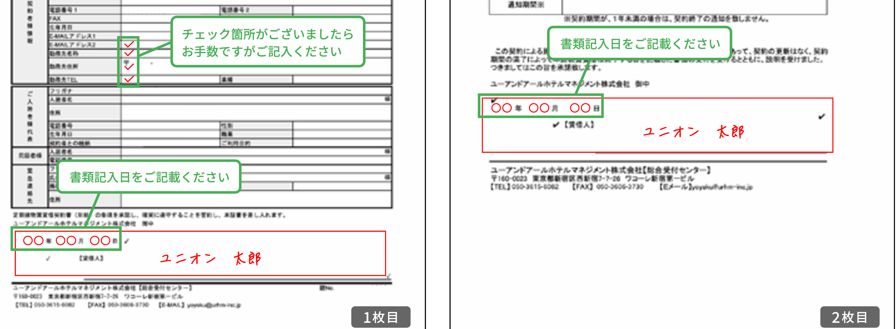
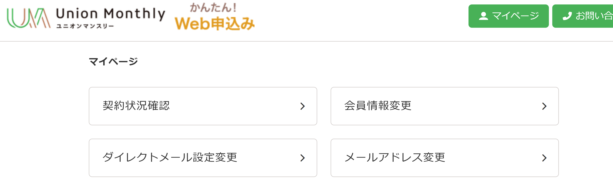
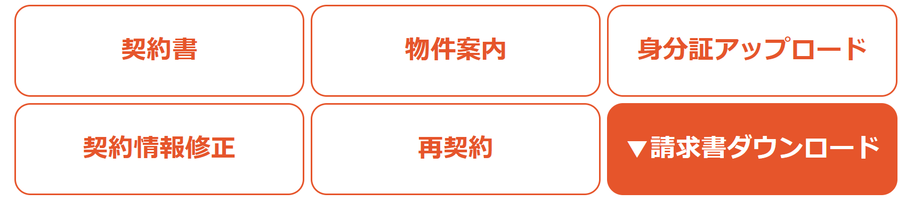

# 日本

## Visa
### 旅游签
| 类型   | 时长限制  | 材料                                                      |
|------|-------|---------------------------------------------------------|
| 单次   | 每次15天 | 刚毕业没几年的学信网学历证明 <br> 居住证 <br> 身份证复印件 <br> 照片 <br> 户口本复印件 |
| 3年多次 | 每次30天 |                                                         |
| 5年多次 | 每次90天 |                                                         |

## 交通
### 飞机
不建议徒步到任何一个机场

- 开门时间

| 机场 | 开门  |
| -- |-----|
| 羽田机场 | 5点  |

#### 国际
- **到达（入境）**
  提前填好两个表格（建议找空姐要纸质的，起飞前记得带根笔），然后下飞机一共有两个窗口要通过，一个窗口交一个表格。第一个窗口和第二个窗口之间是行李提取处。

- **出发**
  安检比中国宽松，但不可以带液体。

  福冈机场候机处的购物免税店很少，建议在外面买想要的东西。

#### 国内
  整体而言安检很宽松，羽田机场可以带瓶装水。成田机场安检较严，手提行李需要单独取出电子设备过安检仪（日本很多机场电脑可以放包里过安检），并且会有工作人员在入口处称重手提行李重量（一些机场没有）。

### 地舔
没有安检，随便带饮料或酒。建议刷西瓜卡

### 公交
后门上车，一上车取票或刷西瓜卡。下车在前门司机处结算。

也存在前门上车的公交，那种情况下司机会先开后门让乘客下车，再开前门，注意观察。这种车往往是一票制的。

## 住宿
### Hotel
可以在美团订，在东京住要额外收300日元的税（虽然美团付款时本来收了一个税不知道干嘛用的，但是到了酒店前台还会收钱，使用美团要额外注意），日本半夜2点退房也是有人的。

### 长租
80kJPY/m

### 短租(Union Monthly)
条件：需要日本银行口座（或能给日本银行账户汇款的渠道）和会日语的紧急联系人

网址: https://www.unionmonthly.jp/

目前支持的住房地址有：东京、埼玉、神奈川、茨城、千叶

#### 1.帐号注册
推荐先注册一个账号，点击网站右上角的【会員登録】先输入信息。

#### 2.看房
可以直接输入车站/地铁站来检索合适的房源。

#### 3.申请
看好房后，在房屋的详情页中，选择画面下方【Web申込みはこちら】


其中紧急联系人需要会日语

#### 4.审核
在提交申请后，会进入审核阶段。工作人员会通过邮件形式进行反馈（机构周末不休息，因此周末也需要注意邮件）。

如果碰到问紧急联系人是否能日语沟通，可以回复以下示例（直接邮件方式回复原始邮件）
```text
ご担当者様

お世話になっております。【自己名字】です。  
この度はご確認いただきありがとうございます。  

緊急連絡先として登録した【紧急联系人的名字】は、日本語能力試験N1を取得しており、  
日本語での会話・連絡に問題ございません。  

引き続き審査のほど、よろしくお願いいたします。  

【自己名字】
```

#### 5.合同签字
审核完成后会同时收到一份合同和付款说明的邮件。邮件内容大致如下：
```
【自己名字】様 

このたびはお申込みいただき、誠にありがとうございます。
お申込み内容を元に、契約の審査が完了いたしました。 
こちらのメールをもって、お申込みを承りました。 
※ご注意：明日よりキャンセル料　日額3,000円を申し受けます。 

下記の通り、ご契約手続きとご入居に関するご案内を差し上げます。
大切な内容となりますので、必ず最後までご確認くださいませ。

■ご契約手続きについて（重要）　期日：【这里是最终期限日期】まで

1. 書類のご記入とアップロード（※法人でお申込みの場合は、法人印の押印が必要です。）
【这里是最终期限日期】までに、必要書類のご記入とアップロードをお願いいたします。

1-1.ご契約書類のダウンロード
ダウンロードURL：【契约书下载/上传的URL】
【提出が必要な書類一式】をマイページからダウンロードください。
• 定期建物賃貸借契約証書
• 定期建物賃貸借（定期借家）契約についての説明書
• 定期建物賃貸借契約証書（別紙）
• 個人情報のお取り扱いについて
•入居届　※本メールにその他書類が添付ある場合のみ

お手続きガイド
https://www.unionmonthly.jp/img/keiyaku_doc_payment_faq_230322.pdf

1-2.ご契約書類のご記入
記入例に沿って必要事項をご記入ください。

1-3.ご記入済書類のアップロード
マイページ：契約状況確認▶契約書　からご記入済書類をアップロードください。

2. ご入金
【这里是最终期限日期】までに、マイページより【請求書】をダウンロードのうえ指定口座へお振込みをお願いいたします。
請求書はマイページ「契約状況確認」よりダウンロードいただけます。
マイページ：http://reservation.unionmonthly.jp/mypage
お振込み先は請求書に記載しております。

３. 鍵（1セット）の送付先ご連絡
鍵は【クロネコヤマト宅急便】で発送いたします。
ご希望のお届け先を、本メールへのご返信にてご連絡ください。

◆クロネコヤマトの宅急便 
・送り先郵便番号：〒
・送り先住所：
　※建物名・号室までご入力ください
・宛名：
・電話番号：
・日時：
※【这里是钥匙发送相关日期】午前中以降より、ご指定いただけます  
※なし / 午前中 / 14時～16時 / 16時～18時 / 18時～20時 / 19時～21時 
◆ご注意
・日本国内の指定住所へクロネコヤマトの日時指定でお届けいたします。 
・離島、コンビニ、空港、宅配ロッカー、ご入居いただくお部屋宛のご指定はいただけません。
・道路工事や規制による交通渋滞、および全国的な荷物の増加により、現在荷物のお届けに遅延が発生する可能性があります。
　日数に余裕をもってご指定いただくか物件近くのヤマト営業所留め受け取りをご検討ください。
　なお、遅延による補償はいたしかねますことを予めご了承ください。
営業所検索：https://www.e-map.ne.jp/p/yamato01/

鍵の発送についての詳細はこちら
https://www.unionmonthly.jp/img/keiyaku_key_about_faq_230322.pdf

[广告]

■ご入居に関するご案内（重要）

・マイページからのご案内書類ダウンロード
以下の書類をご確認ください：
① 契約物件の詳細案内
② 入居・退去時の注意事項（ポスト番号等含む）

・レンタル品の配送
ご入居日当日、14-16時指定で物件宛に宅配いたします。
※ご不在の場合は再配達の手配をお願いいたします。


・お部屋について
自治体指定のゴミ袋が必要です。コンビニ、スーパー等でご購入ください。

ご契約内容
【申请/付款/利用时间信息】

 ■キャンセル・早期解約について 
１．ご入居前のキャンセル  
　3,000円/日（非課税）  
※当社が、お申し込みを承諾した翌日を起算日として、キャンセルのお申し出日まで1日あたり3,000円のキャンセル料を申し受けます。（上限90,000円）  
 ２．ご契約期間中の早期解約  
①解約日の1ヶ月前までにお申し出が必要です。  
②早期解約違約金として1か月分の賃料と共益費相当額を申し受けます。  
......
```

翻译
```
这次非常感谢您的申请。
根据您的申请内容，合同的审核已经完成。
本邮件即表示您的申请已被受理。
※注意：从明天开始将收取每日3,000日元的取消费用。
......

■关于合同手续（重要） 截止日期：【这里是最终期限日期】

1. 填写并上传资料（※以公司名义申请时需加盖公司印章）
请在【这里是最终期限日期】前填写并上传所需资料。

1-1.下载合同资料
下载URL：【合同下载/上传的URL】
请在个人页面下载【需要提交的全部资料】。
• 定期建筑租赁合同书
• 关于定期建筑租赁（定期租房）的说明书
• 定期建筑租赁合同书（附页）
• 关于个人信息的处理
• 入住登记表 ※如本邮件有其他资料附件也请一并提交

办理指南
https://www.unionmonthly.jp/img/keiyaku_doc_payment_faq_230322.pdf

1-2.填写合同资料
请按照填写示例填写必要事项。

1-3.上传已填写资料
请在个人页面：合同状态确认▶合同书 上传已填写的资料。

2. 付款
请在【这里是最终期限日期】前，登录个人页面下载【账单】，并将款项汇入指定账户。
账单可在个人页面“合同状态确认”下载。
个人页面：http://reservation.unionmonthly.jp/mypage
汇款账户详见账单。

3. 通知钥匙（1套）的收件地址
钥匙将通过【黑猫雅玛多快递】寄送。
请通过回复本邮件告知希望的收件地址。

◆黑猫雅玛多快递
・收件邮编：〒
・收件地址：
　※请填写建筑名称及房间号
・收件人姓名：
・电话号码：
・日期：
※【这里是钥匙发送相关日期】上午以后可指定
※无 / 上午 / 14点～16点 / 16点～18点 / 18点～20点 / 19点～21点
◆注意事项
・仅限日本国内指定地址可通过黑猫雅玛多快递指定时间送达。
・无法指定离岛、便利店、机场、快递柜、入住房间地址为收件地址。
・因道路施工或......可能会延迟送达。
　请预留充足时间或考虑在房源附近的雅玛多营业所自取。
　因延迟造成的损失无法赔偿，敬请谅解。
营业所查询：https://www.e-map.ne.jp/p/yamato01/

关于钥匙寄送详情请见
https://www.unionmonthly.jp/img/keiyaku_key_about_faq_230322.pdf

[广告]

■关于入住的说明（重要）

・个人页面下载入住相关文件
请确认以下文件：
① 合同房源详细说明
② 入住/退房注意事项（含邮箱编号等）

・租赁物品配送
入住当天，14-16点指定送达房源。
※如不在请自行安排重新配送。

・关于房间
需使用当地指定的垃圾袋。可在便利店、超市等购买。

合同内容
【申请/付款/利用时间信息】

■关于取消和提前解约
1. 入住前取消
　3,000日元/天（免税）
※以本公司承诺受理申请的次日为起算日，至提出取消申请当日，每天收取3,000日元取消费（上限90,000日元）。
2. 合同期间提前解约
①需在解约日1个月前提出申请。
②提前解约违约金为1个月房租及共益费。
```

根据邮件内容，在页面中下载合同，签好后上传合同，其中合同后页有如何签合同的样例，包含哪些信息需要填写。



填好上传后，很快会收到确认邮件
```text
【自己名字】　様

お世話になっております。
ユニオンマンスリー契約サポートでございます。

契約書をご返送いただき、誠にありがとうございます。
契約書類を不備なく確認し受領いたしました。
お手続きいただき、ありがとうございました。
......
```

#### 6.付款
在网站的【My Page】中点击【契約状況確認】


然后找到契约成功的房屋，点击【請求書ダウンロード】下载账单，并将款项汇入指定账户。



#### 7.配送钥匙

付款后，等待一个工作日。会受到已确认付款的邮件，并要求指定钥匙的配送地点和时间。可按照以下模板回复邮件
```text
ユニオンマンスリー契約サポート御中


お世話になっております。【自己名字】　です。

鍵の配送先について、下記の通りご指定いたします。


★クロネコヤマトの宅急便

・送り先郵便番号：〒xxx-xxxx

・送り先住所：xx県xx市xx区xxx 1丁目1番1号 XXXX 101

・宛名：【自己名字】　

・電話番号：xxxx

・日時：2000/01/30 16時～18時


どうぞよろしくお願いいたします。


【自己名字】　
```

Tips: 可以通过邮件和[クロネコヤマト官网](https://www.kuronekoyamato.co.jp/ytc/customer/)实时追踪包裹或变更配送时间/场所。

## 日语相关考试
### J-Test
官方网站: http://www.j-test.com/ （Jtest是中国的考试）

J.TEST的特点

注重实际能力

    J.TEST的基本思路是以实际应用能力为重。因此，出题结构上加重了听力部分的比例（达总分的50%） 。与此同时，对日本文化的理解、时时新闻及图表分析方面也有相当的要求。

鉴定范围广
    J.TEST的鉴定的范围广。不管是初学者，还是资深日语翻译，J.TEST都可对其进行正确的评价。而目前在日语考试中，可适应企业在选用初、中、高级日语人才要求的实属罕见．所以，对企业而言，J.TEST不失为一个对日语人才全面鉴定的考试。

考试频次高

     J.TEST举办频次高。隔月都有公开考试。最大程度方便了企业的人事培训计划的制作、新人的采用及人才的选拔之所需，同时也为日语爱好者对鉴定阶段性日语的提高而提供一个平台。

    另外，还可以应企业要求，单独举办团体考试（详情请参考本网站的[团体考试]栏目）。


便于考生的自我提高
    为便于考生的自我提高，J.TEST考试结束后，仅需提交答题卡，考卷可以让考生带回(团体考试除外）。经批阅后，考生除了得到成绩单、证书（对合格者）外，还可得到考生实际答题与标准答案的差异表。差异表上详尽记载了每道问题的答对率及其他相关统计，将考生的问题所在尽表其上，最大化了自我鉴定的功效。

一卷多级的考试制度

  J.TEST考试分高级（A-C级）中级（D-E级）及初级（F-G级）三种考卷。

 高中级（A-C级）中分6个级别。

 中级/初级（D-E级）中分2个级别。

 入门级（F-G级）中分2个级别。

  由于是根据考试的分数来评判级别，将级别认定最大化，避免了单一考卷单一级别的诸多弊端。

  （级别同分数的关系请参考【证书与成绩】栏中的说明）

J.TEST考试的人性化：
    4．J.TEST更便于考生的自我鉴定。
    J.TEST考试完毕后考生 只需交上答题卡，考卷可以带回供日后参考学习(团体考试除外）。阅卷后，除了成绩单、证书外，还给每位考生各自的差异表，差异表中明晰记载着各位考生考试的不足之处，便于自我鉴定，明确努力方向。
