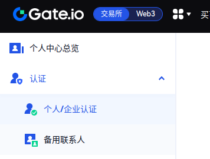
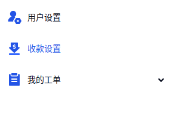
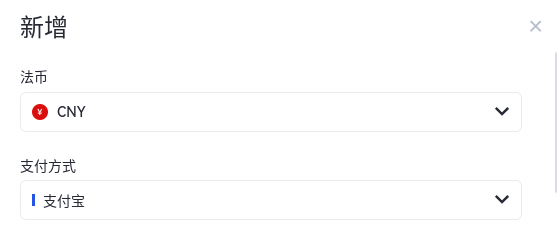
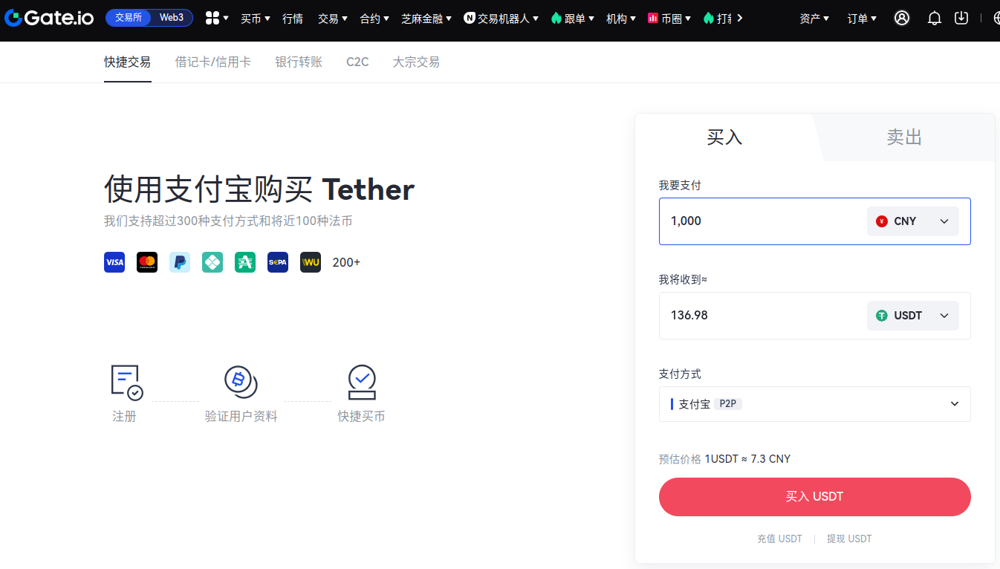

---
tags:
  - BTC
  - ETH
  - 理财
---

# 虚拟币交易

## 芝麻开门
### 1.帐号注册
官网注册： https://www.gate.io/signup/VFUSVFBY?ref_type=103

### 2.认证
在个人账户页面，左边导航栏点击【认证】-【个人/企业认证】，按照流程进行认证，提交后一般需要等待一段时间

### 3.设置收款方式
用于将USDT兑换回人民币时使用
在个人账户页面，左边导航栏点击【收款设置】

新增一项支付方式，人民币交易选择【CNY】

### 4.买入USDT(C2C交易)
在这之后，你也可以使用手机APP操作。

在上方导航栏中点击【买币】-【快捷交易】，输入先买的金额

匹配到交易人后，你需要根据对方提供的支付方式在20分钟内打款到对方账户（支付宝等）。

打款后，点击【我已付款】，然后等待对方点击【确认收款】

### 5.买入虚拟币
有了USDT那么就可以交易虚拟币了

