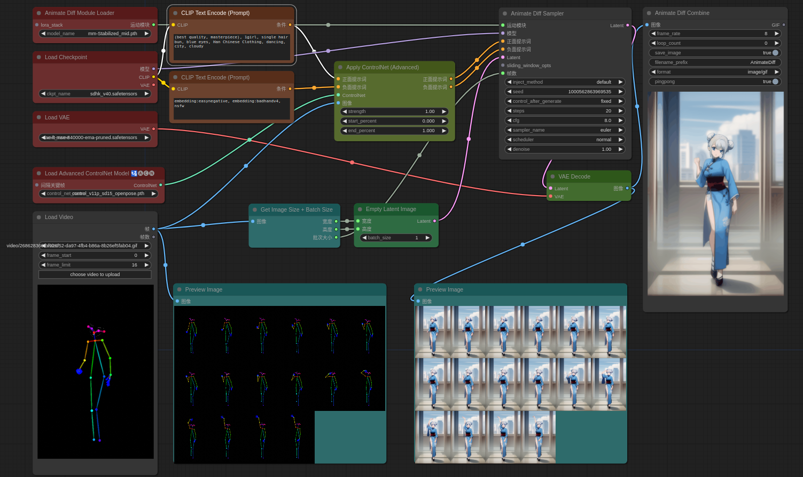
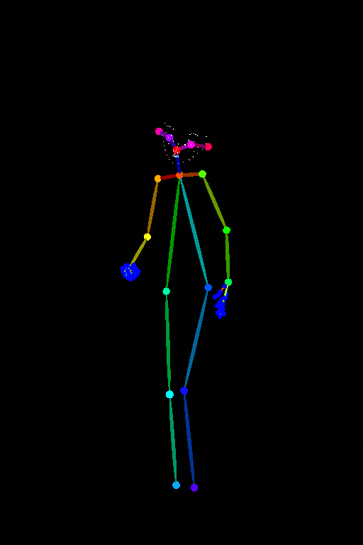
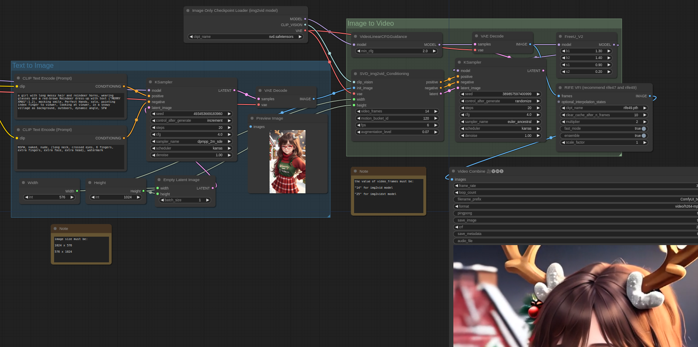
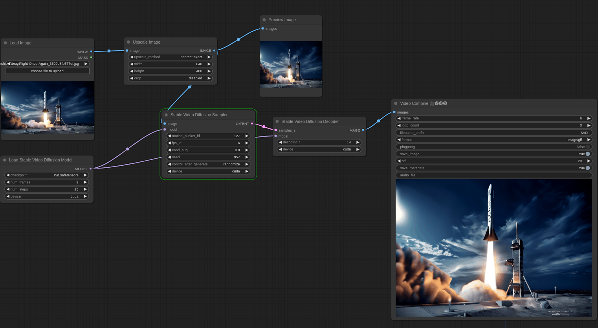

---
tags:
  - Stable Diffusion
---

# AIGC
Stable Diffusion最初是由Heidelberg 大学和[Stability AI](https://stability.ai/), [Runway](https://runwayml.com/)合作的开源项目。

## 项目地址
Stable Diffusion:
https://github.com/CompVis/stable-diffusion

WebUI:
https://github.com/AUTOMATIC1111/stable-diffusion-webui

WebUI插件：
- ControlNet: https://github.com/Mikubill/sd-webui-controlnet
- IP2P(非ControlNet版): https://github.com/Klace/stable-diffusion-webui-instruct-pix2pix
- AnimateDiff: https://github.com/continue-revolution/sd-webui-animatediff

ComfyUI:
https://github.com/comfyanonymous/ComfyUI/tree/master
```shell
pip install -r requirements.txt  -i https://pypi.tuna.tsinghua.edu.cn/simple
```
ComfyUI 插件:
- 插件管理器: https://github.com/ltdrdata/ComfyUI-Manager
- lllyasviel/ControlNet:
  1. https://huggingface.co/lllyasviel/Annotators/tree/5bc80eec2b4fddbb743c1e9329e3bd94b2cae14d
  2. https://huggingface.co/dhkim2810/MobileSAM/tree/main

## 优化加速
Xformers安装： https://post.smzdm.com/p/axzmd56d/
bash webui.sh --xformers
or
 CUDA_VISIBLE_DEVICES=7 python3 launch.py --listen --enable-insecure-extension-access --xformers

加速效果
OneFlow > [TensorRT](https://docs.nvidia.com/deeplearning/tensorrt/archives/index.html) > Aitemplate > Xformers

LLM: https://latent-consistency-models.github.io/

### 测试
生成图片的大小为450*800，在使用TensorRT时，生成图片的大小为768*450

| 环境 | 面部修复 | LoRA | 速度 | +Xformers速度 | +TensorRT速度 |
| --- |:---:|:---:| --- | --- | --- |
| 3060(Notebook) | &#x2713; |   | 3.65it/s | 4.80it/s ||
| 4090 | &#x2713; |   | 7.80it/s | 9.63it/s |32.83it/s|
| 3060(Notebook) | &#x2713;  | &#x2713;  |	3.16it/s | 3.96it/s ||
| 4090 | &#x2713;  | &#x2713;  | 5.54it/s | 6.25it/s |32.87it/s|
| 4090 |  |   | 8.14it/s | 10.06it/s |37.25it/s|

## Embeddings
- ConfyUI:
https://comfyanonymous.github.io/ComfyUI_examples/textual_inversion_embeddings/

To use an embedding put the file in the `models/embeddings` folder then use it in your prompt like I used the SDA768.pt embedding in the previous picture.

Note that you can omit the filename extension so these two are equivalent:

`embedding:SDA768.pt`

`embedding:SDA768`

You can also set the strength of the embedding just like regular words in the prompt:

`(embedding:SDA768:1.2)`

- WebUI
https://zhuanlan.zhihu.com/p/627500143

将embedding文件下载，拷贝至根目录下的embedding目录里

## 动画
- Gen-1(2023): Runway 公司的Video to Video的AI产品。https://arxiv.org/abs/2302.03011
- Gen-2(2023): Runway 公司的Text/Image to Video的AI产品。  （Paper Coming Soon）
- Animate Diff: open source, 结合Stable Diffusion的开源视频生成模型。 需要12G显存）https://arxiv.org/abs/2307.04725
- Deforum: open source, 使用 Stable Diffusion 创建动画视频的工具。
- Kaiber.ai: AI创作者平台，输入图片/视频/prompt生成视频，Audioreactivity。
- Pika Labs: Text-to-Video，Discord上通过聊天机器人使用

### Text-to-Video

#### Gen-2

#### Pika Labs

#### AnimateDiff
- **AnimateDiff & ControlNet & Pose**

将AnimateDiff、动作序列和ControlNet并入一个工作流，实现文生视频（和Animate Anyone相比，效果稍微差一些，但Animate Anyone是图生视频）


- **AnimateDiff + 动态LoRA实现视角控制**
将AnimateDiff在原有算法的基础上结合视角控制的LoRA并入一个工作流

#### 文生图 + SVD

*通过文字生成视频序列工作流*

### Image-to-Video
#### Animate Anyone
[Project](https://humanaigc.github.io/animate-anyone/) | [Code](https://github.com/HumanAIGC/AnimateAnyone/tree/main)

Animate Anyone 是阿里提出的用于人物动画场景的图生视频的方法，只需一张人物照片，再配合骨骼动画引导，就能生成动画视频。


#### Stable Video Diffusion

*通过任意一张图片生成视频序列工作流*


*原始图片*


*SVD生成视频*


*加入补帧算法后效果*

### Video-to-Video

## 平面设计
[ArchiGAN](https://developer.nvidia.com/blog/archigan-generative-stack-apartment-building-design/?linkId=70968833)

图神经网络方法
[News](https://baijiahao.baidu.com/s?id=1678104857914261902) | [Paper](https://link.springer.com/chapter/10.1007/978-3-030-66823-5_27)(ECCV 2020)

GAN：
https://blog.csdn.net/qq_28941587/article/details/104104823

## Motion

- MDM: [Project](https://guytevet.github.io/mdm-page/) | [Paper](https://arxiv.org/abs/2209.14916) | [Code](https://github.com/GuyTevet/motion-diffusion-model)
- MLD: [Paper](https://arxiv.org/abs/2212.04048) | [Code](https://github.com/ChenFengYe/motion-latent-diffusion)
- T2M-GPT: [Project](https://mael-zys.github.io/T2M-GPT/) | [Paper](https://arxiv.org/abs/2301.06052) | [Code](https://github.com/Mael-zys/T2M-GPT)
- **MoMask**:
[Project](https://ericguo5513.github.io/momask) | [Paper](https://arxiv.org/abs/2312.00063) | [Github](https://github.com/EricGuo5513/momask-codes/tree/main)

Application
- Text-to-motion: is the task of generating motion given an input text prompt.
- Action-to-motion: is the task of generating motion given an input action class, represented by a scalar.
- Motion Editing
  1. Body Part Editing: fix the joints we don’t want to edit and leave the model to generate the rest.
  2. Motion In-Betweening: fix the first and last 25% of the motion, leaving the model to generate the remaining
50% in the middle.

## 3D

Depth Map

3D-GPT: [Project](https://chuny1.github.io/3DGPT/3dgpt.html) | [Paper](https://arxiv.org/abs/2310.12945) | [Code](https://github.com/Chuny1/3DGPT)

## 动物动作的生成


### MANN

[Video](https://www.youtube.com/watch?v=uFJvRYtjQ4c) | [Paper](https://github.com/sebastianstarke/AI4Animation/blob/master/Media/SIGGRAPH_2018/Paper.pdf) | [Code](https://github.com/sebastianstarke/AI4Animation/tree/master/AI4Animation/SIGGRAPH_2018)

**输入的具体格式**

| 内容 | 成员 | 尺寸 |
| :---: | :---: | :---: |
| state (i)的Trajectory，所有值都**相对于**根节点 | pos.x | 12 |
|| pos.z | 12 |
|| dir.x | 12 |
|| dir.z | 12 |
|| vel.x | 12 |
|| vel.z | 12 |
|| speed | 12 |
|| Styles的6维one-hot向量| 12 |
| state (i-1) 的关节 | pos.x | 27 |
|| pos.y | 27 |
|| pos.z | 27 |
|| foward.x | 27 |
|| foward.y | 27 | | 27 |
|| foward.z | 27 |
|| up.x | 27 |
|| up.y | 27 |
|| up.z | 27 |
|| vel.x | 27 |
|| vel.y | 27 |
|| vel.z | 27 |

**输出的具体格式**

| 内容 | 成员 | 尺寸 |
| :---: | :---: | :---: |
| state (i+1)的Trajectory，所有值都**相对于**根节点 | pos.x | 6 |
|| pos.z | 6 |
|| dir.x | 6 |
|| dir.z | 6 |
|| vel.x | 6 |
|| vel.z | 6 |
| state (i-1) 的关节 | pos.x | 27 |
|| pos.y | 27 |
|| pos.z | 27 |
|| foward.x | 27 |
|| foward.y | 27 | | 27 |
|| foward.z | 27 |
|| up.x | 27 |
|| up.y | 27 |
|| up.z | 27 |
|| vel.x | 27 |
|| vel.y | 27 |
|| vel.z | 27 |
| root节点相对于上一帧的位移 | (x, 角度, z) | 3 |

MoE 指的是 Mixture of Experts（专家混合模型），是一种用于构建深度神经网络的架构。这种架构通常包括两个关键组件：专家网络和门控网络。

1. 专家网络（Experts）： 这是多个神经网络模块的集合，每个模块被称为一个专家。每个专家被设计为在处理输入数据的特定方面上表现出色。例如，对于图像分类任务，不同的专家可能擅长识别不同类别的物体。

2. 门控网络（Gating Network）： 门控网络用于确定在给定输入上哪个专家应该发挥作用。门控网络输出一组权重，这些权重表示每个专家对给定输入的贡献。这些权重通常是在0到1之间的值，它们的和等于1。

整个 MoE 模型的输出是所有专家的输出的加权和，权重由门控网络确定。这使得 MoE 能够在不同的输入情况下动态地选择不同的专家来执行任务。

MoE 的优点之一是其能够处理复杂的、多模态的数据分布，因为不同的专家可以专注于处理不同方面的数据。这种结构也有助于提高模型的容量和表达能力，使其能够更好地适应复杂的任务。 MoE 结构常常在涉及大规模神经网络和复杂任务的情况下取得了良好的性能。

权重文件命名规则：

1. `cp[0-2]_[a,b][0-7].bin`，一共3x2x8=48个文件
  - `ExpertWeights.py`
  - a,b 表示 $\alpha$和$\beta$
  - 0-7 表示专家的索引

2. `wc[0-2]_[b,w].bin`，一共3x2=6个文件
  - `Gating.py`
  - w 表示weight
  - b 表示bias

3. `[X,Y][mean,std].bin`，一共2x2=4个文件
  - `Utils.py`
  - mean 表示均值
  - std 表示方差

| 变量 | 尺寸 |
| :---: | :---: |
| Xmean | 480 x 1 |
| Xstd | 480 x 1 |
| Ymean | 363 x 1 |
| Ystd | 363 x 1 |
| wc0_w | 32 x 19 |
| wc0_b | 32 x 1 |
| wc1_w | 32 x 32 |
| wc1_b | 32 x 1 |
| wc2_w | 8 x 32 |
| wc2_b | 8 x 1 |
| cp0_a0-7 | 512 x 480 |
| cp0_b0-7 | 512 x 1 |
| cp1_a0-7 | 512 x 512 |
| cp1_b0-7 | 512 x 1 |
| cp2_a0-7 | 363 x 512 |
| cp2_b0-7 | 363 x 1 |


## 其他
Custom Diffusion
[Home](https://www.cs.cmu.edu/~custom-diffusion/results.html) |
[Github](https://github.com/adobe-research/custom-diffusion)

https://zhuanlan.zhihu.com/p/620852185
