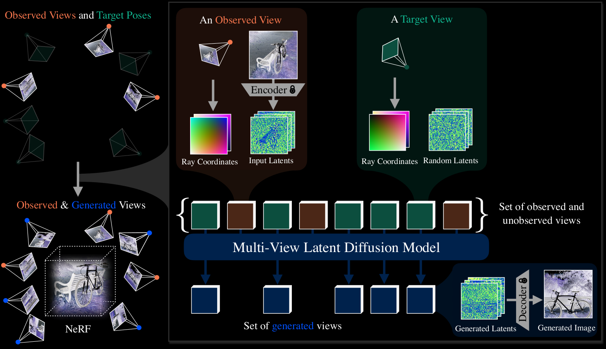

---
tags:
  - AIGC
  - 3D
---

<style>
html.dark .light-mode {
  display: none;
}

html.dark .dark-mode {
  display: block;
}

html:not(.dark) .light-mode {
  display: block;
}

html:not(.dark) .dark-mode {
  display: none;
}
</style>

# 3D生成

- Depth Map
- 3D-GPT: [Project](https://chuny1.github.io/3DGPT/3dgpt.html) | [Paper](https://arxiv.org/abs/2310.12945) | [Code](https://github.com/Chuny1/3DGPT)
- DreamScene: [Project](https://dreamscene-project.github.io/) | [Paper](https://arxiv.org/abs/2404.03575) | [Code](https://github.com/DreamScene-Project/DreamScene)
- DreamScene360: [Paper](https://arxiv.org/abs/2404.06903)
- Text2Room: [Project](https://lukashoel.github.io/text-to-room/) | [Code](https://github.com/lukasHoel/text2room)
- Text2NeRF: [Project](https://eckertzhang.github.io/Text2NeRF.github.io/) | [Code](https://github.com/eckertzhang/Text2NeRF)
- GaussianCube: [Project](https://gaussiancube.github.io/) | [Paper](https://arxiv.org/abs/2403.19655) | [Code](https://github.com/GaussianCube/GaussianCube)
- ReconFusion: [Project](https://reconfusion.github.io/)
- TripoSR: [Demo](https://huggingface.co/spaces/stabilityai/TripoSR)
- Stable Fast 3D: [Project](https://stable-fast-3d.github.io) | [Paper](https://arxiv.org/abs/2408.00653) | [Demo](https://huggingface.co/spaces/stabilityai/stable-fast-3d)
- GRM: [Project](https://justimyhxu.github.io/projects/grm/) | [Demo目前无效](https://huggingface.co/spaces/GRM-demo/GRM)
- InstantMesh: [Project](https://github.com/TencentARC/InstantMesh?tab=readme-ov-file) | [Demo](https://huggingface.co/spaces/TencentARC/InstantMesh)
  - 可以生成`.obj`和`.glb`模型。
- VFUsion3D: [Demo](https://huggingface.co/spaces/facebook/VFusion3D)
- Cube 3D: [Code](https://github.com/Roblox/cube?tab=readme-ov-file) | [Demo](https://huggingface.co/spaces/Roblox/cube3d-interactive)

非开源：
| 工具 / 平台 | 输入类型 | 优势 | 可用性 / 备注 |
| --- | --- | --- | --- |
| Luma AI – Genie | 文本 | 免费、支持多语言、易上手 | | 
| Copilot 3D (微软) | 图片 | 快速图→3D，可输出 GLB | [网站](https://copilot.microsoft.com/labs/experiments/copilot-3d) | 
| Meshy.ai | 文本/图像 | 多模式支持、试用额度 | [网站](https://www.meshy.ai/)<br>免费版受限，模型必须公开 | 
- [Tripo3D](https://studio.tripo3d.ai/workspace/overview)


## 3D Editing
[GaussCtrl](https://gaussctrl.active.vision/)

## 模型重优化
InFusion: [Project](https://johanan528.github.io/Infusion/) | [Code](https://github.com/ali-vilab/infusion) | [Model](https://huggingface.co/Johanan0528/Infusion/tree/main)

首先训练一个高斯模型（待优化，好像不是待优化，是结合预先标注好的mask训练一个不完整的高斯模型），然后把这个模型渲染出来。然后挑选一张渲染图片，把要编辑的部位画出来，做成Mask图像，通过SDXL-Inpainting这张图像。得到inpaint后的图像，然后训练模型，最后微调模型。

如果能通过UNet自动检测缺陷部位，生成Mask，那么就可以自动化。

## CAT3D
[Project](https://cat3d.github.io/) | [Paper](https://arxiv.org/abs/2405.10314)

之前的工作是侧重于如何更好地重建模型/提升单图重建模型的质量，但这篇文章的侧重点是如何通过diffusion model 产生更多视角的图像，解决最大的痛点。

<div class="theme-image">
  
  
</div>

CAT3D has two stages:

(1) generate a large set of synthetic views from a **multi-view latent diffusion model** conditioned on the input views alongside
the camera poses of target views;

(2) run a **robust 3D reconstruction pipeline** on the observed and
generated views to learn a NeRF representation.

CAT3D最终可以通过多张图像、单张图像或纯文本生成3D模型。

## LGM
[Project](https://me.kiui.moe/lgm/) | [Paper](https://arxiv.org/abs/2402.05054) | [Demo](https://huggingface.co/spaces/ashawkey/LGM)

生成高斯模型

推荐环境：CUDA 11.8以上


### Run
```shell
CUDA_VISIBLE_DEVICES=0 python3 app.py big --resume pretrained/model_fp16_fixrot.safetensors
```

### 代码分C
- 多视角图片

代码中已经很明确标注了各个Tensor的尺寸，文本生成和图像生成分别对应于`pipe_text`和`pipe_image`（MVDream和ImageDream）

对于图生多视角图片，这里首先使用了`rembg`库（自动会下载一个UNet）获取背景的mask，然后通过[`kiui.op.recenter()`](https://kit.kiui.moe/ops/#kiui.op.recenter)方法获取一个新图片，最后将这个图片归一化，由0-255归一化到0-1。

- 高斯渲染

可以看到里面涉及一个库：[diff-gaussian-rasterization](https://github.com/ashawkey/diff-gaussian-rasterization)

保存和读取高斯模型时使用另一个库: [plyfile](https://python-plyfile.readthedocs.io/en/latest/) （这两个函数都他妈是静态的，还非得写在类里面加个self）

可以看到每个高斯模型是使用一个矩阵存储信息（3维张量，实际上只有2维，第一个维度长度是1），形状为(N,14),其中，颜色为最后3个维度（归一化），依次为R,G,B。
```python
        means3D = gaussians[0, :, 0:3].contiguous().float()
        opacity = gaussians[0, :, 3:4].contiguous().float()
        scales = gaussians[0, :, 4:7].contiguous().float()
        rotations = gaussians[0, :, 7:11].contiguous().float()
        shs = gaussians[0, :, 11:].unsqueeze(1).contiguous().float() # [N, 1, 3]
```

```python
gaussians[:, :, -3] # 红色通道
gaussians[:, :, -2] # 绿色通道
gaussians[:, :, -1] # 蓝色通道
```

## Unique3D
[Project](https://wukailu.github.io/Unique3D/) | [Paper](https://arxiv.org/abs/2405.20343) | [Demo](https://huggingface.co/spaces/Wuvin/Unique3D)

可以生成`.glb`模型，效果比Stable Fast 3D好。

<div class="theme-image">
  
  
</div>
