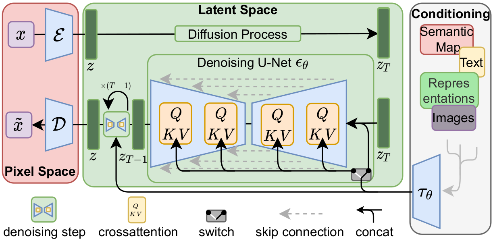
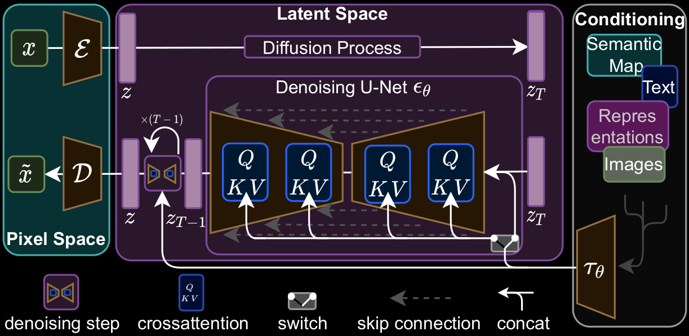
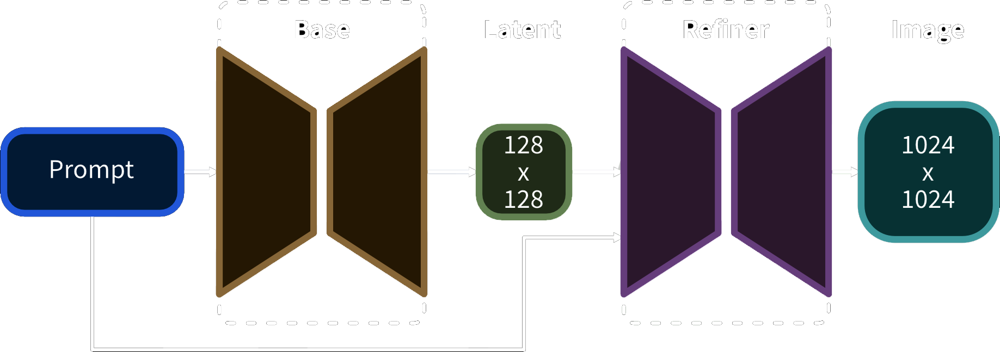
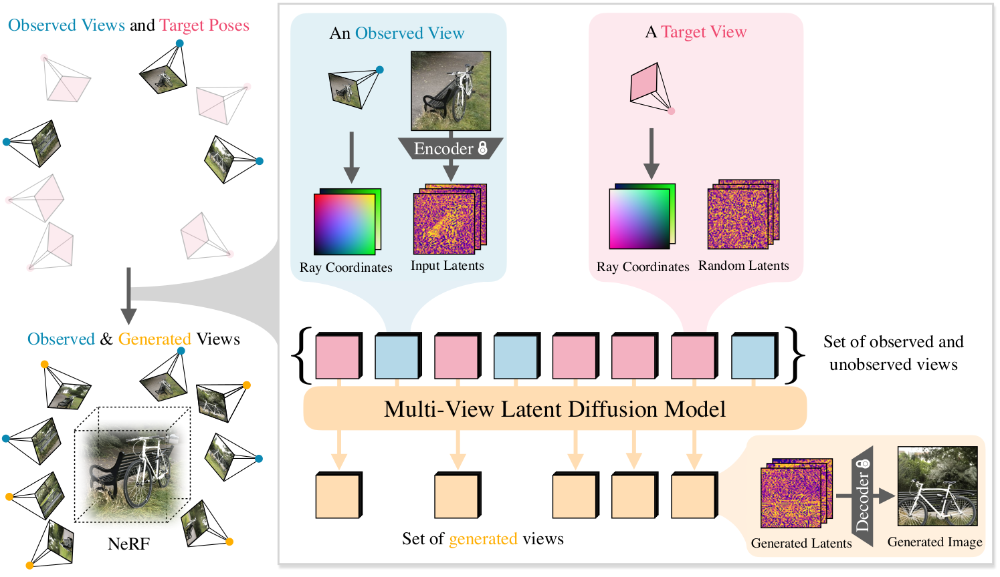
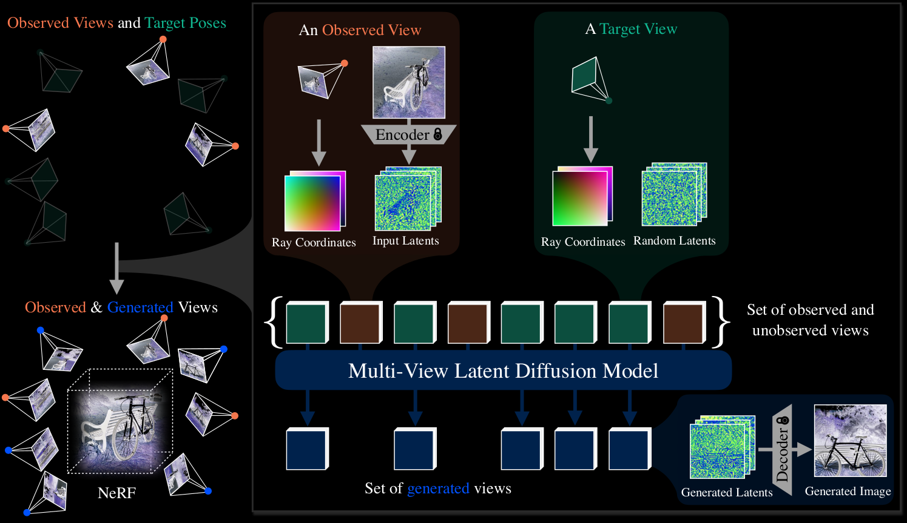
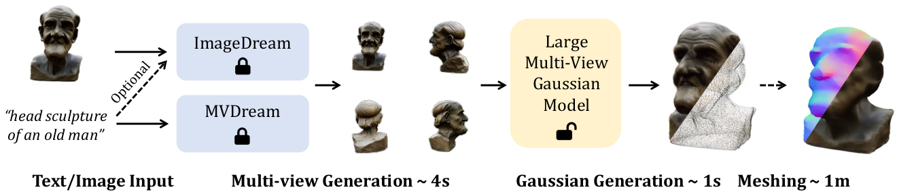
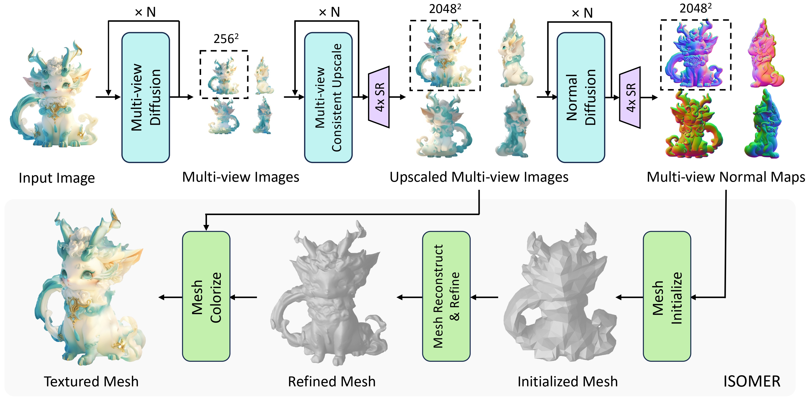
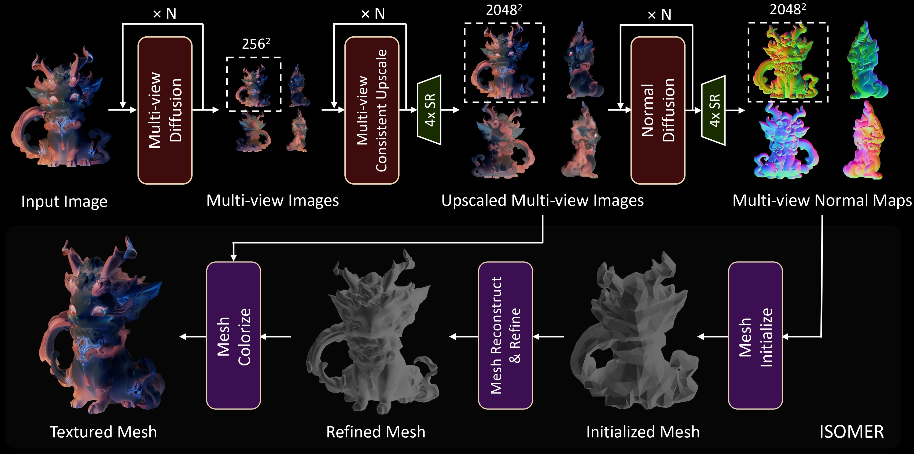

---
tags:
  - Stable Diffusion
  - AI绘图
---

<style>
html.dark .light-mode {
  display: none;
}

html.dark .dark-mode {
  display: block;
}

html:not(.dark) .light-mode {
  display: block;
}

html:not(.dark) .dark-mode {
  display: none;
}
</style>

# AIGC

常用的AI绘图模型：
1. [Midjourney](https://midjourney.co/generator): 在线AI绘图网站，免费使用15次。
2. 文心一格: 由百度飞桨、文心大模型的技术创新推出的“AI 作画”产品，在线使用。
3. Stable Diffusion: 有开源模型，也有API
4. [DALL·E 2](https://openai.com/dall-e-2): 付费订阅ChatGPT后可直接使用

## 实用工具
Stable Diffusion XL Inpainting: https://huggingface.co/spaces/diffusers/stable-diffusion-xl-inpainting

## 项目地址
Stable Diffusion:
https://github.com/CompVis/stable-diffusion

WebUI:
https://github.com/AUTOMATIC1111/stable-diffusion-webui

WebUI插件：
- LoRA: https://github.com/kohya-ss/sd-webui-additional-networks
- ControlNet: https://github.com/Mikubill/sd-webui-controlnet
- 腾讯ControlNet模型: [T2I-Adapter](https://huggingface.co/TencentARC/T2I-Adapter/tree/main/models) | [t2i-adapter-lineart-sdxl](https://huggingface.co/TencentARC/t2i-adapter-lineart-sdxl-1.0)
- IP2P(非ControlNet版): https://github.com/Klace/stable-diffusion-webui-instruct-pix2pix
- AnimateDiff: https://github.com/continue-revolution/sd-webui-animatediff

ComfyUI:
https://github.com/comfyanonymous/ComfyUI/tree/master
```shell
pip install -r requirements.txt  -i https://pypi.tuna.tsinghua.edu.cn/simple
```
ComfyUI 插件:
- 插件管理器: https://github.com/ltdrdata/ComfyUI-Manager
- lllyasviel/ControlNet [安装](#controlnet-aux):
  1. https://huggingface.co/lllyasviel/Annotators/tree/5bc80eec2b4fddbb743c1e9329e3bd94b2cae14d
  2. https://huggingface.co/dhkim2810/MobileSAM/tree/main

## Stable Diffusion
Stable Diffusion最初是由Heidelberg 大学和[Stability AI](https://stability.ai/), [Runway](https://runwayml.com/)合作的开源项目。

### 原理

<div class="theme-image">
  
  
</div>

#### 分词器(tokenizer)
text先由CLIP进行标记化，CLIP是由OpenAI开发（英文版）的一种多模态模型，旨在理解图像和文本之间的关系。CLIP的训练过程包括：
1. **数据集**：CLIP使用包含图像和相应描述性文本对的大规模数据集进行训练。
2. **对比学习**：CLIP采用对比学习的方法，通过最大化图像和对应文本的相似性（而不是与随机文本的相似性）来训练模型。CLIP使用了两个独立的神经网络，一个用于处理图像（图像编码器），一个用于处理文本（文本编码器）。

[[Blog]](https://openai.com/blog/clip/) [[Paper]](https://arxiv.org/abs/2103.00020) [[Model Card]](model-card.md) [[Colab]](https://colab.research.google.com/github/openai/clip/blob/master/notebooks/Interacting_with_CLIP.ipynb)


功能：
- 图像-文本相似性评估：CLIP可以计算任意图像和文本之间的相似性，找到最相关的图像或文本。
- 零样本分类：通过对文本描述进行编码，CLIP可以在没有明确训练过的分类任务上进行图像分类。
- 图像生成指导：在生成任务中，CLIP可以提供目标图像的特征指导，帮助生成高质量的图像。

#### 令牌化(Tokenization)
max 75个令牌

#### 嵌入/标签(Embedding)
ViT-L/14

#### VAE（Variational Autoencoder）
VAE是一种生成模型，用于学习数据的潜在表示并生成新数据。VAE包括两个主要部分：
1. 编码器（Encoder）：将输入数据（例如图像）编码为潜在表示（通常是一个潜在向量）。
2. 解码器（Decoder）：从潜在表示中重建输入数据。
VAE的训练目标是最大化变分下界（Variational Lower Bound），以使重建的图像尽可能接近原始图像，并使潜在表示的分布接近先验分布（通常是标准正态分布）。

#### why VAE? not CLIP
CLIP和VAE的区别

CLIP（Contrastive Language-Image Pre-Training）：

- 功能：CLIP是一个用于理解图像和文本之间关系的多模态模型。它包含两个部分：图像编码器和文本编码器。
- 作用：CLIP用于计算图像和文本之间的相似性。通过对比学习，CLIP能够将图像和文本映射到同一个特征空间中，从而可以进行相似性评估。
限制：CLIP没有解码器部分，因此无法直接生成图像。它主要用于评估和指导生成过程，而不是直接参与图像生成。

VAE（Variational Autoencoder）：

功能：VAE是一种生成模型，用于学习数据的潜在表示，并能够从潜在表示生成新数据。VAE包含编码器和解码器两部分。
作用：在Stable Diffusion中，VAE用于将图像编码为潜在向量（编码器），并从潜在向量生成图像（解码器）。
优势：VAE的解码器部分在图像生成过程中起关键作用，能够从扩散模型生成的潜在表示重建图像。

为什么使用VAE而不是CLIP进行解码

CLIP没有解码器部分，所以它不能直接从潜在表示生成图像。CLIP的主要作用是提供文本和图像之间的相似性指导。例如，在生成过程中，CLIP可以帮助确保生成的图像与给定的文本描述相符，但实际的图像生成和解码过程需要依赖其他模型（如VAE）。

总结

在Stable Diffusion中，VAE的解码器用于将扩散模型生成的潜在表示转化为图像。CLIP则用于提供文本-图像相似性指导，确保生成的图像符合文本描述。由于CLIP缺乏解码器部分，Stable Diffusion使用VAE来完成图像的实际生成。

### Install

#### WebUI Linux
```shell
conda create -n AIGC python=3.10
conda activate AIGC
pip install torch==2.3.0+cu121 torchvision==0.18.0+cu121 torchaudio==2.3.0+cu121 --extra-index-url https://download.pytorch.org/whl/cu121

git clone https://github.com/AUTOMATIC1111/stable-diffusion-webui.git
#放入模型文件到models/StableDiffusion

cd repositories/
git clone https://github.com/AUTOMATIC1111/stable-diffusion-webui-assets.git
git clone https://github.com/Stability-AI/stablediffusion.git

cd ..
mkdir openai
mkdir openai/clip-vit-large-patch14
#放入这个仓库的模型文件

CUDA_VISIBLE_DEVICES=0 python3 launch.py --listen --enable-insecure-extension-access --xformers

# 安装xformers
pip install xformers
CUDA_VISIBLE_DEVICES=0 python3 launch.py --listen --enable-insecure-extension-access --xformers


```

### 版本
#### SD 3
[Paper](https://arxiv.org/pdf/2403.03206)

combines a [diffusion transformer](https://arxiv.org/abs/2212.09748) architecture and [flow matching](https://arxiv.org/abs/2210.02747). T5 是一个seq-to-seq模型。

#### SDXL-Lightning
[HuggingFace](https://huggingface.co/ByteDance/SDXL-Lightning) | [Paper](https://arxiv.org/abs/2402.13929) （2024.2）

SDXL-Lightning是由字节跳动开发的一个项目，采用了创新的蒸馏策略，优化了扩散模型，实现了从文本到高分辨率图像的快速、高质量生成。

在WebUI 1.9版本中，集成了SDXL-Lightning使用的sgm_uniform采样器（2024.4）

#### SDXL Turbo
[HuggingFace](https://huggingface.co/stabilityai/sdxl-turbo) | [Paper](https://stability.ai/research/adversarial-diffusion-distillation) (2023.12)
SD Turbo的大号版(高质量)
- 尺寸: 512x512(fix)

#### SD Turbo
[HuggingFace](https://huggingface.co/stabilityai/sd-turbo) (2023.12)
由SD2.1微调而来
- 尺寸: 512x512(fix)

#### SDXL
[stable-diffusion-xl-base-1.0](https://huggingface.co/stabilityai/stable-diffusion-xl-base-1.0)

- DreamShaper XL Alpha 2
[Model](https://civitai.com/models/112902?modelVersionId=126688)

在模型页面上可以看到，其使用的Basemodel 是SDXL 1.0

What does it do better than SDXL1.0?
- No need for refiner. Just do highres fix (upscale+i2i)
- Better looking people
- Less blurry edges
- 75% better dragons 🐉
- Better NSFW


#### SDXL 0.9
[HuggingFace](https://huggingface.co/stabilityai/stable-diffusion-xl-base-0.9) | [Paper](https://arxiv.org/abs/2307.01952)
使用不同尺寸的图像训练（最高1024x1024)


<div class="theme-image">
  
  
</div>

SDXL模型更复杂一些，除了Base模型以外还包含Refiner模型（两个U-Net?）

#### SD 2.0/2.1
[SD2.1 HuggingFace](https://huggingface.co/stabilityai/stable-diffusion-2-1) (2.1:2022.12, 2.0: 2022.11)

[SD2.1 Base HuggingFace](https://huggingface.co/stabilityai/stable-diffusion-2-1-base)
- Hardware: 32 x 8 x A100 GPUs
- 尺寸: 768x768(SD 2.1-v), 512x512(SD 2.1-base)

#### SD 1.5
[Code](https://huggingface.co/runwayml/stable-diffusion-v1-5)(2022.10)

这是SD 1最后一个版本（截止到2024.3），如果你看到什么SD1.8，那肯定是那个人没分清WebUI版本和模型版本。

#### SD 1.1-1.4
[Code](https://github.com/CompVis/stable-diffusion)(2022.8)
- 尺寸: 512x512

### 采样器
#### 分类

| 旧采样器                                                          | DPM采样器                                                                                                             | 新采样器
|---------------------------------------------------------------|--------------------------------------------------------------------------------------------------------------------|------------------|
| LMS<br>LMS Karras<br>Heun<br>Euler<br>Euler a<br>DDIM<br>PLMS | DPM2<br>DPM2a<br>DPM++2S a<br>DPM++2M<br>DPM++SDE<br>DPM++2M SDE<br>DPM++3M SDE<br>...<br>DPM fast<br>DPM adaptive | UniPC<br>Restart |

#### 旧采样器
推荐Euler, Euler a

a代表祖先采样器，(迭代噪声)不收敛

#### DPM采样器
- **DPM++2M Karras**
最推荐算法，收敛，速度快，质量OK

- DPM++SDE Karras
随机微分方程算法

- DPM++2M SDE Exponential(WebUI1.6 新增)
指数算法，不收敛，细节少些，画面柔和、干净

- DPM++3M SDE Karas(WebUI1.6 新增)
速度和2M一样，需要更多采样步数，调低CFG，采样步数>30步效果更好

- DPM++3M SDE Exponential(WebUI1.6 新增)
同上

#### 新采样器
- UniPC (2023)
统一预测校正器，兼容性很好收敛，10步左右就能生成可用画面。

- Restart(WebUI1.6 新增)
每步渲染长些，但只需很少的采样步数

在WebUI中可以在【设置】-【Sampler parameters】设定显示和隐藏采样器

#### 实例
采样器的具体实现代码可参考 https://github.com/crowsonkb/k-diffusion.git 的`k_diffusion/sampling.py`
### Comfy UI

#### 共享路径设置
个人习惯将模型路径设定为一个统一的路径，使任何平台的WebUI和ComfyUI都用同一路径下的模型，节省空间。

- Windows版: 修改`ComgyUI/folder_paths.py`
```python
import os
import time
import logging

supported_pt_extensions = set(['.ckpt', '.pt', '.bin', '.pth', '.safetensors', '.pkl'])

folder_names_and_paths = {}

base_path = os.path.dirname(os.path.realpath(__file__))
models_dir = os.path.join(base_path, "models")
share_path = "C:\Software\ShareModel" # [!code ++]
folder_names_and_paths["checkpoints"] = ([os.path.join(models_dir, "checkpoints")], supported_pt_extensions) # [!code --]
folder_names_and_paths["checkpoints"] = ([os.path.join(share_path, "stablediffusion")], supported_pt_extensions) # [!code ++]
folder_names_and_paths["configs"] = ([os.path.join(models_dir, "configs")], [".yaml"])

folder_names_and_paths["loras"] = ([os.path.join(models_dir, "loras")], supported_pt_extensions) # [!code --]
folder_names_and_paths["loras"] = ([os.path.join(share_path, "loras")], supported_pt_extensions) # [!code ++]
folder_names_and_paths["vae"] = ([os.path.join(models_dir, "vae")], supported_pt_extensions)
folder_names_and_paths["clip"] = ([os.path.join(models_dir, "clip")], supported_pt_extensions)
folder_names_and_paths["unet"] = ([os.path.join(models_dir, "unet")], supported_pt_extensions)
folder_names_and_paths["clip_vision"] = ([os.path.join(models_dir, "clip_vision")], supported_pt_extensions)
folder_names_and_paths["style_models"] = ([os.path.join(models_dir, "style_models")], supported_pt_extensions)
folder_names_and_paths["embeddings"] = ([os.path.join(models_dir, "embeddings")], supported_pt_extensions)
folder_names_and_paths["diffusers"] = ([os.path.join(models_dir, "diffusers")], ["folder"])
folder_names_and_paths["vae_approx"] = ([os.path.join(models_dir, "vae_approx")], supported_pt_extensions)

#folder_names_and_paths["controlnet"] = ([os.path.join(models_dir, "controlnet"), os.path.join(models_dir, "t2i_adapter")], supported_pt_extensions)
folder_names_and_paths["controlnet"] = ([os.path.join(share_path, "controlnet"), os.path.join(models_dir, "t2i_adapter")], supported_pt_extensions)
```

#### comfyui-various
https://github.com/jamesWalker55/comfyui-various/tree/main

`match`语句在Python3.10版本以下引发的报错`SyntaxError: invalid syntax`问题解决方案：

在`comfyui_primitive_ops.py`的`line280`中
```python
    if from_right:
        splits = source.rsplit(split_by, 1)
    else:
        splits = source.split(split_by, 1)
    #match splits:
    #    case a, b:
    #        return (a, b)
    #    case a:
    #        return (a, "")
    # 检查 splits 是否是一个包含两个元素的序列
    if isinstance(splits, (list, tuple)) and len(splits) == 2:
        a, b = splits
        return (a, b)
    # 检查 splits 是否是一个包含一个元素的序列
    elif isinstance(splits, (list, tuple)) and len(splits) == 1:
        a = splits[0]
        return (a, "")
    else:
        return ("Invalid input",)
```

#### WD14 Tagger
https://github.com/pythongosssss/ComfyUI-WD14-Tagger?tab=readme-ov-file

Waifu Diffusion 1.4 Tagger，这是一个用于自动化图像标签生成的工具，专门为动漫风格图像（通常称为 "[waifu](https://zh.wiktionary.org/wiki/waifu)" 图像）设计的。这个工具基于深度学习模型，能够为给定的动漫图像生成描述性标签，以便于分类、搜索和其他用途。

主要功能
1. 自动标签生成：
   - WD 1.4 Tagger 使用预训练的深度学习模型来分析输入的动漫图像，并自动生成一组描述性标签。这些标签可以包括角色的外貌特征、服装、动作、背景等。
2. 高效的动漫图像处理：
   - 该工具专门针对动漫图像进行了优化，能够识别和生成高质量的标签，使得管理和分类大量的动漫图像变得更加容易。
3. 集成到 ComfyUI：
   - 在 ComfyUI 中，WD 1.4 Tagger 可以无缝集成到用户界面中，使得用户能够轻松地为他们的图像生成标签，并使用这些标签进行搜索和过滤。

模型下载：https://huggingface.co/SmilingWolf

**Offline Use**

Simplest way is to use it online, interrogate an image, and the model will be downloaded and cached, however if you want to manually download the models:

- Create a `models` folder (in same folder as the `wd14tagger.py`)
- Use URLs for models from the list in `pysssss.json`
- Download `model.onnx` and name it with the model name e.g. `wd-v1-4-convnext-tagger-v2.onnx`
- Download `selected_tags.csv` and name it with the model name e.g. `wd-v1-4-convnext-tagger-v2.csv`

requirements
```text
flax
wandb
clu
```

TypeError: Descriptors cannot be created directly.

If this call came from a _pb2.py file, your generated code is out of date and must be regenerated with protoc >= 3.19.0.
```text
pip install protobuf==3.20.*
```
#### IPAdapter plus
https://github.com/cubiq/ComfyUI_IPAdapter_plus

下载模型：
- `/ComfyUI/models/clip_vision`
    - [CLIP-ViT-H-14-laion2B-s32B-b79K.safetensors](https://huggingface.co/h94/IP-Adapter/resolve/main/models/image_encoder/model.safetensors), download and rename
    - [CLIP-ViT-bigG-14-laion2B-39B-b160k.safetensors](https://huggingface.co/h94/IP-Adapter/resolve/main/sdxl_models/image_encoder/model.safetensors), download and rename
- `/ComfyUI/models/ipadapter`, create it if not present
    - [ip-adapter_sd15.safetensors](https://huggingface.co/h94/IP-Adapter/resolve/main/models/ip-adapter_sd15.safetensors), Basic model, average strength
    - [ip-adapter_sd15_light_v11.bin](https://huggingface.co/h94/IP-Adapter/resolve/main/models/ip-adapter_sd15_light_v11.bin), Light impact model
    - [ip-adapter-plus_sd15.safetensors](https://huggingface.co/h94/IP-Adapter/resolve/main/models/ip-adapter-plus_sd15.safetensors), Plus model, very strong
    - [ip-adapter-plus-face_sd15.safetensors](https://huggingface.co/h94/IP-Adapter/resolve/main/models/ip-adapter-plus-face_sd15.safetensors), Face model, portraits
    - [ip-adapter-full-face_sd15.safetensors](https://huggingface.co/h94/IP-Adapter/resolve/main/models/ip-adapter-full-face_sd15.safetensors), Stronger face model, not necessarily better
    - [ip-adapter_sd15_vit-G.safetensors](https://huggingface.co/h94/IP-Adapter/resolve/main/models/ip-adapter_sd15_vit-G.safetensors), Base model, **requires bigG clip vision encoder**
    - [ip-adapter_sdxl_vit-h.safetensors](https://huggingface.co/h94/IP-Adapter/resolve/main/sdxl_models/ip-adapter_sdxl_vit-h.safetensors), SDXL model
    - [ip-adapter-plus_sdxl_vit-h.safetensors](https://huggingface.co/h94/IP-Adapter/resolve/main/sdxl_models/ip-adapter-plus_sdxl_vit-h.safetensors), SDXL plus model
    - [ip-adapter-plus-face_sdxl_vit-h.safetensors](https://huggingface.co/h94/IP-Adapter/resolve/main/sdxl_models/ip-adapter-plus-face_sdxl_vit-h.safetensors), SDXL face model
    - [ip-adapter_sdxl.safetensors](https://huggingface.co/h94/IP-Adapter/resolve/main/sdxl_models/ip-adapter_sdxl.safetensors), vit-G SDXL model, **requires bigG clip vision encoder**
    - **Deprecated** [ip-adapter_sd15_light.safetensors](https://huggingface.co/h94/IP-Adapter/resolve/main/models/ip-adapter_sd15_light.safetensors), v1.0 Light impact model


#### controlnet-aux
下载模型 https://huggingface.co/lllyasviel/Annotators/tree/main 到：
`ComfyUI/custom_nodes/comfyui_controlnet_aux/ckpts/lllyasviel/Annotators`

### 优化加速
Xformers安装： https://post.smzdm.com/p/axzmd56d/
bash webui.sh --xformers
or
 CUDA_VISIBLE_DEVICES=7 python3 launch.py --listen --enable-insecure-extension-access --xformers

加速效果
OneFlow > [TensorRT](https://docs.nvidia.com/deeplearning/tensorrt/archives/index.html) > Aitemplate > Xformers

LLM: https://latent-consistency-models.github.io/

#### 测试
生成图片的大小为`(450,800)`，在使用TensorRT时，生成图片的大小为`(768,450)`

| 环境 | 面部修复 | LoRA | 速度 | +Xformers速度 | +TensorRT速度 |
| --- |:---:|:---:| --- | --- | --- |
| 3060(Notebook) | &#x2713; |   | 3.65it/s | 4.80it/s ||
| 4090 | &#x2713; |   | 7.80it/s | 9.63it/s |32.83it/s|
| 3060(Notebook) | &#x2713;  | &#x2713;  |	3.16it/s | 3.96it/s ||
| 4090 | &#x2713;  | &#x2713;  | 5.54it/s | 6.25it/s |32.87it/s|
| 4090 |  |   | 8.14it/s | 10.06it/s |37.25it/s|

### Embeddings
- ConfyUI:
https://comfyanonymous.github.io/ComfyUI_examples/textual_inversion_embeddings/

To use an embedding put the file in the `models/embeddings` folder then use it in your prompt like I used the SDA768.pt embedding in the previous picture.

Note that you can omit the filename extension so these two are equivalent:

`embedding:SDA768.pt`

`embedding:SDA768`

You can also set the strength of the embedding just like regular words in the prompt:

`(embedding:SDA768:1.2)`

- WebUI
https://zhuanlan.zhihu.com/p/627500143

将embedding文件下载，拷贝至根目录下的embedding目录里

使用：直接在prompt里输入embedding的名字即可，不需要写后缀。新版本的WebUI会自动识别embedding，选择可自动填充prompt

### Controlnet

#### Openpose
这里的Openpose是指借助它提取keypoint特征，而使用[Openpose Editor](https://github.com/fkunn1326/openpose-editor)编辑出来的骨架如果没有输入图像参考，则没有用到Openpose

在 https://huggingface.co/lllyasviel/Annotators/tree/main 中下载3个模型放入`extensions/sd-webui-controlnet/annotator/downloads/openpose`中：

- `body_pose_model.pth`
- `facenet.pth`
- `hand_pose_model.pth`

### 训练

#### LoRA

1. 准备数据: 准备至少10张图像，如果是人，那么背景尽量为白色，不然会被AI学习到背景。放入【文件夹A】

2. 打tag: 使用SD WebUI，点【训练】-【预处理】

   - 其中源目录输入【文件夹A】，创建一个新目录【文件夹B】设为目标目录

   - 自动焦点裁切，使用deepbooru生成说明文字(tags)

   - 设置完后点【输出】

   - 手动修改不正确的标签（在【文件夹B】的`.txt`文件中，可使用[GUI工具](https://github.com/cangzihan/sd_lazy_editor/blob/main/webui.py)）

3. 数据集格式：创建一个新文件夹【文件夹C】，然后在里面再创建一个【文件夹D】命名为"数字_名称"，如“10_face”。其中数字代表训练次数。
然后把【文件夹B】中的所有文件放进去。

4. 训练
```shell
git clone https://github.com/Akegarasu/lora-scripts.git
```

修改`train.ps1`中的内容（代码注释已经很清楚了）

| 变量                  | 说明   |
|---------------------|------|
| `pretrained_model`  |      |
| `train_data_dir`    | 改为【文件夹C】 |
| `max_train_epoches` | 改为14 |
| `output_name`       |      |

然后运行它
```shell
# chmod a+x train.ps1
./train.ps1
```

### LCM
[Project](https://latent-consistency-models.github.io/) | [Paper](https://arxiv.org/abs/2310.04378) | [Code](https://github.com/luosiallen/latent-consistency-model) | [Model](https://huggingface.co/SimianLuo/LCM_Dreamshaper_v7)

LCM-LoRA: [Paper](https://arxiv.org/abs/2311.05556) | [Model](https://huggingface.co/latent-consistency/lcm-lora-sdv1-5)

LCM(Latent Consistency Models)是清华大学提出的快速文生图模型， LCM可以让迭代步数进一步减少到7

#### 使用方法
- WebUI: https://www.bilibili.com/video/BV1Q94y1E7uc
- ComfyUI: https://www.bilibili.com/video/BV1D94y1P7FM

参数：step:4 cfg:1.5 采样器:lcm

可以配合AnimateDiff使用

### SDXL-Lightning

#### 使用方法
在官方Model Card上有ComfyUI workflow供下载

1. 直接使用大模型
Checkpoint: sdxl_lighting_4step.safetensors
Latent Image: 1024, 1024
steps: 4
cfg: 1.0
sampler: euler
scheduler: sgm_uniform

2. 使用LoRA(如果使用的是non-SDXL base models)

3. 1-step模型（不稳定）

(模型后面的1-step, 2-step, 4-step, and 8-step 标注代表它能在这些步骤画图)


- DreamShaper XL - Lightning DPM++ SDE

[Model](https://civitai.com/models/112902?modelVersionId=354657)

DreamShaper is a general purpose SD model that aims at doing everything well, photos, art, anime, manga. It's designed to go against other general purpose models and pipelines like Midjourney and DALL-E.

在模型页面上可以看到，其使用的Basemodel 是SDXL lighting

### SDXL Inpainting
```shell
pip install diffusers
```

#### Deploy
下载diffusers/stable-diffusion-xl-1.0-inpainting-0.1的全部文件，和stabilityai/stable-diffusion-xl-base-1.0的`scheduler`文件夹里的文件即可，分别放入两个路径下
```python
from diffusers import AutoPipelineForInpainting
import diffusers
import torch

from PIL import Image

prompt = "gray laptop on the table"
guidance_scale = 7.5
steps = 20
strength = 0.99

#print(type(image))  # PIL Image


device = "cuda" if torch.cuda.is_available() else "cpu"
print("Using device", device)
pipe = AutoPipelineForInpainting.from_pretrained("models/diffusers/stable-diffusion-xl-1.0-inpainting-0.1", torch_dtype=torch.float16, variant="fp16").to(device)


def sdxl_inpaint(image, mask, negative_prompt, scheduler):
    if negative_prompt == "":
        negative_prompt = None
    scheduler_class_name = scheduler.split("-")[0]

    add_kwargs = {}
    if len(scheduler.split("-")) > 1:
        add_kwargs["use_karras"] = True
    if len(scheduler.split("-")) > 2:
        add_kwargs["algorithm_type"] = "sde-dpmsolver++"

    scheduler = getattr(diffusers, scheduler_class_name)
    pipe.scheduler = scheduler.from_pretrained("models/stabilityai/stable-diffusion-xl-base-1.0", subfolder="scheduler", **add_kwargs)

    init_image = image.convert("RGB").resize((1024, 1024))
    mask = mask.convert("RGB").resize((1024, 1024))

    output = pipe(prompt=prompt, negative_prompt=negative_prompt, image=init_image, mask_image=mask,
                  guidance_scale=guidance_scale, num_inference_steps=int(steps), strength=strength)

    out_pil = output.images[0]

    # 获取图像的宽度和高度
    width, height = image.size
    resized_image = out_pil.resize((width, height))
    return resized_image


if __name__ == "__main__":
    image = Image.open("IMG_1024_540.png")
    mask = Image.open("mask.png")
    negative_prompt = "QR code"
    scheduler = "EulerDiscreteScheduler"
    image_new = sdxl_inpaint(image, mask, negative_prompt, scheduler)
    image_new.save('edit.png', format='PNG')

```

### 代码分C

#### WebUI
这里以1.9.4版本为准

UI部分在`modules/ui.py`
- create_ui()
  - with gr.Blocks(analytics_enabled=False) as txt2img_interface: ......
  - with gr.Blocks(analytics_enabled=False) as img2img_interface: ......
  - with gr.Blocks(analytics_enabled=False) as pnginfo_interface: ......
  - with gr.Blocks(analytics_enabled=False) as train_interface: ......
  - 【汉化】interfaces = [(txt2img_interface, "txt2img", "txt2img")......]
  - interfaces += script_callbacks.ui_tabs_callback()
  - 【网页标题】with gr.Blocks(theme, ..., title="Stable Diffusion") as demo: ......

部分组件在`modules/ui_toprow.py`中

文生图部分在`modules/txt2img.py`的`txt2img()`函数中，`modules.scripts.scripts_txt2img.run`实际上是运行了`txt2img_create_processing`

::: details `from contextlib import closing`是做什么的?

from contextlib import closing是Python标准库中的一个模块，它提供了一个上下文管理器，用于确保某个资源的正确打开和关闭。

当使用closing()函数时，我们可以将需要打开、使用后需要关闭的资源作为参数传递给它。这样，当代码块执行完毕后，closing()函数会自动调用该资源的关闭方法，确保资源得到正确地释放。

这个模块的好处是，它可以确保在打开资源后，无论代码执行是否正常，都能确保资源被正确地关闭。例如，在打开文件时，如果文件操作出错，那么closing()函数就会确保文件被关闭。

以下是一个使用`closing()`函数的例子：

```python
from contextlib import closing

with closing(open('example.txt', 'r')) as f:
    data = f.read()
    # 使用文件数据...
```
在这个例子中，`open()`函数打开了一个文件，并返回了一个文件对象。然后，`closing()`函数接收这个文件对象作为参数，并将其作为一个上下文管理器。在这个上下文管理器中，我们读入了文件的数据，并使用这些数据进行一些操作。当代码块执行完毕后，closing()函数会自动调用f.close()方法，确保文件被正确地关闭。

```python
    p = txt2img_create_processing(id_task, request, *args)

    with closing(p):
        processed = modules.scripts.scripts_txt2img.run(p, *p.script_args)

        if processed is None:
            processed = processing.process_images(p)
```
在这里，`p`是一个可能需要关闭的资源。使用with closing(p)可以确保在代码块执行完毕后，会调用p的close()方法。这对于文件、网络连接、数据库连接等资源管理非常有用。

以下是`closing`的实现，可以帮助你更好地理解它的工作原理：
```python
from contextlib import closing

class ClosingExample:
    def close(self):
        print("Resource has been closed")

# 使用示例
example = ClosingExample()

with closing(example):
    print("Using the resource")
# 输出: Resource has been closed
```
:::

`txt2img()`的输入参数`*args`（除此之外前面还有两个参数）
```shell
[1]: bottle (<class 'str'>)
[2]:  (<class 'str'>)
[3]: [] (<class 'list'>)
[4]: 1 (<class 'int'>)
[5]: 1 (<class 'int'>)
[6]: 7 (<class 'int'>)
[7]: 512 (<class 'int'>)
[8]: 512 (<class 'int'>)
[9]: False (<class 'bool'>)
[10]: 0.7 (<class 'float'>)
[11]: 2 (<class 'int'>)
[12]: Latent (<class 'str'>)
[13]: 0 (<class 'int'>)
[14]: 0 (<class 'int'>)
[15]: 0 (<class 'int'>)
[16]: Use same checkpoint (<class 'str'>)
[17]: Use same sampler (<class 'str'>)
[18]: Use same scheduler (<class 'str'>)
[19]:  (<class 'str'>)
[20]:  (<class 'str'>)
[21]: [] (<class 'list'>)
[22]: 0 (<class 'int'>)
[23]: 20 (<class 'int'>)
[24]: DPM++ 2M (<class 'str'>)
[25]: Automatic (<class 'str'>)
[26]: False (<class 'bool'>)
[27]:  (<class 'str'>)
[28]: 0.8 (<class 'float'>)
[29]: -1 (<class 'int'>)
[30]: False (<class 'bool'>)
[31]: -1 (<class 'int'>)
[32]: 0 (<class 'int'>)
[33]: 0 (<class 'int'>)
[34]: 0 (<class 'int'>)
[35]: False (<class 'bool'>)
[36]: False (<class 'bool'>)
[37]: LoRA (<class 'str'>)
[38]: None (<class 'str'>)
[39]: 1 (<class 'int'>)
[40]: 1 (<class 'int'>)
[41]: LoRA (<class 'str'>)
[42]: None (<class 'str'>)
[43]: 1 (<class 'int'>)
[44]: 1 (<class 'int'>)
[45]: LoRA (<class 'str'>)
[46]: None (<class 'str'>)
[47]: 1 (<class 'int'>)
[48]: 1 (<class 'int'>)
[49]: LoRA (<class 'str'>)
[50]: None (<class 'str'>)
[51]: 1 (<class 'int'>)
[52]: 1 (<class 'int'>)
[53]: LoRA (<class 'str'>)
[54]: None (<class 'str'>)
[55]: 1 (<class 'int'>)
[56]: 1 (<class 'int'>)
[57]: None (<class 'NoneType'>)
[58]: Refresh models (<class 'str'>)
[59]: False (<class 'bool'>)
[60]: False (<class 'bool'>)
[61]: positive (<class 'str'>)
[62]: comma (<class 'str'>)
[63]: 0 (<class 'int'>)
[64]: False (<class 'bool'>)
[65]: False (<class 'bool'>)
[66]: start (<class 'str'>)
[67]:  (<class 'str'>)
[68]: 1 (<class 'int'>)
[69]:  (<class 'str'>)
[70]: [] (<class 'list'>)
[71]: 0 (<class 'int'>)
[72]:  (<class 'str'>)
[73]: [] (<class 'list'>)
[74]: 0 (<class 'int'>)
[75]:  (<class 'str'>)
[76]: [] (<class 'list'>)
[77]: True (<class 'bool'>)
[78]: False (<class 'bool'>)
[79]: False (<class 'bool'>)
[80]: False (<class 'bool'>)
[81]: False (<class 'bool'>)
[82]: False (<class 'bool'>)
[83]: False (<class 'bool'>)
[84]: 0 (<class 'int'>)
[85]: False (<class 'bool'>)
```

文生图最后执行了`modules/processing.py`的`line 861`处`process_images_inner`函数。
其中的sample过程最终是进入到了[外部库](https://github.com/crowsonkb/k-diffusion.git)`repositories/k-diffusion/k_diffusion/sampling.py`中的各个采样器，如`sample_dpmpp_2m()`函数。

`KDiffusionSampler`也是继承了`sd_samplers_common.Sampler`

::: details 关于`@property`
`@property`是Python中一个装饰器，主要用于将一个方法变成一个只读属性。它使得对属性值的修改变得非常自然和直观，尤其是在对象属性上进行各种计算时。

使用`@property`装饰器可以定义一个方法，该方法在调用时会自动执行，而且可以作为属性来使用。当对象实例通过点语法访问该属性的值时，会自动调用该方法，执行方法内的逻辑，然后返回其返回值。

下面是一个简单的例子：
```python
class Person:
    def __init__(self, name, age):
        self.name = name
        self.age = age

    @property
    def age_status(self):
        if self.age < 18:
            return "Minor"
        elif self.age < 65:
            return "Adult"
        else:
            return "Senior"

# 创建Person实例
person = Person("Alice", 30)

# 直接通过点语法访问属性，会自动调用@property装饰器定义的getter方法
print(person.age_status)  # 输出 "Adult"
```
在这个例子中，`age_status`是一个通过`@property`装饰器定义的属性，但它背后是一个方法。
当我们尝试通过`person.age_status`来获取这个属性值时，实际上是在调用`age_status`方法并返回其返回值。

在`modules/sd_samplers_kdiffusion.py`中
```python
class CFGDenoiserKDiffusion(sd_samplers_cfg_denoiser.CFGDenoiser):
    @property
    def inner_model(self):
        if self.model_wrap is None:
            denoiser = k_diffusion.external.CompVisVDenoiser if shared.sd_model.parameterization == "v" else k_diffusion.external.CompVisDenoiser
            self.model_wrap = denoiser(shared.sd_model, quantize=shared.opts.enable_quantization)

        return self.model_wrap
```
这段代码定义了一个名为`CFGDenoiserKDiffusion`的类，它继承自`sd_samplers_cfg_denoiser.CFGDenoiser`类。在这个类中，有一个名为`inner_model`的属性，通过`@property`装饰器定义。

当访问`inner_model`属性时，Python会自动调用`inner_model`方法。在这个方法内部，首先检查`self.model_wrap`是否为`None`。如果不是`None`，则直接返回`self.model_wrap`的值。
如果`self.model_wrap为None`，则执行以下逻辑：
1. 根据`shared.sd_model.parameterization`的值来选择使用`k_diffusion.external.CompVisVDenoiser`还是`k_diffusion.external.CompVisDenoiser`类。
2. 使用上面选定的类创建一个新的对象，传入`shared.sd_model`作为参数，并设置`quantize`参数为`shared.opts.enable_quantization`的值。
3. 将新创建的对象赋值给`self.model_wrap`。
最后，方法返回`self.model_wrap`的值，即`self.model_wrap`对象，这个对象在第一次调用`inner_model`属性时被创建并返回。

可以查到，它继承的类中也有`inner_model`的函数，默认使用时会引发`NotImplementedError()`
```python
    @property
    def inner_model(self):
        raise NotImplementedError()
```
:::

::: details 关于`@property` 和 `.setter`
先抛出问题，在`modules/processing.py`中：
```python
@dataclass(repr=False)
class StableDiffusionProcessing:
    @property
    def script_args(self):
        return self.script_args_value

    @script_args.setter
    def script_args(self, value):
        self.script_args_value = value

        if self.scripts_value and self.script_args_value and not self.scripts_setup_complete:
            self.setup_scripts()
```
关于`@dataclass`装饰器会在后面说明，在 Python 中，可以使用`@property`装饰器来定义属性，同时使用同名的`@property`装饰器的`.setter`方法来定义该属性的设置方法。这使得你可以创建具有更复杂行为的属性。例如，可以控制属性的获取和设置操作，添加额外的逻辑或验证。
```python
class Person:
    def __init__(self, name):
        self._name = name
        self._age = 0  # 默认年龄为0

    @property
    def age(self):
        return self._age

    @age.setter
    def age(self, value):
        if value < 0:
            raise ValueError("Age cannot be negative")
        self._age = value

    @property
    def name(self):
        return self._name

    @name.setter
    def name(self, value):
        if not value:
            raise ValueError("Name cannot be empty")
        self._name = value

# 使用示例
try:
    p = Person("Alice")
    print(p.age)  # 输出: 0

    p.age = 30
    print(p.age)  # 输出: 30

    p.age = -5  # 这将引发 ValueError
except ValueError as e:
    print(e)

# 输出:
# 0
# 30
# Age cannot be negative

# 尝试设置空名字
try:
    p.name = ""  # 这将引发 ValueError
except ValueError as e:
    print(e)
```
:::

::: details 关于`model`为什么可以像函数一样使用
在PyTorch中，继承自torch.nn.Module的类可以像函数一样使用，这主要是因为torch.nn.Module类实现了特殊方法`__call__`。当你创建一个自定义的神经网络类并继承自torch.nn.Module时，`__call__`方法会自动调用你在子类中定义的forward方法。

`repositories/k-diffusion/k_diffusion/sampling.py`
```python
    for i in trange(len(sigmas) - 1, disable=disable):
        denoised = model(x, sigmas[i] * s_in, **extra_args)
```
`sd_samplers_cfg_denoiser.py`
```python
class CFGDenoiser(torch.nn.Module):
    @property
    def inner_model(self):
        raise NotImplementedError()

    def forward(self, x, sigma, uncond, cond, cond_scale, s_min_uncond, image_cond):
        ......
        return denoised
```
:::

::: details Python 标准库`dataclasses`
`dataclass` 和 `field` 是`dataclasses`模块中的两个组件。`dataclasses`模块用于简化数据类的创建和管理。数据类是一种特殊的类，主要用于存储数据而不需要定义很多样板代码。

以下是一个简单的示例，展示了如何使用 `@dataclass` 和 `field`：
```python
from dataclasses import dataclass, field
from typing import List

@dataclass
class Person:
    name: str
    age: int
    friends: List[str] = field(default_factory=list)

# 创建一个 Person 实例
john = Person(name="John Doe", age=30)

print(john)  # 输出: Person(name='John Doe', age=30, friends=[])
```

`@dataclass(repr=False)`的含义：
如果你不希望数据类自动生成`__repr__`方法，可以将`repr`参数设置为`False`。这意味着你需要手动定义`__repr__`方法，或者根本不定义。
```python
from dataclasses import dataclass

@dataclass(repr=False)
class Person:
    name: str
    age: int

# 手动定义 __repr__ 方法
@dataclass(repr=False)
class PersonWithCustomRepr:
    name: str
    age: int

    def __repr__(self):
        return f'Person(name={self.name})'

# 创建实例
person = Person(name="John Doe", age=30)
person_with_custom_repr = PersonWithCustomRepr(name="Jane Doe", age=25)

print(repr(person))  # 输出: <__main__.Person object at 0x...>
print(repr(person_with_custom_repr))  # 输出: Person(name=Jane Doe)
```
:::

ldm是`repositories/stable-diffusion-stability-ai`里的一个文件夹。`No module 'xformers'. Proceeding without it.`是在
`repositories/stable-diffusion-stability-ai/ldm/modules/diffusionmodules/model.py`中初始化。
```python
try:
    import xformers
    import xformers.ops
    XFORMERS_IS_AVAILBLE = True
except:
    XFORMERS_IS_AVAILBLE = False
    print("No module 'xformers'. Proceeding without it.")
```
这里是判断能否成功导入`xformers`库来决定是否使用xformers，但是在实际使用中，用过Linux版的都知道即使环境有这个库，如果在使用时不添加`--xfomers`
这一项，依然不会载入`xformers`，因此可知，之前有代码会影响这一步导入库是否成功。在`modules/import_hook.py`中有：

```python
import sys

# this will break any attempt to import xformers which will prevent stability diffusion repo from trying to use it
if "--xformers" not in "".join(sys.argv):
    sys.modules["xformers"] = None
```

至于为什么要这么判断，我想应该是这两个代码不属于同一个仓库，但是需要一个方法共享相同的信息，直接这样最方便


## SD & 3D Model

### 贴图生成
#### 无缝贴图
教程: https://www.bilibili.com/video/BV1Kp42117Mv
::: code-group
```json [无缝贴图-AI生成v3.1]
{
  "last_node_id": 329, "last_link_id": 695,
  "nodes": [
    {
      "id": 172, "type": "PrimitiveNode", "pos": [1468.0768300781262, 350], "size": {"0": 210, "1": 80}, "flags": {}, "order": 0, "mode": 0,
      "outputs": [
        {"name": "INT", "type": "INT", "links": [282, 289], "slot_index": 0, "widget": {"name": "x_offset"}, "label": "INT"}
      ],
      "properties": {"Run widget replace on values": false}, "widgets_values": [1020, "fixed"]
    },
    {"id": 227, "type": "Reroute", "pos": [1538.0768300781262, 500], "size": [75, 26], "flags": {}, "order": 29, "mode": 0, "inputs": [{"name": "", "type": "*", "link": 695, "label": ""}], "outputs": [{"name": "", "type": "IMAGE", "links": [434, 435, 436, 437], "slot_index": 0, "label": ""}], "properties": {"showOutputText": false, "horizontal": false}},
    {"id": 6, "type": "CLIPTextEncode", "pos": [630, 210], "size": {"0": 210, "1": 90}, "flags": {"collapsed": true}, "order": 18, "mode": 0, "inputs": [{"name": "clip", "type": "CLIP", "link": 224, "label": "CLIP"}, {"name": "text", "type": "STRING", "link": 98, "widget": {"name": "text"}, "label": "\u6587\u672c"}], "outputs": [{"name": "CONDITIONING", "type": "CONDITIONING", "links": [48], "slot_index": 0, "label": "\u6761\u4ef6"}], "properties": {"Node name for S&R": "CLIPTextEncode"}, "widgets_values": ["1girl"], "color": "#232", "bgcolor": "#353"},
    {"id": 7, "type": "CLIPTextEncode", "pos": [640, 260], "size": {"0": 210, "1": 100}, "flags": {"collapsed": true}, "order": 21, "mode": 0, "inputs": [{"name": "clip", "type": "CLIP", "link": 225, "label": "CLIP"}, {"name": "text", "type": "STRING", "link": 100, "widget": {"name": "text"}, "label": "\u6587\u672c", "slot_index": 1}], "outputs": [{"name": "CONDITIONING", "type": "CONDITIONING", "links": [6], "slot_index": 0, "label": "\u6761\u4ef6"}], "properties": {"Node name for S&R": "CLIPTextEncode"}, "widgets_values": ["text, watermark"], "color": "#322", "bgcolor": "#533"},
    {"id": 245, "type": "CLIPTextEncode", "pos": [310, 1110], "size": {"0": 210, "1": 90}, "flags": {"collapsed": true}, "order": 20, "mode": 0, "inputs": [{"name": "clip", "type": "CLIP", "link": 457, "label": "CLIP"}, {"name": "text", "type": "STRING", "link": 464, "widget": {"name": "text"}, "label": "\u6587\u672c", "slot_index": 1}], "outputs": [{"name": "CONDITIONING", "type": "CONDITIONING", "links": [459], "slot_index": 0, "label": "\u6761\u4ef6"}], "properties": {"Node name for S&R": "CLIPTextEncode"}, "widgets_values": ["1girl"], "color": "#232", "bgcolor": "#353"},
    {"id": 3, "type": "KSampler", "pos": [810, 220], "size": {"0": 260, "1": 470}, "flags": {}, "order": 25, "mode": 0, "inputs": [{"name": "model", "type": "MODEL", "link": 223, "label": "\u6a21\u578b"}, {"name": "positive", "type": "CONDITIONING", "link": 48, "label": "\u6b63\u9762\u6761\u4ef6"}, {"name": "negative", "type": "CONDITIONING", "link": 6, "label": "\u8d1f\u9762\u6761\u4ef6"}, {"name": "latent_image", "type": "LATENT", "link": 431, "label": "Latent"}, {"name": "seed", "type": "INT", "link": 506, "widget": {"name": "seed"}, "label": "\u968f\u673a\u79cd", "slot_index": 4}, {"name": "steps", "type": "INT", "link": 503, "widget": {"name": "steps"}, "label": "\u6b65\u6570"}, {"name": "cfg", "type": "FLOAT", "link": 502, "widget": {"name": "cfg"}, "label": "CFG"}, {"name": "sampler_name", "type": "COMBO", "link": 504, "widget": {"name": "sampler_name"}, "label": "\u91c7\u6837\u5668", "slot_index": 7}, {"name": "scheduler", "type": "COMBO", "link": 505, "widget": {"name": "scheduler"}, "label": "\u8c03\u5ea6\u5668", "slot_index": 8}], "outputs": [{"name": "LATENT", "type": "LATENT", "links": [7], "slot_index": 0, "label": "Latent"}], "properties": {"Node name for S&R": "KSampler"}, "widgets_values": [386213472092672, "randomize", 8, 1, "euler", "sgm_uniform", 1]}, {"id": 65, "type": "SDXLPromptStyler", "pos": [560, 330], "size": {"0": 230, "1": 170}, "flags": {"collapsed": false}, "order": 15, "mode": 0, "inputs": [{"name": "text_positive", "type": "STRING", "link": 204, "widget": {"name": "text_positive"}, "label": "\u6b63\u9762\u6761\u4ef6"}, {"name": "text_negative", "type": "STRING", "link": 205, "widget": {"name": "text_negative"}, "label": "\u8d1f\u9762\u6761\u4ef6"}], "outputs": [{"name": "positive_prompt_text_g", "type": "STRING", "links": [98, 134, 464], "shape": 3, "label": "positive_prompt_text_g", "slot_index": 0}, {"name": "negative_prompt_text_g", "type": "STRING", "links": [100, 135, 465], "shape": 3, "label": "negative_prompt_text_g", "slot_index": 1}], "properties": {"Node name for S&R": "SDXLPromptStyler"}, "widgets_values": ["1 girl, long hair, dress, 3/4 profile, ", "text, watermark", "sai-texture", true, true, true], "color": "#232", "bgcolor": "#353"},
    {"id": 211, "type": "PreviewImage", "pos": [1988.0768300781262, 250], "size": {"0": 210, "1": 250}, "flags": {}, "order": 33, "mode": 0, "inputs": [{"name": "images", "type": "IMAGE", "link": 361, "label": "\u56fe\u50cf"}], "properties": {"Node name for S&R": "PreviewImage"}}, {"id": 268, "type": "PrimitiveNode", "pos": [570, 820], "size": {"0": 210, "1": 80}, "flags": {}, "order": 1, "mode": 0, "outputs": [{"name": "FLOAT", "type": "FLOAT", "links": [497, 502], "slot_index": 0, "widget": {"name": "cfg"}, "label": "FLOAT"}], "properties": {"Run widget replace on values": false}, "widgets_values": [1, "fixed"]}, {"id": 274, "type": "PrimitiveNode", "pos": [570, 680], "size": {"0": 210, "1": 80}, "flags": {}, "order": 2, "mode": 0, "outputs": [{"name": "INT", "type": "INT", "links": [501, 503], "slot_index": 0, "widget": {"name": "steps"}, "label": "INT"}], "properties": {"Run widget replace on values": false}, "widgets_values": [8, "fixed"]}, {"id": 91, "type": "CheckpointLoader|pysssss", "pos": [230, 230], "size": {"0": 210, "1": 122}, "flags": {}, "order": 3, "mode": 0, "outputs": [{"name": "MODEL", "type": "MODEL", "links": [223, 454], "shape": 3, "label": "\u6a21\u578b", "slot_index": 0}, {"name": "CLIP", "type": "CLIP", "links": [224, 225, 457, 458], "shape": 3, "label": "CLIP", "slot_index": 1}, {"name": "VAE", "type": "VAE", "links": [609], "shape": 3, "label": "VAE", "slot_index": 2}], "properties": {"Node name for S&R": "CheckpointLoader|pysssss"}, "widgets_values": [{"content": "SDXL-lightning/sdxl_lightning_8step.safetensors", "image": null}, "[none]"]}, {"id": 306, "type": "Reroute", "pos": [1140, 150], "size": [75, 26], "flags": {}, "order": 13, "mode": 0, "inputs": [{"name": "", "type": "*", "link": 609}], "outputs": [{"name": "", "type": "VAE", "links": [613, 617], "slot_index": 0}], "properties": {"showOutputText": false, "horizontal": false}}, {"id": 176, "type": "PreviewImage", "pos": [1988.0768300781262, 630], "size": {"0": 200, "1": 250}, "flags": {}, "order": 31, "mode": 0, "inputs": [{"name": "images", "type": "IMAGE", "link": 290, "label": "\u56fe\u50cf"}], "properties": {"Node name for S&R": "PreviewImage"}}, {"id": 181, "type": "Image Overlay", "pos": [1748.0768300781262, 630], "size": {"0": 210, "1": 290}, "flags": {}, "order": 30, "mode": 0, "inputs": [{"name": "base_image", "type": "IMAGE", "link": 693, "label": "\u57fa\u7840\u56fe\u50cf", "slot_index": 0}, {"name": "overlay_image", "type": "IMAGE", "link": 434, "label": "\u8986\u76d6\u56fe\u50cf", "slot_index": 1}, {"name": "optional_mask", "type": "MASK", "link": null, "label": "\u906e\u7f69", "slot_index": 2}, {"name": "y_offset", "type": "INT", "link": 289, "widget": {"name": "y_offset"}, "label": "Y\u504f\u79fb", "slot_index": 4}], "outputs": [{"name": "IMAGE", "type": "IMAGE", "links": [290, 405], "shape": 3, "label": "\u56fe\u50cf", "slot_index": 0}], "properties": {"Node name for S&R": "Image Overlay"}, "widgets_values": ["None", "nearest-exact", 1, 0, 0, 0, 1020, 0, 0], "color": "#222233", "bgcolor": "#333355", "shape": 1},
    {"id": 264, "type": "PreviewImage", "pos": [1090, 370], "size": {"0": 290, "1": 320}, "flags": {}, "order": 28, "mode": 0, "inputs": [{"name": "images", "type": "IMAGE", "link": 489, "label": "\u56fe\u50cf"}], "properties": {"Node name for S&R": "PreviewImage"}}, {"id": 270, "type": "PrimitiveNode", "pos": [810, 810], "size": {"0": 210, "1": 110}, "flags": {}, "order": 4, "mode": 0, "outputs": [{"name": "COMBO", "type": "COMBO", "links": [498, 504], "slot_index": 0, "widget": {"name": "sampler_name"}, "label": "COMBO"}], "properties": {"Run widget replace on values": false}, "widgets_values": ["euler", "fixed", ""]},
    {"id": 271, "type": "PrimitiveNode", "pos": [1060, 810], "size": {"0": 210, "1": 110}, "flags": {}, "order": 5, "mode": 0, "outputs": [{"name": "COMBO", "type": "COMBO", "links": [499, 505], "slot_index": 0, "widget": {"name": "scheduler"}, "label": "COMBO"}], "properties": {"Run widget replace on values": false}, "widgets_values": ["sgm_uniform", "fixed", ""]}, {"id": 307, "type": "Reroute", "pos": [109.90929193787348, 1038.4640011941774], "size": [75, 26], "flags": {}, "order": 16, "mode": 0, "inputs": [{"name": "", "type": "*", "link": 613}], "outputs": [{"name": "", "type": "VAE", "links": [614, 615], "slot_index": 0}], "properties": {"showOutputText": false, "horizontal": false}}, {"id": 290, "type": "SaveImage", "pos": [2414.773395543872, 1209.6649475057209], "size": {"0": 380, "1": 480}, "flags": {}, "order": 53, "mode": 2, "inputs": [{"name": "images", "type": "IMAGE", "link": 659, "label": "\u56fe\u50cf"}], "properties": {}, "widgets_values": ["normal-map"]},
    {"id": 291, "type": "SaveImage", "pos": [2840.6181026141826, 1216.2230412752522], "size": {"0": 400, "1": 480}, "flags": {}, "order": 54, "mode": 2, "inputs": [{"name": "images", "type": "IMAGE", "link": 660, "label": "\u56fe\u50cf"}], "properties": {}, "widgets_values": ["bump-map"]}, {"id": 288, "type": "AIO_Preprocessor", "pos": [2840.6181026141826, 1076.2230412752522], "size": {"0": 310, "1": 82}, "flags": {}, "order": 51, "mode": 2, "inputs": [{"name": "image", "type": "IMAGE", "link": 691, "label": "\u56fe\u50cf", "slot_index": 0}], "outputs": [{"name": "IMAGE", "type": "IMAGE", "links": [660], "shape": 3, "label": "\u56fe\u50cf", "slot_index": 0}], "properties": {"Node name for S&R": "AIO_Preprocessor"}, "widgets_values": ["MiDaS-DepthMapPreprocessor", 1024]},
    {"id": 286, "type": "AIO_Preprocessor", "pos": [2428.2527168593847, 1080.2547984062505], "size": {"0": 310, "1": 82}, "flags": {}, "order": 50, "mode": 2, "inputs": [{"name": "image", "type": "IMAGE", "link": 690, "label": "\u56fe\u50cf", "slot_index": 0}], "outputs": [{"name": "IMAGE", "type": "IMAGE", "links": [659], "shape": 3, "label": "\u56fe\u50cf", "slot_index": 0}], "properties": {"Node name for S&R": "AIO_Preprocessor"}, "widgets_values": ["BAE-NormalMapPreprocessor", 1024]}, {"id": 179, "type": "Image Overlay", "pos": [1750, 220], "size": {"0": 210, "1": 290}, "flags": {}, "order": 32, "mode": 0, "inputs": [{"name": "base_image", "type": "IMAGE", "link": 405, "label": "\u57fa\u7840\u56fe\u50cf", "slot_index": 0}, {"name": "overlay_image", "type": "IMAGE", "link": 435, "label": "\u8986\u76d6\u56fe\u50cf", "slot_index": 1}, {"name": "optional_mask", "type": "MASK", "link": null, "label": "\u906e\u7f69", "slot_index": 2}, {"name": "x_offset", "type": "INT", "link": 282, "widget": {"name": "x_offset"}, "label": "X\u504f\u79fb", "slot_index": 3}], "outputs": [{"name": "IMAGE", "type": "IMAGE", "links": [361, 669], "shape": 3, "label": "\u56fe\u50cf", "slot_index": 0}], "properties": {"Node name for S&R": "Image Overlay"}, "widgets_values": ["None", "nearest-exact", 1, 0, 0, 1020, 0, 0, 0], "color": "#222233", "bgcolor": "#333355", "shape": 1}, {"id": 222, "type": "Image Overlay", "pos": [2230, 220], "size": {"0": 210, "1": 290}, "flags": {}, "order": 34, "mode": 0, "inputs": [{"name": "base_image", "type": "IMAGE", "link": 669, "label": "\u57fa\u7840\u56fe\u50cf", "slot_index": 0}, {"name": "overlay_image", "type": "IMAGE", "link": 437, "label": "\u8986\u76d6\u56fe\u50cf", "slot_index": 1}, {"name": "optional_mask", "type": "MASK", "link": null, "label": "\u906e\u7f69", "slot_index": 2}], "outputs": [{"name": "IMAGE", "type": "IMAGE", "links": [422, 670], "shape": 3, "label": "\u56fe\u50cf", "slot_index": 0}], "properties": {"Node name for S&R": "Image Overlay"}, "widgets_values": ["None", "nearest-exact", 1, 0, 0, 1020, 1020, 0, 0], "color": "#222233", "bgcolor": "#333355", "shape": 1}, {"id": 220, "type": "Image Overlay", "pos": [2230, 620], "size": {"0": 210, "1": 290}, "flags": {}, "order": 36, "mode": 0, "inputs": [{"name": "base_image", "type": "IMAGE", "link": 670, "label": "\u57fa\u7840\u56fe\u50cf", "slot_index": 0}, {"name": "overlay_image", "type": "IMAGE", "link": 436, "label": "\u8986\u76d6\u56fe\u50cf", "slot_index": 1}, {"name": "optional_mask", "type": "MASK", "link": null, "label": "\u906e\u7f69", "slot_index": 2}], "outputs": [{"name": "IMAGE", "type": "IMAGE", "links": [416, 671], "shape": 3, "label": "\u56fe\u50cf", "slot_index": 0}], "properties": {"Node name for S&R": "Image Overlay"}, "widgets_values": ["None", "nearest-exact", 1, 0, 0, 0, 0, 0, 0], "color": "#222233", "bgcolor": "#333355", "shape": 1}, {"id": 223, "type": "PreviewImage", "pos": [2460, 240], "size": {"0": 210, "1": 250}, "flags": {}, "order": 35, "mode": 0, "inputs": [{"name": "images", "type": "IMAGE", "link": 422, "label": "\u56fe\u50cf"}], "properties": {"Node name for S&R": "PreviewImage"}}, {"id": 221, "type": "PreviewImage", "pos": [2460, 620], "size": {"0": 210, "1": 250}, "flags": {}, "order": 37, "mode": 0, "inputs": [{"name": "images", "type": "IMAGE", "link": 416, "label": "\u56fe\u50cf"}], "properties": {"Node name for S&R": "PreviewImage"}},
    {"id": 317, "type": "Reroute", "pos": [1133.988006132812, 1061.076388007812], "size": [75, 26], "flags": {}, "order": 43, "mode": 0, "inputs": [{"name": "", "type": "*", "link": 687, "label": ""}], "outputs": [{"name": "", "type": "IMAGE", "links": [633, 634, 637, 643], "slot_index": 0}], "properties": {"showOutputText": false, "horizontal": false}}, {"id": 324, "type": "ImageToMask", "pos": [1113.988006132812, 1631.076388007812], "size": {"0": 210, "1": 60}, "flags": {}, "order": 26, "mode": 0, "inputs": [{"name": "image", "type": "IMAGE", "link": 677, "label": "\u56fe\u50cf"}], "outputs": [{"name": "MASK", "type": "MASK", "links": [683, 684, 685], "shape": 3, "label": "\u906e\u7f69", "slot_index": 0}], "properties": {"Node name for S&R": "ImageToMask"}, "widgets_values": ["red"]}, {"id": 313, "type": "Image Overlay", "pos": [1383.988006132812, 1441.076388007812], "size": {"0": 210, "1": 290}, "flags": {}, "order": 45, "mode": 0, "inputs": [{"name": "base_image", "type": "IMAGE", "link": 636, "label": "\u57fa\u7840\u56fe\u50cf", "slot_index": 0}, {"name": "overlay_image", "type": "IMAGE", "link": 637, "label": "\u8986\u76d6\u56fe\u50cf", "slot_index": 1}, {"name": "optional_mask", "type": "MASK", "link": 684, "label": "\u906e\u7f69", "slot_index": 2}, {"name": "y_offset", "type": "INT", "link": 638, "widget": {"name": "y_offset"}, "label": "Y\u504f\u79fb"}], "outputs": [{"name": "IMAGE", "type": "IMAGE", "links": [642], "shape": 3, "label": "\u56fe\u50cf", "slot_index": 0}], "properties": {"Node name for S&R": "Image Overlay"}, "widgets_values": ["None", "nearest-exact", 1, 1280, 256, 0, -1020, 0, 0], "color": "#222233", "bgcolor": "#333355", "shape": 1},
    {"id": 318, "type": "Image Overlay", "pos": [1623.9880061328115, 1311.076388007812], "size": {"0": 210, "1": 290}, "flags": {}, "order": 46, "mode": 0, "inputs": [{"name": "base_image", "type": "IMAGE", "link": 642, "label": "\u57fa\u7840\u56fe\u50cf", "slot_index": 0}, {"name": "overlay_image", "type": "IMAGE", "link": 643, "label": "\u8986\u76d6\u56fe\u50cf", "slot_index": 1}, {"name": "optional_mask", "type": "MASK", "link": 685, "label": "\u906e\u7f69", "slot_index": 2}, {"name": "x_offset", "type": "INT", "link": 644, "widget": {"name": "x_offset"}, "label": "X\u504f\u79fb", "slot_index": 3}, {"name": "y_offset", "type": "INT", "link": 645, "widget": {"name": "y_offset"}, "label": "Y\u504f\u79fb", "slot_index": 4}], "outputs": [{"name": "IMAGE", "type": "IMAGE", "links": [639], "shape": 3, "label": "\u56fe\u50cf", "slot_index": 0}], "properties": {"Node name for S&R": "Image Overlay"}, "widgets_values": ["None", "nearest-exact", 1, 256, 256, -1020, -1020, 0, 0], "color": "#222233", "bgcolor": "#333355", "shape": 1}, {"id": 315, "type": "SaveImage", "pos": [1853.9880061328115, 1261.076388007812], "size": {"0": 460, "1": 480}, "flags": {}, "order": 49, "mode": 0, "inputs": [{"name": "images", "type": "IMAGE", "link": 689, "label": "\u56fe\u50cf"}], "properties": {}, "widgets_values": ["color-map"]}, {"id": 322, "type": "ImageScale", "pos": [1113.988006132812, 1271.076388007812], "size": {"0": 210, "1": 130}, "flags": {}, "order": 17, "mode": 0, "inputs": [{"name": "image", "type": "IMAGE", "link": 676, "label": "\u56fe\u50cf"}], "outputs": [{"name": "IMAGE", "type": "IMAGE", "links": [675], "shape": 3, "label": "\u56fe\u50cf", "slot_index": 0}], "properties": {"Node name for S&R": "ImageScale"}, "widgets_values": ["bilinear", 1590, 1590, "disabled"]}, {"id": 323, "type": "ImageCrop", "pos": [1113.988006132812, 1451.076388007812], "size": {"0": 210, "1": 130}, "flags": {}, "order": 24, "mode": 0, "inputs": [{"name": "image", "type": "IMAGE", "link": 675, "label": "\u56fe\u50cf"}], "outputs": [{"name": "IMAGE", "type": "IMAGE", "links": [677], "shape": 3, "label": "\u56fe\u50cf", "slot_index": 0}], "properties": {"Node name for S&R": "ImageCrop"}, "widgets_values": [1276, 1276, 0, 0]}, {"id": 129, "type": "VAEEncode", "pos": [110, 1110], "size": {"0": 140, "1": 46}, "flags": {}, "order": 38, "mode": 0, "inputs": [{"name": "pixels", "type": "IMAGE", "link": 671, "label": "\u56fe\u50cf"}, {"name": "vae", "type": "VAE", "link": 614, "label": "VAE", "slot_index": 1}], "outputs": [{"name": "LATENT", "type": "LATENT", "links": [208], "shape": 3, "label": "Latent", "slot_index": 0}], "properties": {"Node name for S&R": "VAEEncode"}},
    {"id": 249, "type": "KSampler", "pos": [400, 1220], "size": {"0": 260, "1": 470}, "flags": {}, "order": 40, "mode": 0, "inputs": [{"name": "model", "type": "MODEL", "link": 454, "label": "\u6a21\u578b"}, {"name": "positive", "type": "CONDITIONING", "link": 459, "label": "\u6b63\u9762\u6761\u4ef6", "slot_index": 1}, {"name": "negative", "type": "CONDITIONING", "link": 460, "label": "\u8d1f\u9762\u6761\u4ef6", "slot_index": 2}, {"name": "latent_image", "type": "LATENT", "link": 466, "label": "Latent", "slot_index": 3}, {"name": "cfg", "type": "FLOAT", "link": 497, "widget": {"name": "cfg"}, "label": "CFG"}, {"name": "sampler_name", "type": "COMBO", "link": 498, "widget": {"name": "sampler_name"}, "label": "\u91c7\u6837\u5668"}, {"name": "scheduler", "type": "COMBO", "link": 499, "widget": {"name": "scheduler"}, "label": "\u8c03\u5ea6\u5668"}, {"name": "seed", "type": "INT", "link": 500, "widget": {"name": "seed"}, "label": "\u968f\u673a\u79cd"}, {"name": "steps", "type": "INT", "link": 501, "widget": {"name": "steps"}, "label": "\u6b65\u6570"}], "outputs": [{"name": "LATENT", "type": "LATENT", "links": [461], "slot_index": 0, "label": "Latent"}], "properties": {"Node name for S&R": "KSampler"}, "widgets_values": [1065189257968362, "randomize", 8, 1, "euler", "sgm_uniform", 1]},
    {"id": 132, "type": "SetLatentNoiseMask", "pos": [110, 1220], "size": {"0": 176.39999389648438, "1": 46}, "flags": {}, "order": 39, "mode": 0, "inputs": [{"name": "samples", "type": "LATENT", "link": 208, "label": "Latent"}, {"name": "mask", "type": "MASK", "link": 491, "label": "\u906e\u7f69", "slot_index": 1}], "outputs": [{"name": "LATENT", "type": "LATENT", "links": [466], "shape": 3, "label": "Latent", "slot_index": 0}], "properties": {"Node name for S&R": "SetLatentNoiseMask"}}, {"id": 246, "type": "CLIPTextEncode", "pos": [310, 1160], "size": {"0": 210, "1": 100}, "flags": {"collapsed": true}, "order": 23, "mode": 0, "inputs": [{"name": "clip", "type": "CLIP", "link": 458, "label": "CLIP"}, {"name": "text", "type": "STRING", "link": 465, "widget": {"name": "text"}, "label": "\u6587\u672c", "slot_index": 1}], "outputs": [{"name": "CONDITIONING", "type": "CONDITIONING", "links": [460], "slot_index": 0, "label": "\u6761\u4ef6"}], "properties": {"Node name for S&R": "CLIPTextEncode"}, "widgets_values": ["text, watermark"], "color": "#322", "bgcolor": "#533"}, {"id": 263, "type": "PreviewImage", "pos": [690, 1230], "size": {"0": 310, "1": 350}, "flags": {}, "order": 42, "mode": 0, "inputs": [{"name": "images", "type": "IMAGE", "link": 487, "label": "\u56fe\u50cf"}], "properties": {"Node name for S&R": "PreviewImage"}}, {"id": 312, "type": "Image Overlay", "pos": [1384.784878124999, 1092.8564836914059], "size": {"0": 210, "1": 290}, "flags": {}, "order": 44, "mode": 0, "inputs": [{"name": "base_image", "type": "IMAGE", "link": 633, "label": "\u57fa\u7840\u56fe\u50cf", "slot_index": 0}, {"name": "overlay_image", "type": "IMAGE", "link": 634, "label": "\u8986\u76d6\u56fe\u50cf", "slot_index": 1}, {"name": "optional_mask", "type": "MASK", "link": 683, "label": "\u906e\u7f69", "slot_index": 2}, {"name": "x_offset", "type": "INT", "link": 635, "widget": {"name": "x_offset"}, "label": "X\u504f\u79fb"}], "outputs": [{"name": "IMAGE", "type": "IMAGE", "links": [636], "shape": 3, "label": "\u56fe\u50cf", "slot_index": 0}], "properties": {"Node name for S&R": "Image Overlay"}, "widgets_values": ["None", "nearest-exact", 1, 256, 1280, -1020, 0, 0, 0], "color": "#222233", "bgcolor": "#333355", "shape": 1}, {"id": 316, "type": "PrimitiveNode", "pos": [1113.988006132812, 1141.076388007812], "size": {"0": 210, "1": 80}, "flags": {}, "order": 6, "mode": 0, "outputs": [{"name": "INT", "type": "INT", "links": [635, 638, 644, 645], "slot_index": 0, "widget": {"name": "x_offset"}, "label": "INT"}], "properties": {"Run widget replace on values": false}, "widgets_values": [-1020, "fixed"]}, {"id": 206, "type": "LoadImageMask", "pos": [110, 1340], "size": {"0": 250, "1": 320}, "flags": {}, "order": 7, "mode": 0, "outputs": [{"name": "MASK", "type": "MASK", "links": [491, 493], "shape": 3, "label": "\u906e\u7f69", "slot_index": 0}], "properties": {"Node name for S&R": "LoadImageMask"}, "widgets_values": ["alpha \u8d34\u56fe.png", "alpha", "image"]}, {"id": 266, "type": "MaskToImage", "pos": [850, 1150], "size": {"0": 140, "1": 30}, "flags": {}, "order": 14, "mode": 0, "inputs": [{"name": "mask", "type": "MASK", "link": 493, "label": "\u906e\u7f69"}], "outputs": [{"name": "IMAGE", "type": "IMAGE", "links": [676], "shape": 3, "label": "\u56fe\u50cf", "slot_index": 0}], "properties": {"Node name for S&R": "MaskToImage"}}, {"id": 248, "type": "VAEDecode", "pos": [680, 1120], "size": {"0": 140, "1": 50}, "flags": {}, "order": 41, "mode": 0, "inputs": [{"name": "samples", "type": "LATENT", "link": 461, "label": "Latent"}, {"name": "vae", "type": "VAE", "link": 615, "label": "VAE", "slot_index": 1}], "outputs": [{"name": "IMAGE", "type": "IMAGE", "links": [487, 687], "slot_index": 0, "label": "\u56fe\u50cf"}], "properties": {"Node name for S&R": "VAEDecode"}}, {"id": 314, "type": "ImageCrop", "pos": [1613.9880061328115, 1081.076388007812], "size": {"0": 210, "1": 130}, "flags": {}, "order": 47, "mode": 0, "inputs": [{"name": "image", "type": "IMAGE", "link": 639, "label": "\u56fe\u50cf", "slot_index": 0}], "outputs": [{"name": "IMAGE", "type": "IMAGE", "links": [688], "shape": 3, "label": "\u56fe\u50cf", "slot_index": 0}], "properties": {"Node name for S&R": "ImageCrop"}, "widgets_values": [1020, 1020, 0, 0]}, {"id": 319, "type": "PlaySound|pysssss", "pos": [2090, 1090], "size": {"0": 210, "1": 110}, "flags": {}, "order": 52, "mode": 0, "inputs": [{"name": "any", "type": "*", "link": 692, "label": "\u8f93\u5165"}], "outputs": [{"name": "*", "type": "*", "links": null, "shape": 6}], "properties": {"Node name for S&R": "PlaySound|pysssss"}, "widgets_values": ["always", 1, "notify.mp3"]}, {"id": 327, "type": "ImageScale", "pos": [1854.7848781249986, 1082.8564836914059], "size": {"0": 210, "1": 130}, "flags": {}, "order": 48, "mode": 0, "inputs": [{"name": "image", "type": "IMAGE", "link": 688, "label": "\u56fe\u50cf"}], "outputs": [{"name": "IMAGE", "type": "IMAGE", "links": [689, 690, 691, 692], "shape": 3, "label": "\u56fe\u50cf", "slot_index": 0}], "properties": {"Node name for S&R": "ImageScale"}, "widgets_values": ["bilinear", 1024, 1024, "disabled"]},
    {"id": 328, "type": "EmptyImage", "pos": [1480, 710], "size": [210, 130], "flags": {}, "order": 8, "mode": 0, "outputs": [{"name": "IMAGE", "type": "IMAGE", "links": [693], "shape": 3, "label": "\u56fe\u50cf", "slot_index": 0}], "properties": {"Node name for S&R": "EmptyImage"}, "widgets_values": [1276, 1276, 1, 999999]}, {"id": 8, "type": "VAEDecode", "pos": [1110, 240], "size": {"0": 140, "1": 50}, "flags": {}, "order": 27, "mode": 0, "inputs": [{"name": "samples", "type": "LATENT", "link": 7, "label": "Latent"}, {"name": "vae", "type": "VAE", "link": 617, "label": "VAE", "slot_index": 1}], "outputs": [{"name": "IMAGE", "type": "IMAGE", "links": [489, 695], "slot_index": 0, "label": "\u56fe\u50cf"}], "properties": {"Node name for S&R": "VAEDecode"}}, {"id": 126, "type": "DeepTranslatorTextNode", "pos": [90, 400], "size": [230, 250], "flags": {}, "order": 9, "mode": 0, "outputs": [{"name": "text", "type": "STRING", "links": [204], "shape": 3, "label": "\u6587\u672c", "slot_index": 0}], "properties": {"Node name for S&R": "DeepTranslatorTextNode"}, "widgets_values": ["auto", "english", "disable", "", "", "GoogleTranslator [free]", "rock", "proxy_hide", "authorization_hide"], "color": "#232", "bgcolor": "#353"}, {"id": 127, "type": "DeepTranslatorTextNode", "pos": [90, 690], "size": [230, 250], "flags": {}, "order": 10, "mode": 0, "outputs": [{"name": "text", "type": "STRING", "links": [205], "shape": 3, "label": "\u6587\u672c", "slot_index": 0}], "properties": {"Node name for S&R": "DeepTranslatorTextNode"}, "widgets_values": ["auto", "english", "disable", "", "", "GoogleTranslator [free]", "", "proxy_hide", "authorization_hide"], "color": "#322", "bgcolor": "#533"},
    {"id": 92, "type": "ShowText|pysssss", "pos": [330, 410], "size": [220, 160], "flags": {"collapsed": false}, "order": 19, "mode": 0, "inputs": [{"name": "text", "type": "STRING", "link": 134, "widget": {"name": "text"}, "label": "\u6587\u672c"}], "outputs": [{"name": "STRING", "type": "STRING", "links": null, "shape": 6, "label": "\u5b57\u7b26\u4e32"}], "properties": {"Node name for S&R": "ShowText|pysssss"}, "widgets_values": [["ethereal fantasy concept art of  psychedelic style 1 girl, \u9648\u5c0f\u7ead, long hair, dress, looking back,   . vibrant colors, swirling patterns, abstract forms, surreal, trippy . magnificent, celestial, ethereal, painterly, epic, majestic, magical, fantasy art, cover art, dreamy"], "ethereal fantasy concept art of  psychedelic style 1 girl, \u9648\u5c0f\u7ead, long hair, dress, looking back,   . vibrant colors, swirling patterns, abstract forms, surreal, trippy . magnificent, celestial, ethereal, painterly, epic, majestic, magical, fantasy art, cover art, dreamy", "texture rock top down close-up"], "color": "#232", "bgcolor": "#353"},
    {"id": 272, "type": "PrimitiveNode", "pos": [570, 550], "size": {"0": 210, "1": 80}, "flags": {}, "order": 11, "mode": 0, "outputs": [{"name": "INT", "type": "INT", "links": [500, 506], "slot_index": 0, "widget": {"name": "seed"}, "label": "INT"}], "properties": {"Run widget replace on values": false}, "widgets_values": [386213472092672, "randomize"]},
    {"id": 93, "type": "ShowText|pysssss", "pos": [330, 610], "size": [220, 130], "flags": {"collapsed": false}, "order": 22, "mode": 0, "inputs": [{"name": "text", "type": "STRING", "link": 135, "widget": {"name": "text"}, "label": "\u6587\u672c"}], "outputs": [{"name": "STRING", "type": "STRING", "links": null, "shape": 6, "label": "\u5b57\u7b26\u4e32"}], "properties": {"Node name for S&R": "ShowText|pysssss"}, "widgets_values": [["photographic, realistic, realism, 35mm film, dslr, cropped, frame, text, deformed, glitch, noise, noisy, off-center, deformed, cross-eyed, closed eyes, bad anatomy, ugly, disfigured, sloppy, duplicate, mutated, black and white, monochrome, black and white, low contrast, realistic, photorealistic, plain, simple, text, watermark"], "photographic, realistic, realism, 35mm film, dslr, cropped, frame, text, deformed, glitch, noise, noisy, off-center, deformed, cross-eyed, closed eyes, bad anatomy, ugly, disfigured, sloppy, duplicate, mutated, black and white, monochrome, black and white, low contrast, realistic, photorealistic, plain, simple, text, watermark", "ugly, deformed, noisy, blurry"], "color": "#322", "bgcolor": "#533"},
    {"id": 5, "type": "EmptyLatentImage", "pos": [340, 800], "size": {"0": 210, "1": 110}, "flags": {}, "order": 12, "mode": 0, "outputs": [{"name": "LATENT", "type": "LATENT", "links": [431], "slot_index": 0, "label": "Latent"}], "properties": {"Node name for S&R": "EmptyLatentImage"}, "widgets_values": [1024, 1024, 1]}
  ],
  "links": [
    [6, 7, 0, 3, 2, "CONDITIONING"], [7, 3, 0, 8, 0, "LATENT"], [48, 6, 0, 3, 1, "CONDITIONING"], [98, 65, 0, 6, 1, "STRING"], [100, 65, 1, 7, 1, "STRING"], [134, 65, 0, 92, 0, "STRING"], [135, 65, 1, 93, 0, "STRING"], [204, 126, 0, 65, 0, "STRING"], [205, 127, 0, 65, 1, "STRING"], [208, 129, 0, 132, 0, "LATENT"], [223, 91, 0, 3, 0, "MODEL"], [224, 91, 1, 6, 0, "CLIP"], [225, 91, 1, 7, 0, "CLIP"], [282, 172, 0, 179, 3, "INT"], [289, 172, 0, 181, 3, "INT"], [290, 181, 0, 176, 0, "IMAGE"], [361, 179, 0, 211, 0, "IMAGE"], [405, 181, 0, 179, 0, "IMAGE"], [416, 220, 0, 221, 0, "IMAGE"], [422, 222, 0, 223, 0, "IMAGE"], [431, 5, 0, 3, 3, "LATENT"], [434, 227, 0, 181, 1, "IMAGE"], [435, 227, 0, 179, 1, "IMAGE"], [436, 227, 0, 220, 1, "IMAGE"], [437, 227, 0, 222, 1, "IMAGE"], [454, 91, 0, 249, 0, "MODEL"], [457, 91, 1, 245, 0, "CLIP"], [458, 91, 1, 246, 0, "CLIP"], [459, 245, 0, 249, 1, "CONDITIONING"], [460, 246, 0, 249, 2, "CONDITIONING"], [461, 249, 0, 248, 0, "LATENT"], [464, 65, 0, 245, 1, "STRING"], [465, 65, 1, 246, 1, "STRING"], [466, 132, 0, 249, 3, "LATENT"], [487, 248, 0, 263, 0, "IMAGE"], [489, 8, 0, 264, 0, "IMAGE"], [491, 206, 0, 132, 1, "MASK"], [493, 206, 0, 266, 0, "MASK"], [497, 268, 0, 249, 4, "FLOAT"], [498, 270, 0, 249, 5, "COMBO"], [499, 271, 0, 249, 6, "COMBO"], [500, 272, 0, 249, 7, "INT"], [501, 274, 0, 249, 8, "INT"], [502, 268, 0, 3, 6, "FLOAT"], [503, 274, 0, 3, 5, "INT"], [504, 270, 0, 3, 7, "COMBO"], [505, 271, 0, 3, 8, "COMBO"], [506, 272, 0, 3, 4, "INT"], [609, 91, 2, 306, 0, "*"], [613, 306, 0, 307, 0, "*"], [614, 307, 0, 129, 1, "VAE"], [615, 307, 0, 248, 1, "VAE"], [617, 306, 0, 8, 1, "VAE"], [633, 317, 0, 312, 0, "IMAGE"], [634, 317, 0, 312, 1, "IMAGE"], [635, 316, 0, 312, 3, "INT"], [636, 312, 0, 313, 0, "IMAGE"], [637, 317, 0, 313, 1, "IMAGE"], [638, 316, 0, 313, 3, "INT"], [639, 318, 0, 314, 0, "IMAGE"], [642, 313, 0, 318, 0, "IMAGE"], [643, 317, 0, 318, 1, "IMAGE"], [644, 316, 0, 318, 3, "INT"], [645, 316, 0, 318, 4, "INT"], [659, 286, 0, 290, 0, "IMAGE"], [660, 288, 0, 291, 0, "IMAGE"], [669, 179, 0, 222, 0, "IMAGE"], [670, 222, 0, 220, 0, "IMAGE"], [671, 220, 0, 129, 0, "IMAGE"], [675, 322, 0, 323, 0, "IMAGE"], [676, 266, 0, 322, 0, "IMAGE"], [677, 323, 0, 324, 0, "IMAGE"], [683, 324, 0, 312, 2, "MASK"], [684, 324, 0, 313, 2, "MASK"], [685, 324, 0, 318, 2, "MASK"], [687, 248, 0, 317, 0, "*"], [688, 314, 0, 327, 0, "IMAGE"], [689, 327, 0, 315, 0, "IMAGE"], [690, 327, 0, 286, 0, "IMAGE"], [691, 327, 0, 288, 0, "IMAGE"], [692, 327, 0, 319, 0, "*"], [693, 328, 0, 181, 0, "IMAGE"], [695, 8, 0, 227, 0, "*"]
  ],
  "groups": [
    {"title": "\u7b2c\u4e00\u6b65\uff1a\u51fa\u56fe", "bounding": [77, 93, 1313, 862], "color": "#3f789e", "font_size": 24, "locked": false},
    {"title": "\u7b2c\u4e8c\u6b65\uff1a\u62fc\u56fe", "bounding": [1428, 94, 1269, 862], "color": "#3f789e", "font_size": 24, "locked": false},
    {"title": "\u7b2c\u4e09\u6b65\uff1a\u6d88\u9664\u63a5\u7f1d", "bounding": [78, 992, 958, 771], "color": "#3f789e", "font_size": 24, "locked": false},
    {"title": "\u7b2c\u56db\u6b65\uff1a\u8f93\u51fa\u989c\u8272\u8d34\u56fe", "bounding": [1076, 993, 1266, 775], "color": "#3f789e", "font_size": 24, "locked": false},
    {"title": "\u7b2c\u4e94\u6b65\uff1a\u8f93\u51fa\u6cd5\u7ebf\u548c\u6df1\u5ea6\u8d34\u56fe", "bounding": [2371, 990, 932, 773], "color": "#3f789e", "font_size": 24, "locked": false}
  ],
  "config": {}, "extra": {}, "version": 0.4}
```

```json [无缝贴图-AI生成v3.1]
{"last_node_id": 365, "last_link_id": 769, "nodes": [{"id": 245, "type": "CLIPTextEncode", "pos": [2670, 210], "size": {"0": 210, "1": 90}, "flags": {"collapsed": true}, "order": 14, "mode": 0, "inputs": [{"name": "clip", "type": "CLIP", "link": 457, "label": "CLIP"}, {"name": "text", "type": "STRING", "link": 464, "widget": {"name": "text"}, "label": "\u6587\u672c", "slot_index": 1}], "outputs": [{"name": "CONDITIONING", "type": "CONDITIONING", "links": [459], "slot_index": 0, "label": "\u6761\u4ef6"}], "properties": {"Node name for S&R": "CLIPTextEncode"}, "widgets_values": ["1girl"], "color": "#232", "bgcolor": "#353"}, {"id": 290, "type": "SaveImage", "pos": [1622.586564967992, 1231.5679835842157], "size": {"0": 390, "1": 460}, "flags": {}, "order": 45, "mode": 2, "inputs": [{"name": "images", "type": "IMAGE", "link": 650, "label": "\u56fe\u50cf"}], "properties": {}, "widgets_values": ["normal-map"]}, {"id": 291, "type": "SaveImage", "pos": [2072.5865649680004, 1221.5679835842157], "size": {"0": 380, "1": 460}, "flags": {}, "order": 46, "mode": 2, "inputs": [{"name": "images", "type": "IMAGE", "link": 659, "label": "\u56fe\u50cf"}], "properties": {}, "widgets_values": ["bump-map"]}, {"id": 288, "type": "AIO_Preprocessor", "pos": [2082.586564968002, 1081.567983584216], "size": {"0": 310, "1": 82}, "flags": {}, "order": 43, "mode": 2, "inputs": [{"name": "image", "type": "IMAGE", "link": 761, "label": "\u56fe\u50cf", "slot_index": 0}], "outputs": [{"name": "IMAGE", "type": "IMAGE", "links": [659], "shape": 3, "label": "\u56fe\u50cf", "slot_index": 0}], "properties": {"Node name for S&R": "AIO_Preprocessor"}, "widgets_values": ["MiDaS-DepthMapPreprocessor", 1024]}, {"id": 315, "type": "ImageScale", "pos": [594.8780563964839, 168.33799871826173], "size": {"0": 210, "1": 130}, "flags": {}, "order": 11, "mode": 0, "inputs": [{"name": "image", "type": "IMAGE", "link": 665, "label": "\u56fe\u50cf"}], "outputs": [{"name": "IMAGE", "type": "IMAGE", "links": [693], "shape": 3, "label": "\u56fe\u50cf", "slot_index": 0}], "properties": {"Node name for S&R": "ImageScale"}, "widgets_values": ["bilinear", 1024, 1024, "center"]}, {"id": 286, "type": "AIO_Preprocessor", "pos": [1632.586564967992, 1091.567983584216], "size": {"0": 310, "1": 82}, "flags": {}, "order": 42, "mode": 2, "inputs": [{"name": "image", "type": "IMAGE", "link": 760, "label": "\u56fe\u50cf", "slot_index": 0}], "outputs": [{"name": "IMAGE", "type": "IMAGE", "links": [650], "shape": 3, "label": "\u56fe\u50cf", "slot_index": 0}], "properties": {"Node name for S&R": "AIO_Preprocessor"}, "widgets_values": ["BAE-NormalMapPreprocessor", 1024]}, {"id": 337, "type": "Reroute", "pos": [840, 170], "size": [75, 26], "flags": {}, "order": 17, "mode": 0, "inputs": [{"name": "", "type": "*", "link": 693, "label": ""}], "outputs": [{"name": "", "type": "IMAGE", "links": [674, 677, 681, 684, 767], "slot_index": 0}], "properties": {"showOutputText": false, "horizontal": false}}, {"id": 330, "type": "Image Overlay", "pos": [590, 350], "size": {"0": 210, "1": 290}, "flags": {}, "order": 19, "mode": 0, "inputs": [{"name": "base_image", "type": "IMAGE", "link": 763, "label": "\u57fa\u7840\u56fe\u50cf", "slot_index": 0}, {"name": "overlay_image", "type": "IMAGE", "link": 677, "label": "\u8986\u76d6\u56fe\u50cf", "slot_index": 1}, {"name": "optional_mask", "type": "MASK", "link": null, "label": "\u906e\u7f69", "slot_index": 2}, {"name": "y_offset", "type": "INT", "link": 678, "widget": {"name": "y_offset"}, "label": "Y\u504f\u79fb", "slot_index": 4}], "outputs": [{"name": "IMAGE", "type": "IMAGE", "links": [672, 673], "shape": 3, "label": "\u56fe\u50cf", "slot_index": 0}], "properties": {"Node name for S&R": "Image Overlay"}, "widgets_values": ["None", "nearest-exact", 1, 0, 0, 0, 1020, 0, 0], "color": "#222233", "bgcolor": "#333355", "shape": 1}, {"id": 328, "type": "PreviewImage", "pos": [590, 680], "size": {"0": 210, "1": 250}, "flags": {}, "order": 22, "mode": 0, "inputs": [{"name": "images", "type": "IMAGE", "link": 672, "label": "\u56fe\u50cf"}], "properties": {"Node name for S&R": "PreviewImage"}}, {"id": 332, "type": "PreviewImage", "pos": [830, 680], "size": {"0": 210, "1": 250}, "flags": {}, "order": 25, "mode": 0, "inputs": [{"name": "images", "type": "IMAGE", "link": 679, "label": "\u56fe\u50cf"}], "properties": {"Node name for S&R": "PreviewImage"}}, {"id": 329, "type": "Image Overlay", "pos": [830, 300], "size": {"0": 210, "1": 290}, "flags": {}, "order": 23, "mode": 0, "inputs": [{"name": "base_image", "type": "IMAGE", "link": 673, "label": "\u57fa\u7840\u56fe\u50cf", "slot_index": 0}, {"name": "overlay_image", "type": "IMAGE", "link": 674, "label": "\u8986\u76d6\u56fe\u50cf", "slot_index": 1}, {"name": "optional_mask", "type": "MASK", "link": null, "label": "\u906e\u7f69", "slot_index": 2}, {"name": "x_offset", "type": "INT", "link": 675, "widget": {"name": "x_offset"}, "label": "X\u504f\u79fb", "slot_index": 3}], "outputs": [{"name": "IMAGE", "type": "IMAGE", "links": [679, 683], "shape": 3, "label": "\u56fe\u50cf", "slot_index": 0}], "properties": {"Node name for S&R": "Image Overlay"}, "widgets_values": ["None", "nearest-exact", 1, 0, 0, 1020, 0, 0, 0], "color": "#222233", "bgcolor": "#333355", "shape": 1}, {"id": 335, "type": "Image Overlay", "pos": [1060, 300], "size": {"0": 210, "1": 290}, "flags": {}, "order": 26, "mode": 0, "inputs": [{"name": "base_image", "type": "IMAGE", "link": 683, "label": "\u57fa\u7840\u56fe\u50cf", "slot_index": 0}, {"name": "overlay_image", "type": "IMAGE", "link": 684, "label": "\u8986\u76d6\u56fe\u50cf", "slot_index": 1}, {"name": "optional_mask", "type": "MASK", "link": null, "label": "\u906e\u7f69", "slot_index": 2}], "outputs": [{"name": "IMAGE", "type": "IMAGE", "links": [680, 685], "shape": 3, "label": "\u56fe\u50cf", "slot_index": 0}], "properties": {"Node name for S&R": "Image Overlay"}, "widgets_values": ["None", "nearest-exact", 1, 0, 0, 1020, 1020, 0, 0], "color": "#222233", "bgcolor": "#333355", "shape": 1}, {"id": 333, "type": "Image Overlay", "pos": [1300, 300], "size": {"0": 210, "1": 290}, "flags": {}, "order": 27, "mode": 0, "inputs": [{"name": "base_image", "type": "IMAGE", "link": 680, "label": "\u57fa\u7840\u56fe\u50cf", "slot_index": 0}, {"name": "overlay_image", "type": "IMAGE", "link": 681, "label": "\u8986\u76d6\u56fe\u50cf", "slot_index": 1}, {"name": "optional_mask", "type": "MASK", "link": null, "label": "\u906e\u7f69", "slot_index": 2}], "outputs": [{"name": "IMAGE", "type": "IMAGE", "links": [682, 689], "shape": 3, "label": "\u56fe\u50cf", "slot_index": 0}], "properties": {"Node name for S&R": "Image Overlay"}, "widgets_values": ["None", "nearest-exact", 1, 0, 0, 0, 0, 0, 0], "color": "#222233", "bgcolor": "#333355", "shape": 1}, {"id": 336, "type": "PreviewImage", "pos": [1070, 680], "size": {"0": 210, "1": 250}, "flags": {}, "order": 28, "mode": 0, "inputs": [{"name": "images", "type": "IMAGE", "link": 685, "label": "\u56fe\u50cf"}], "properties": {"Node name for S&R": "PreviewImage"}}, {"id": 334, "type": "PreviewImage", "pos": [1310, 680], "size": {"0": 210, "1": 250}, "flags": {}, "order": 29, "mode": 0, "inputs": [{"name": "images", "type": "IMAGE", "link": 682, "label": "\u56fe\u50cf"}], "properties": {"Node name for S&R": "PreviewImage"}}, {"id": 255, "type": "Image Overlay", "pos": [590, 1430], "size": {"0": 210, "1": 290}, "flags": {}, "order": 37, "mode": 0, "inputs": [{"name": "base_image", "type": "IMAGE", "link": 471, "label": "\u57fa\u7840\u56fe\u50cf", "slot_index": 0}, {"name": "overlay_image", "type": "IMAGE", "link": 619, "label": "\u8986\u76d6\u56fe\u50cf", "slot_index": 1}, {"name": "optional_mask", "type": "MASK", "link": 755, "label": "\u906e\u7f69", "slot_index": 2}, {"name": "y_offset", "type": "INT", "link": 495, "widget": {"name": "y_offset"}, "label": "Y\u504f\u79fb"}], "outputs": [{"name": "IMAGE", "type": "IMAGE", "links": [668], "shape": 3, "label": "\u56fe\u50cf", "slot_index": 0}], "properties": {"Node name for S&R": "Image Overlay"}, "widgets_values": ["None", "nearest-exact", 1, 1280, 256, 0, -1020, 0, 0], "color": "#222233", "bgcolor": "#333355", "shape": 1}, {"id": 265, "type": "SaveImage", "pos": [1070, 1260], "size": {"0": 440, "1": 460}, "flags": {}, "order": 44, "mode": 0, "inputs": [{"name": "images", "type": "IMAGE", "link": 762, "label": "\u56fe\u50cf"}], "properties": {}, "widgets_values": ["color-map"]}, {"id": 251, "type": "Image Overlay", "pos": [600, 1070], "size": {"0": 210, "1": 290}, "flags": {}, "order": 36, "mode": 0, "inputs": [{"name": "base_image", "type": "IMAGE", "link": 753, "label": "\u57fa\u7840\u56fe\u50cf", "slot_index": 0}, {"name": "overlay_image", "type": "IMAGE", "link": 618, "label": "\u8986\u76d6\u56fe\u50cf", "slot_index": 1}, {"name": "optional_mask", "type": "MASK", "link": 756, "label": "\u906e\u7f69", "slot_index": 2}, {"name": "x_offset", "type": "INT", "link": 496, "widget": {"name": "x_offset"}, "label": "X\u504f\u79fb"}], "outputs": [{"name": "IMAGE", "type": "IMAGE", "links": [471], "shape": 3, "label": "\u56fe\u50cf", "slot_index": 0}], "properties": {"Node name for S&R": "Image Overlay"}, "widgets_values": ["None", "nearest-exact", 1, 256, 1280, -1020, 0, 0, 0], "color": "#222233", "bgcolor": "#333355", "shape": 1}, {"id": 280, "type": "Reroute", "pos": [470, 1030], "size": [75, 26], "flags": {}, "order": 35, "mode": 0, "inputs": [{"name": "", "type": "*", "link": 754, "label": ""}], "outputs": [{"name": "", "type": "IMAGE", "links": [560, 618, 619, 753], "slot_index": 0, "label": ""}], "properties": {"showOutputText": false, "horizontal": false}}, {"id": 282, "type": "Image Overlay", "pos": [840, 1300], "size": {"0": 210, "1": 290}, "flags": {}, "order": 38, "mode": 0, "inputs": [{"name": "base_image", "type": "IMAGE", "link": 668, "label": "\u57fa\u7840\u56fe\u50cf", "slot_index": 0}, {"name": "overlay_image", "type": "IMAGE", "link": 560, "label": "\u8986\u76d6\u56fe\u50cf", "slot_index": 1}, {"name": "optional_mask", "type": "MASK", "link": 757, "label": "\u906e\u7f69", "slot_index": 2}, {"name": "x_offset", "type": "INT", "link": 550, "widget": {"name": "x_offset"}, "label": "X\u504f\u79fb", "slot_index": 3}, {"name": "y_offset", "type": "INT", "link": 551, "widget": {"name": "y_offset"}, "label": "Y\u504f\u79fb", "slot_index": 4}], "outputs": [{"name": "IMAGE", "type": "IMAGE", "links": [563], "shape": 3, "label": "\u56fe\u50cf", "slot_index": 0}], "properties": {"Node name for S&R": "Image Overlay"}, "widgets_values": ["None", "nearest-exact", 1, 256, 256, -1020, -1020, 0, 0], "color": "#222233", "bgcolor": "#333355", "shape": 1}, {"id": 260, "type": "ImageCrop", "pos": [840, 1080], "size": {"0": 210, "1": 130}, "flags": {}, "order": 39, "mode": 0, "inputs": [{"name": "image", "type": "IMAGE", "link": 563, "label": "\u56fe\u50cf", "slot_index": 0}], "outputs": [{"name": "IMAGE", "type": "IMAGE", "links": [758], "shape": 3, "label": "\u56fe\u50cf", "slot_index": 0}], "properties": {"Node name for S&R": "ImageCrop"}, "widgets_values": [1020, 1020, 0, 0]}, {"id": 308, "type": "PlaySound|pysssss", "pos": [1310, 1090], "size": {"0": 210, "1": 110}, "flags": {}, "order": 41, "mode": 0, "inputs": [{"name": "any", "type": "*", "link": 759, "label": "\u8f93\u5165"}], "outputs": [{"name": "*", "type": "*", "links": null, "shape": 6}], "properties": {"Node name for S&R": "PlaySound|pysssss"}, "widgets_values": ["always", 1, "notify.mp3"]}, {"id": 360, "type": "ImageToMask", "pos": [340, 1690], "size": {"0": 210, "1": 60}, "flags": {}, "order": 24, "mode": 0, "inputs": [{"name": "image", "type": "IMAGE", "link": 750, "label": "\u56fe\u50cf"}], "outputs": [{"name": "MASK", "type": "MASK", "links": [755, 756, 757], "shape": 3, "label": "\u906e\u7f69", "slot_index": 0}], "properties": {"Node name for S&R": "ImageToMask"}, "widgets_values": ["red"]}, {"id": 359, "type": "ImageCrop", "pos": [340, 1510], "size": {"0": 210, "1": 130}, "flags": {}, "order": 21, "mode": 0, "inputs": [{"name": "image", "type": "IMAGE", "link": 748, "label": "\u56fe\u50cf"}], "outputs": [{"name": "IMAGE", "type": "IMAGE", "links": [750], "shape": 3, "label": "\u56fe\u50cf", "slot_index": 0}], "properties": {"Node name for S&R": "ImageCrop"}, "widgets_values": [1276, 1276, 0, 0]}, {"id": 357, "type": "ImageScale", "pos": [340, 1330], "size": {"0": 210, "1": 130}, "flags": {}, "order": 18, "mode": 0, "inputs": [{"name": "image", "type": "IMAGE", "link": 746, "label": "\u56fe\u50cf"}], "outputs": [{"name": "IMAGE", "type": "IMAGE", "links": [748], "shape": 3, "label": "\u56fe\u50cf", "slot_index": 0}], "properties": {"Node name for S&R": "ImageScale"}, "widgets_values": ["bilinear", 1590, 1590, "disabled"]}, {"id": 267, "type": "PrimitiveNode", "pos": [340, 1100], "size": {"0": 210, "1": 80}, "flags": {}, "order": 0, "mode": 0, "outputs": [{"name": "INT", "type": "INT", "links": [495, 496, 550, 551], "slot_index": 0, "widget": {"name": "y_offset"}, "label": "INT"}], "properties": {"Run widget replace on values": false}, "widgets_values": [-1020, "fixed"]}, {"id": 266, "type": "MaskToImage", "pos": [400, 1240], "size": {"0": 140, "1": 30}, "flags": {}, "order": 12, "mode": 0, "inputs": [{"name": "mask", "type": "MASK", "link": 493, "label": "\u906e\u7f69"}], "outputs": [{"name": "IMAGE", "type": "IMAGE", "links": [746], "shape": 3, "label": "\u56fe\u50cf", "slot_index": 0}], "properties": {"Node name for S&R": "MaskToImage"}}, {"id": 361, "type": "ImageScale", "pos": [1080, 1080], "size": {"0": 210, "1": 130}, "flags": {}, "order": 40, "mode": 0, "inputs": [{"name": "image", "type": "IMAGE", "link": 758, "label": "\u56fe\u50cf"}], "outputs": [{"name": "IMAGE", "type": "IMAGE", "links": [759, 760, 761, 762], "shape": 3, "label": "\u56fe\u50cf", "slot_index": 0}], "properties": {"Node name for S&R": "ImageScale"}, "widgets_values": ["bilinear", 1024, 1024, "disabled"]}, {"id": 126, "type": "DeepTranslatorTextNode", "pos": [1890, 190], "size": [220, 260], "flags": {}, "order": 1, "mode": 0, "outputs": [{"name": "text", "type": "STRING", "links": [204], "shape": 3, "label": "\u6587\u672c", "slot_index": 0}], "properties": {"Node name for S&R": "DeepTranslatorTextNode"}, "widgets_values": ["auto", "english", "disable", "", "", "GoogleTranslator [free]", "rock", "proxy_hide", "authorization_hide"], "color": "#232", "bgcolor": "#353"}, {"id": 249, "type": "KSampler", "pos": [2370, 430], "size": {"0": 260, "1": 470}, "flags": {}, "order": 32, "mode": 0, "inputs": [{"name": "model", "type": "MODEL", "link": 768, "label": "\u6a21\u578b"}, {"name": "positive", "type": "CONDITIONING", "link": 459, "label": "\u6b63\u9762\u6761\u4ef6", "slot_index": 1}, {"name": "negative", "type": "CONDITIONING", "link": 460, "label": "\u8d1f\u9762\u6761\u4ef6", "slot_index": 2}, {"name": "latent_image", "type": "LATENT", "link": 466, "label": "Latent", "slot_index": 3}], "outputs": [{"name": "LATENT", "type": "LATENT", "links": [461], "slot_index": 0, "label": "Latent"}], "properties": {"Node name for S&R": "KSampler"}, "widgets_values": [1086404413043726, "randomize", 8, 1, "euler", "sgm_uniform", 1]}, {"id": 246, "type": "CLIPTextEncode", "pos": [2680, 250], "size": {"0": 210, "1": 100}, "flags": {"collapsed": true}, "order": 16, "mode": 0, "inputs": [{"name": "clip", "type": "CLIP", "link": 458, "label": "CLIP"}, {"name": "text", "type": "STRING", "link": 465, "widget": {"name": "text"}, "label": "\u6587\u672c", "slot_index": 1}], "outputs": [{"name": "CONDITIONING", "type": "CONDITIONING", "links": [460], "slot_index": 0, "label": "\u6761\u4ef6"}], "properties": {"Node name for S&R": "CLIPTextEncode"}, "widgets_values": ["text, watermark"], "color": "#322", "bgcolor": "#533"}, {"id": 65, "type": "SDXLPromptStyler", "pos": [2380, 180], "size": {"0": 230, "1": 170}, "flags": {"collapsed": false}, "order": 8, "mode": 0, "inputs": [{"name": "text_positive", "type": "STRING", "link": 204, "widget": {"name": "text_positive"}, "label": "\u6b63\u9762\u6761\u4ef6"}, {"name": "text_negative", "type": "STRING", "link": 205, "widget": {"name": "text_negative"}, "label": "\u8d1f\u9762\u6761\u4ef6"}], "outputs": [{"name": "positive_prompt_text_g", "type": "STRING", "links": [134, 464], "shape": 3, "label": "positive_prompt_text_g", "slot_index": 0}, {"name": "negative_prompt_text_g", "type": "STRING", "links": [135, 465], "shape": 3, "label": "negative_prompt_text_g", "slot_index": 1}], "properties": {"Node name for S&R": "SDXLPromptStyler"}, "widgets_values": ["1 girl, long hair, dress, 3/4 profile, ", "text, watermark", "sai-texture", true, true, true], "color": "#232", "bgcolor": "#353"}, {"id": 127, "type": "DeepTranslatorTextNode", "pos": [2130, 190], "size": [210, 260], "flags": {}, "order": 2, "mode": 0, "outputs": [{"name": "text", "type": "STRING", "links": [205], "shape": 3, "label": "\u6587\u672c", "slot_index": 0}], "properties": {"Node name for S&R": "DeepTranslatorTextNode"}, "widgets_values": ["auto", "english", "disable", "", "", "GoogleTranslator [free]", "", "proxy_hide", "authorization_hide"], "color": "#322", "bgcolor": "#533"}, {"id": 248, "type": "VAEDecode", "pos": [2680, 330], "size": {"0": 140, "1": 50}, "flags": {}, "order": 33, "mode": 0, "inputs": [{"name": "samples", "type": "LATENT", "link": 461, "label": "Latent"}, {"name": "vae", "type": "VAE", "link": 615, "label": "VAE", "slot_index": 1}], "outputs": [{"name": "IMAGE", "type": "IMAGE", "links": [487, 754], "slot_index": 0, "label": "\u56fe\u50cf"}], "properties": {"Node name for S&R": "VAEDecode"}}, {"id": 263, "type": "PreviewImage", "pos": [2660, 450], "size": {"0": 310, "1": 350}, "flags": {}, "order": 34, "mode": 0, "inputs": [{"name": "images", "type": "IMAGE", "link": 487, "label": "\u56fe\u50cf"}], "properties": {"Node name for S&R": "PreviewImage"}}, {"id": 363, "type": "EmptyImage", "pos": [350, 540], "size": {"0": 210, "1": 130}, "flags": {}, "order": 3, "mode": 0, "outputs": [{"name": "IMAGE", "type": "IMAGE", "links": [763], "shape": 3, "label": "\u56fe\u50cf", "slot_index": 0}], "properties": {"Node name for S&R": "EmptyImage"}, "widgets_values": [1276, 1276, 1, 999999]}, {"id": 327, "type": "PrimitiveNode", "pos": [350, 750], "size": {"0": 210, "1": 80}, "flags": {}, "order": 4, "mode": 0, "outputs": [{"name": "INT", "type": "INT", "links": [675, 678], "slot_index": 0, "widget": {"name": "x_offset"}, "label": "INT"}], "properties": {"Run widget replace on values": false}, "widgets_values": [1020, "fixed"]}, {"id": 91, "type": "CheckpointLoader|pysssss", "pos": [1590, 200], "size": {"0": 210, "1": 122}, "flags": {}, "order": 5, "mode": 0, "outputs": [{"name": "MODEL", "type": "MODEL", "links": [766], "shape": 3, "label": "\u6a21\u578b", "slot_index": 0}, {"name": "CLIP", "type": "CLIP", "links": [457, 458], "shape": 3, "label": "CLIP", "slot_index": 1}, {"name": "VAE", "type": "VAE", "links": [634], "shape": 3, "label": "VAE", "slot_index": 2}], "properties": {"Node name for S&R": "CheckpointLoader|pysssss"}, "widgets_values": [{"content": "SDXL-lightning/sdxl_lightning_8step.safetensors", "image": null}, "[none]"]}, {"id": 326, "type": "LoadImage", "pos": [344.878056396484, 178.33799871826173], "size": [220, 310], "flags": {}, "order": 6, "mode": 0, "outputs": [{"name": "IMAGE", "type": "IMAGE", "links": [665], "shape": 3, "label": "\u56fe\u50cf", "slot_index": 0}, {"name": "MASK", "type": "MASK", "links": null, "shape": 3, "label": "\u906e\u7f69"}], "properties": {"Node name for S&R": "LoadImage"}, "widgets_values": ["u=3985828024,2950789954&fm=193.jpeg", "image"]}, {"id": 206, "type": "LoadImageMask", "pos": [1600, 600], "size": {"0": 220, "1": 320}, "flags": {}, "order": 7, "mode": 0, "outputs": [{"name": "MASK", "type": "MASK", "links": [491, 493], "shape": 3, "label": "\u906e\u7f69", "slot_index": 0}], "properties": {"Node name for S&R": "LoadImageMask"}, "widgets_values": ["alpha \u8d34\u56fe.png", "alpha", "image"]}, {"id": 129, "type": "VAEEncode", "pos": [1650, 450], "size": {"0": 140, "1": 46}, "flags": {}, "order": 30, "mode": 0, "inputs": [{"name": "pixels", "type": "IMAGE", "link": 689, "label": "\u56fe\u50cf"}, {"name": "vae", "type": "VAE", "link": 614, "label": "VAE", "slot_index": 1}], "outputs": [{"name": "LATENT", "type": "LATENT", "links": [208], "shape": 3, "label": "Latent", "slot_index": 0}], "properties": {"Node name for S&R": "VAEEncode"}}, {"id": 92, "type": "ShowText|pysssss", "pos": [1890, 500], "size": {"0": 210, "1": 130}, "flags": {"collapsed": false}, "order": 13, "mode": 0, "inputs": [{"name": "text", "type": "STRING", "link": 134, "widget": {"name": "text"}, "label": "\u6587\u672c"}], "outputs": [{"name": "STRING", "type": "STRING", "links": null, "shape": 6, "label": "\u5b57\u7b26\u4e32"}], "properties": {"Node name for S&R": "ShowText|pysssss"}, "widgets_values": [["ethereal fantasy concept art of  psychedelic style 1 girl, \u9648\u5c0f\u7ead, long hair, dress, looking back,   . vibrant colors, swirling patterns, abstract forms, surreal, trippy . magnificent, celestial, ethereal, painterly, epic, majestic, magical, fantasy art, cover art, dreamy"], "ethereal fantasy concept art of  psychedelic style 1 girl, \u9648\u5c0f\u7ead, long hair, dress, looking back,   . vibrant colors, swirling patterns, abstract forms, surreal, trippy . magnificent, celestial, ethereal, painterly, epic, majestic, magical, fantasy art, cover art, dreamy", "texture rock top down close-up"], "color": "#232", "bgcolor": "#353"}, {"id": 93, "type": "ShowText|pysssss", "pos": [2120, 510], "size": {"0": 220, "1": 130}, "flags": {"collapsed": false}, "order": 15, "mode": 0, "inputs": [{"name": "text", "type": "STRING", "link": 135, "widget": {"name": "text"}, "label": "\u6587\u672c"}], "outputs": [{"name": "STRING", "type": "STRING", "links": null, "shape": 6, "label": "\u5b57\u7b26\u4e32"}], "properties": {"Node name for S&R": "ShowText|pysssss"}, "widgets_values": [["photographic, realistic, realism, 35mm film, dslr, cropped, frame, text, deformed, glitch, noise, noisy, off-center, deformed, cross-eyed, closed eyes, bad anatomy, ugly, disfigured, sloppy, duplicate, mutated, black and white, monochrome, black and white, low contrast, realistic, photorealistic, plain, simple, text, watermark"], "photographic, realistic, realism, 35mm film, dslr, cropped, frame, text, deformed, glitch, noise, noisy, off-center, deformed, cross-eyed, closed eyes, bad anatomy, ugly, disfigured, sloppy, duplicate, mutated, black and white, monochrome, black and white, low contrast, realistic, photorealistic, plain, simple, text, watermark", "ugly, deformed, noisy, blurry"], "color": "#322", "bgcolor": "#533"}, {"id": 365, "type": "IPAdapterUnifiedLoader", "pos": [1870, 730], "size": {"0": 240, "1": 80}, "flags": {"collapsed": false}, "order": 9, "mode": 0, "inputs": [{"name": "model", "type": "MODEL", "link": 766, "label": "model", "slot_index": 0}, {"name": "ipadapter", "type": "IPADAPTER", "link": null, "label": "ipadapter"}], "outputs": [{"name": "model", "type": "MODEL", "links": [769], "shape": 3, "label": "model"}, {"name": "ipadapter", "type": "IPADAPTER", "links": [764], "shape": 3, "label": "ipadapter"}], "properties": {"Node name for S&R": "IPAdapterUnifiedLoader"}, "widgets_values": ["PLUS (high strength)"]}, {"id": 364, "type": "IPAdapter", "pos": [2130, 730], "size": {"0": 210, "1": 170}, "flags": {}, "order": 20, "mode": 0, "inputs": [{"name": "model", "type": "MODEL", "link": 769, "label": "\u6a21\u578b", "slot_index": 0}, {"name": "ipadapter", "type": "IPADAPTER", "link": 764, "slot_index": 1}, {"name": "image", "type": "IMAGE", "link": 767, "label": "\u56fe\u50cf", "slot_index": 2}, {"name": "attn_mask", "type": "MASK", "link": null}], "outputs": [{"name": "MODEL", "type": "MODEL", "links": [768], "shape": 3, "label": "\u6a21\u578b", "slot_index": 0}], "properties": {"Node name for S&R": "IPAdapter"}, "widgets_values": [0.8, 0, 1]}, {"id": 132, "type": "SetLatentNoiseMask", "pos": [1880, 870], "size": {"0": 140, "1": 50}, "flags": {}, "order": 31, "mode": 0, "inputs": [{"name": "samples", "type": "LATENT", "link": 208, "label": "Latent"}, {"name": "mask", "type": "MASK", "link": 491, "label": "\u906e\u7f69", "slot_index": 1}], "outputs": [{"name": "LATENT", "type": "LATENT", "links": [466], "shape": 3, "label": "Latent", "slot_index": 0}], "properties": {"Node name for S&R": "SetLatentNoiseMask"}}, {"id": 307, "type": "Reroute", "pos": [1710, 360], "size": [75, 26], "flags": {}, "order": 10, "mode": 0, "inputs": [{"name": "", "type": "*", "link": 634}], "outputs": [{"name": "", "type": "VAE", "links": [614, 615], "slot_index": 0}], "properties": {"showOutputText": false, "horizontal": false}}], "links": [[134, 65, 0, 92, 0, "STRING"], [135, 65, 1, 93, 0, "STRING"], [204, 126, 0, 65, 0, "STRING"], [205, 127, 0, 65, 1, "STRING"], [208, 129, 0, 132, 0, "LATENT"], [457, 91, 1, 245, 0, "CLIP"], [458, 91, 1, 246, 0, "CLIP"], [459, 245, 0, 249, 1, "CONDITIONING"], [460, 246, 0, 249, 2, "CONDITIONING"], [461, 249, 0, 248, 0, "LATENT"], [464, 65, 0, 245, 1, "STRING"], [465, 65, 1, 246, 1, "STRING"], [466, 132, 0, 249, 3, "LATENT"], [471, 251, 0, 255, 0, "IMAGE"], [487, 248, 0, 263, 0, "IMAGE"], [491, 206, 0, 132, 1, "MASK"], [493, 206, 0, 266, 0, "MASK"], [495, 267, 0, 255, 3, "INT"], [496, 267, 0, 251, 3, "INT"], [550, 267, 0, 282, 3, "INT"], [551, 267, 0, 282, 4, "INT"], [560, 280, 0, 282, 1, "IMAGE"], [563, 282, 0, 260, 0, "IMAGE"], [614, 307, 0, 129, 1, "VAE"], [615, 307, 0, 248, 1, "VAE"], [618, 280, 0, 251, 1, "IMAGE"], [619, 280, 0, 255, 1, "IMAGE"], [634, 91, 2, 307, 0, "*"], [650, 286, 0, 290, 0, "IMAGE"], [659, 288, 0, 291, 0, "IMAGE"], [665, 326, 0, 315, 0, "IMAGE"], [668, 255, 0, 282, 0, "IMAGE"], [672, 330, 0, 328, 0, "IMAGE"], [673, 330, 0, 329, 0, "IMAGE"], [674, 337, 0, 329, 1, "IMAGE"], [675, 327, 0, 329, 3, "INT"], [677, 337, 0, 330, 1, "IMAGE"], [678, 327, 0, 330, 3, "INT"], [679, 329, 0, 332, 0, "IMAGE"], [680, 335, 0, 333, 0, "IMAGE"], [681, 337, 0, 333, 1, "IMAGE"], [682, 333, 0, 334, 0, "IMAGE"], [683, 329, 0, 335, 0, "IMAGE"], [684, 337, 0, 335, 1, "IMAGE"], [685, 335, 0, 336, 0, "IMAGE"], [689, 333, 0, 129, 0, "IMAGE"], [693, 315, 0, 337, 0, "*"], [746, 266, 0, 357, 0, "IMAGE"], [748, 357, 0, 359, 0, "IMAGE"], [750, 359, 0, 360, 0, "IMAGE"], [753, 280, 0, 251, 0, "IMAGE"], [754, 248, 0, 280, 0, "*"], [755, 360, 0, 255, 2, "MASK"], [756, 360, 0, 251, 2, "MASK"], [757, 360, 0, 282, 2, "MASK"], [758, 260, 0, 361, 0, "IMAGE"], [759, 361, 0, 308, 0, "*"], [760, 361, 0, 286, 0, "IMAGE"], [761, 361, 0, 288, 0, "IMAGE"], [762, 361, 0, 265, 0, "IMAGE"], [763, 363, 0, 330, 0, "IMAGE"], [764, 365, 1, 364, 1, "IPADAPTER"], [766, 91, 0, 365, 0, "MODEL"], [767, 337, 0, 364, 2, "IMAGE"], [768, 364, 0, 249, 0, "MODEL"], [769, 365, 0, 364, 0, "MODEL"]], "groups": [{"title": "\u7b2c\u4e00\u6b65\uff1a\u4e0a\u4f20\u7d20\u6750+\u62fc\u56fe", "bounding": [305, 85, 1242, 869], "color": "#3f789e", "font_size": 24, "locked": false}, {"title": "\u7b2c\u4e8c\u6b65\uff1a\u6d88\u9664\u63a5\u7f1d", "bounding": [1574, 86, 1419, 865], "color": "#3f789e", "font_size": 24, "locked": false}, {"title": "\u7b2c\u4e09\u6b65\uff1a\u8f93\u51fa\u989c\u8272\u8d34\u56fe", "bounding": [301, 977, 1246, 793], "color": "#3f789e", "font_size": 24, "locked": false}, {"title": "\u7b2c\u56db\u6b65\uff1a\u8f93\u51fa\u6df1\u5ea6\u56fe+\u6cd5\u7ebf\u56fe", "bounding": [1576, 981, 907, 791], "color": "#3f789e", "font_size": 24, "locked": false}], "config": {}, "extra": {}, "version": 0.4}
```
:::

涉及工具/节点：
- ipadapter地址：https://github.com/cubiq/ComfyUI_IPAdapter_plus
- 效率节点地址：https://github.com/jags111/efficiency-nodes-comfyui
- SDXL风格选择插件（汉化版）https://github.com/ZHO-ZHO-ZHO/sdxl_prompt_styler-Zh-Chinese
- https://github.com/bash-j/mikey_nodes

Model:
- https://huggingface.co/ByteDance/SDXL-Lightning

结合ComfyUI_IPAdapter_plus项目的`IPAdapterPlus.py`和`utils.py`(2024.5)
- 将`CLIP-ViT-H-14-laion2B-s32B-b79K.safetensors`放入`models\clip_vision`中
- 将`ip-adapter-plus_sdxl_vit-h.safetensors`放入`models\ipadapter`中(if folder not exist, create one)


## 混元-DiT

[Project](https://dit.hunyuan.tencent.com/) | [Paper](https://arxiv.org/abs/2405.08748) | [Model](https://huggingface.co/Tencent-Hunyuan/HunyuanDiT) | [Code](https://github.com/tencent/HunyuanDiT)

混元-DiT是腾讯提出的一个支持中英文生成图片的模型。

### CLIP model
使用了一种bilingual CLIP。

在`hydit/inference.py`中，有：
```python
#...
from transformers import BertModel, BertTokenizer
# ...
from .diffusion.pipeline import StableDiffusionPipeline
# ...

def get_pipeline(args, vae, text_encoder, tokenizer, model, device, rank,
                 embedder_t5, infer_mode, sampler=None):
    #...
    pipeline = StableDiffusionPipeline(vae=vae,
                                       text_encoder=text_encoder,
                                       tokenizer=tokenizer,
                                       unet=model,
                                       scheduler=scheduler,
                                       feature_extractor=None,
                                       safety_checker=None,
                                       requires_safety_checker=False,
                                       progress_bar_config=progress_bar_config,
                                       embedder_t5=embedder_t5,
                                       infer_mode=infer_mode,
                                       )

    pipeline = pipeline.to(device)

    return pipeline, sampler
# ...
class End2End(object):
    def __init__(self, args, models_root_path):
        # ...
        # ========================================================================
        logger.info(f"Loading CLIP Text Encoder...")
        text_encoder_path = self.root / "clip_text_encoder"
        self.clip_text_encoder = BertModel.from_pretrained(str(text_encoder_path), False, revision=None).to(self.device)
        logger.info(f"Loading CLIP Text Encoder finished")

        # ========================================================================
        logger.info(f"Loading CLIP Tokenizer...")
        tokenizer_path = self.root / "tokenizer"
        self.tokenizer = BertTokenizer.from_pretrained(str(tokenizer_path))
        logger.info(f"Loading CLIP Tokenizer finished")
        # ...
        self.pipeline, self.sampler = self.load_sampler()
        # ...

    def load_sampler(self, sampler=None):
        pipeline, sampler = get_pipeline(self.args,
                                         self.vae,
                                         self.clip_text_encoder,
                                         self.tokenizer,
                                         self.model,
                                         device=self.device,
                                         rank=0,
                                         embedder_t5=self.embedder_t5,
                                         infer_mode=self.infer_mode,
                                         sampler=sampler,
                                         )
        return pipeline, sampler
    # ...
    def predict(self,
                user_prompt,
                height=1024,
                width=1024,
                seed=None,
                enhanced_prompt=None,
                negative_prompt=None,
                infer_steps=100,
                guidance_scale=6,
                batch_size=1,
                src_size_cond=(1024, 1024),
                sampler=None,
                ):
        # ...

        samples = self.pipeline(
            height=target_height,
            width=target_width,
            prompt=prompt,
            negative_prompt=negative_prompt,
            num_images_per_prompt=batch_size,
            guidance_scale=guidance_scale,
            num_inference_steps=infer_steps,
            image_meta_size=image_meta_size,
            style=style,
            return_dict=False,
            generator=generator,
            freqs_cis_img=freqs_cis_img,
            use_fp16=self.args.use_fp16,
            learn_sigma=self.args.learn_sigma,
        )[0]
        gen_time = time.time() - start_time
        logger.debug(f"Success, time: {gen_time}")

        return {
            'images': samples,
            'seed': seed,
        }
```
在`hydit/diffusion/pipeline.py`中，有：
```python
# ...
from diffusers.pipelines.pipeline_utils import DiffusionPipeline
# ...
class StableDiffusionPipeline(DiffusionPipeline, TextualInversionLoaderMixin, LoraLoaderMixin, FromSingleFileMixin):
    # ...
    def __init__(
        self,
        vae: AutoencoderKL,
        text_encoder: Union[BertModel, CLIPTextModel],
        tokenizer: Union[BertTokenizer, CLIPTokenizer],
        unet: Union[HunYuanDiT, UNet2DConditionModel],
        scheduler: KarrasDiffusionSchedulers,
        safety_checker: StableDiffusionSafetyChecker,
        feature_extractor: CLIPImageProcessor,
        requires_safety_checker: bool = True,
        progress_bar_config: Dict[str, Any] = None,
        embedder_t5=None,
        infer_mode='torch',
    ):
        super().__init__()
        # ...
        self.register_modules(
            vae=vae,
            text_encoder=text_encoder,
            tokenizer=tokenizer,
            unet=unet,
            scheduler=scheduler,
            safety_checker=safety_checker,
            feature_extractor=feature_extractor,
        )
        # ...
    @torch.no_grad()
    @replace_example_docstring(EXAMPLE_DOC_STRING)
    def __call__(
            self,
            height: int,
            width: int,
            prompt: Union[str, List[str]] = None,
            num_inference_steps: Optional[int] = 50,
            guidance_scale: Optional[float] = 7.5,
            negative_prompt: Optional[Union[str, List[str]]] = None,
            num_images_per_prompt: Optional[int] = 1,
            eta: Optional[float] = 0.0,
            generator: Optional[Union[torch.Generator, List[torch.Generator]]] = None,
            latents: Optional[torch.FloatTensor] = None,
            prompt_embeds: Optional[torch.FloatTensor] = None,
            prompt_embeds_t5: Optional[torch.FloatTensor] = None,
            negative_prompt_embeds: Optional[torch.FloatTensor] = None,
            negative_prompt_embeds_t5: Optional[torch.FloatTensor] = None,
            output_type: Optional[str] = "pil",
            return_dict: bool = True,
            callback: Optional[Callable[[int, int, torch.FloatTensor, torch.FloatTensor], None]] = None,
            callback_steps: int = 1,
            cross_attention_kwargs: Optional[Dict[str, Any]] = None,
            guidance_rescale: float = 0.0,
            image_meta_size: Optional[torch.LongTensor] = None,
            style: Optional[torch.LongTensor] = None,
            progress: bool = True,
            use_fp16: bool = False,
            freqs_cis_img: Optional[tuple] = None,
            learn_sigma: bool = True,
    ):
        # ...
```

再后面查下去就到diffuser内部库了（用了很多继承的变量和方法），综上一顿瞎分析可知，如果想单独使用“CLIP”模型，先下载[Model](https://huggingface.co/Tencent-Hunyuan/HunyuanDiT) 中`clip_text_encoder`和`tokenizer`的模型：
```python
import torch
from transformers import BertTokenizer, BertModel

# 设置模型和Tokenizer的路径
model_dir = "hunyuanDiT/clip_text_encoder"  # 包含config.json和pytorch_model.bin的目录
tokenizer_dir = "hunyuanDiT/tokenizer"  # 包含tokenizer文件的目录

# 加载Tokenizer和模型
tokenizer = BertTokenizer.from_pretrained(tokenizer_dir)
model = BertModel.from_pretrained(model_dir)

# 准备输入文本
text = "你好，世界！"
inputs = tokenizer(text, return_tensors="pt", max_length=512, truncation=True, padding="max_length")

# 进行推理
with torch.no_grad():
    outputs = model(**inputs)

# 输出结果
last_hidden_state = outputs.last_hidden_state
print(last_hidden_state)
print("Shape:", last_hidden_state.shape)


```

在`dialoggen/llava/model/multimodal_encoder/clip_encoder.py`中
```python
from transformers import CLIPVisionModel, CLIPImageProcessor, CLIPVisionConfig

```

## 平面设计
[ArchiGAN](https://developer.nvidia.com/blog/archigan-generative-stack-apartment-building-design/?linkId=70968833)

图神经网络方法
[News](https://baijiahao.baidu.com/s?id=1678104857914261902) | [Paper](https://link.springer.com/chapter/10.1007/978-3-030-66823-5_27)(ECCV 2020)

GAN：
https://blog.csdn.net/qq_28941587/article/details/104104823

## Motion

- MDM: [Project](https://guytevet.github.io/mdm-page/) | [Paper](https://arxiv.org/abs/2209.14916) | [Code](https://github.com/GuyTevet/motion-diffusion-model)
- MLD: [Paper](https://arxiv.org/abs/2212.04048) | [Code](https://github.com/ChenFengYe/motion-latent-diffusion)
- T2M-GPT: [Project](https://mael-zys.github.io/T2M-GPT/) | [Paper](https://arxiv.org/abs/2301.06052) | [Code](https://github.com/Mael-zys/T2M-GPT)
- **MoMask**:
[Project](https://ericguo5513.github.io/momask) | [Paper](https://arxiv.org/abs/2312.00063) | [Github](https://github.com/EricGuo5513/momask-codes/tree/main)

Application
- Text-to-motion: is the task of generating motion given an input text prompt.
- Action-to-motion: is the task of generating motion given an input action class, represented by a scalar.
- Motion Editing
  1. Body Part Editing: fix the joints we don’t want to edit and leave the model to generate the rest.
  2. Motion In-Betweening: fix the first and last 25% of the motion, leaving the model to generate the remaining
50% in the middle.

## 3D

- Depth Map
- 3D-GPT: [Project](https://chuny1.github.io/3DGPT/3dgpt.html) | [Paper](https://arxiv.org/abs/2310.12945) | [Code](https://github.com/Chuny1/3DGPT)
- DreamScene: [Project](https://dreamscene-project.github.io/) | [Paper](https://arxiv.org/abs/2404.03575) | [Code](https://github.com/DreamScene-Project/DreamScene)
- DreamScene360: [Paper](https://arxiv.org/abs/2404.06903)
- Text2Room: [Project](https://lukashoel.github.io/text-to-room/) | [Code](https://github.com/lukasHoel/text2room)
- Text2NeRF: [Project](https://eckertzhang.github.io/Text2NeRF.github.io/) | [Code](https://github.com/eckertzhang/Text2NeRF)
- GaussianCube: [Project](https://gaussiancube.github.io/) | [Paper](https://arxiv.org/abs/2403.19655) | [Code](https://github.com/GaussianCube/GaussianCube)
- ReconFusion: [Project](https://reconfusion.github.io/)
- TripoSR: [Demo](https://huggingface.co/spaces/stabilityai/TripoSR)
- Stable Fast 3D: [Project](https://stable-fast-3d.github.io) | [Paper](https://arxiv.org/abs/2408.00653) | [Demo](https://huggingface.co/spaces/stabilityai/stable-fast-3d)
- GRM: [Project](https://justimyhxu.github.io/projects/grm/) | [Demo目前无效](https://huggingface.co/spaces/GRM-demo/GRM)
- InstantMesh: [Project](https://github.com/TencentARC/InstantMesh?tab=readme-ov-file) | [Demo](https://huggingface.co/spaces/TencentARC/InstantMesh)
  - 可以生成`.obj`和`.glb`模型。
- VFUsion3D: [Demo](https://huggingface.co/spaces/facebook/VFusion3D)

### 3D Editing
[GaussCtrl](https://gaussctrl.active.vision/)

### 模型重优化
InFusion: [Project](https://johanan528.github.io/Infusion/) | [Code](https://github.com/ali-vilab/infusion) | [Model](https://huggingface.co/Johanan0528/Infusion/tree/main)

首先训练一个高斯模型（待优化），然后把这个模型渲染出来。然后挑选一张渲染图片，把要编辑的部位画出来，做成Mask图像，通过SDXL-Inpainting这张图像。得到inpaint后的图像，然后训练模型，最后微调模型。

如果能通过UNet自动检测缺陷部位，生成Mask，那么就可以自动化。

### CAT3D
[Project](https://cat3d.github.io/) | [Paper](https://arxiv.org/abs/2405.10314)

之前的工作是侧重于如何更好地重建模型/提升单图重建模型的质量，但这篇文章的侧重点是如何通过diffusion model 产生更多视角的图像，解决最大的痛点。

<div class="theme-image">
  
  
</div>

CAT3D has two stages:

(1) generate a large set of synthetic views from a **multi-view latent diffusion model** conditioned on the input views alongside
the camera poses of target views;

(2) run a **robust 3D reconstruction pipeline** on the observed and
generated views to learn a NeRF representation.

CAT3D最终可以通过多张图像、单张图像或纯文本生成3D模型。

### LGM
[Project](https://me.kiui.moe/lgm/) | [Paper](https://arxiv.org/abs/2402.05054) | [Demo](https://huggingface.co/spaces/ashawkey/LGM)

生成高斯模型

推荐环境：CUDA 11.8以上



#### Run
```shell
CUDA_VISIBLE_DEVICES=0 python3 app.py big --resume pretrained/model_fp16_fixrot.safetensors
```

#### 代码分C
- 多视角图片

代码中已经很明确标注了各个Tensor的尺寸，文本生成和图像生成分别对应于`pipe_text`和`pipe_image`（MVDream和ImageDream）

对于图生多视角图片，这里首先使用了`rembg`库（自动会下载一个UNet）获取背景的mask，然后通过[`kiui.op.recenter()`](https://kit.kiui.moe/ops/#kiui.op.recenter)方法获取一个新图片，最后将这个图片归一化，由0-255归一化到0-1。

- 高斯渲染

可以看到里面涉及一个库：[diff-gaussian-rasterization](https://github.com/ashawkey/diff-gaussian-rasterization)

保存和读取高斯模型时使用另一个库: [plyfile](https://python-plyfile.readthedocs.io/en/latest/) （这两个函数都他妈是静态的，还非得写在类里面加个self）

可以看到每个高斯模型是使用一个矩阵存储信息（3维张量，实际上只有2维，第一个维度长度是1），形状为(N,14),其中，颜色为最后3个维度（归一化），依次为R,G,B。
```python
        means3D = gaussians[0, :, 0:3].contiguous().float()
        opacity = gaussians[0, :, 3:4].contiguous().float()
        scales = gaussians[0, :, 4:7].contiguous().float()
        rotations = gaussians[0, :, 7:11].contiguous().float()
        shs = gaussians[0, :, 11:].unsqueeze(1).contiguous().float() # [N, 1, 3]
```

```python
gaussians[:, :, -3] # 红色通道
gaussians[:, :, -2] # 绿色通道
gaussians[:, :, -1] # 蓝色通道
```

### Unique3D
[Project](https://wukailu.github.io/Unique3D/) | [Paper](https://arxiv.org/abs/2405.20343) | [Demo](https://huggingface.co/spaces/Wuvin/Unique3D)

可以生成`.glb`模型，效果比Stable Fast 3D好。

<div class="theme-image">
  
  
</div>


## 动物动作的生成

### MANN

[Video](https://www.youtube.com/watch?v=uFJvRYtjQ4c) | [Paper](https://github.com/sebastianstarke/AI4Animation/blob/master/Media/SIGGRAPH_2018/Paper.pdf) | [Code](https://github.com/sebastianstarke/AI4Animation/tree/master/AI4Animation/SIGGRAPH_2018)

**输入的具体格式**

| 内容 | 成员 | 尺寸 |
| :---: | :---: | :---: |
| state (i)的Trajectory，所有值都**相对于**根节点 | pos.x | 12 |
|| pos.z | 12 |
|| dir.x | 12 |
|| dir.z | 12 |
|| vel.x | 12 |
|| vel.z | 12 |
|| speed | 12 |
|| Styles的6维one-hot向量| 12 |
| state (i-1) 的关节 | pos.x | 27 |
|| pos.y | 27 |
|| pos.z | 27 |
|| foward.x | 27 |
|| foward.y | 27 | | 27 |
|| foward.z | 27 |
|| up.x | 27 |
|| up.y | 27 |
|| up.z | 27 |
|| vel.x | 27 |
|| vel.y | 27 |
|| vel.z | 27 |

**输出的具体格式**

| 内容 | 成员 | 尺寸 |
| :---: | :---: | :---: |
| state (i+1)的Trajectory，所有值都**相对于**根节点 | pos.x | 6 |
|| pos.z | 6 |
|| dir.x | 6 |
|| dir.z | 6 |
|| vel.x | 6 |
|| vel.z | 6 |
| state (i-1) 的关节 | pos.x | 27 |
|| pos.y | 27 |
|| pos.z | 27 |
|| foward.x | 27 |
|| foward.y | 27 | | 27 |
|| foward.z | 27 |
|| up.x | 27 |
|| up.y | 27 |
|| up.z | 27 |
|| vel.x | 27 |
|| vel.y | 27 |
|| vel.z | 27 |
| root节点相对于上一帧的位移 | (x, 角度, z) | 3 |

MoE 指的是 Mixture of Experts（专家混合模型），是一种用于构建深度神经网络的架构。这种架构通常包括两个关键组件：专家网络和门控网络。

1. 专家网络（Experts）： 这是多个神经网络模块的集合，每个模块被称为一个专家。每个专家被设计为在处理输入数据的特定方面上表现出色。例如，对于图像分类任务，不同的专家可能擅长识别不同类别的物体。

2. 门控网络（Gating Network）： 门控网络用于确定在给定输入上哪个专家应该发挥作用。门控网络输出一组权重，这些权重表示每个专家对给定输入的贡献。这些权重通常是在0到1之间的值，它们的和等于1。

整个 MoE 模型的输出是所有专家的输出的加权和，权重由门控网络确定。这使得 MoE 能够在不同的输入情况下动态地选择不同的专家来执行任务。

MoE 的优点之一是其能够处理复杂的、多模态的数据分布，因为不同的专家可以专注于处理不同方面的数据。这种结构也有助于提高模型的容量和表达能力，使其能够更好地适应复杂的任务。 MoE 结构常常在涉及大规模神经网络和复杂任务的情况下取得了良好的性能。

权重文件命名规则：

1. `cp[0-2]_[a,b][0-7].bin`，一共3x2x8=48个文件
  - `ExpertWeights.py`
  - a,b 表示 $\alpha$和$\beta$
  - 0-7 表示专家的索引

2. `wc[0-2]_[b,w].bin`，一共3x2=6个文件
  - `Gating.py`
  - w 表示weight
  - b 表示bias

3. `[X,Y][mean,std].bin`，一共2x2=4个文件
  - `Utils.py`
  - mean 表示均值
  - std 表示方差

| 变量 | 尺寸 |
| :---: | :---: |
| Xmean | 480 x 1 |
| Xstd | 480 x 1 |
| Ymean | 363 x 1 |
| Ystd | 363 x 1 |
| wc0_w | 32 x 19 |
| wc0_b | 32 x 1 |
| wc1_w | 32 x 32 |
| wc1_b | 32 x 1 |
| wc2_w | 8 x 32 |
| wc2_b | 8 x 1 |
| cp0_a0-7 | 512 x 480 |
| cp0_b0-7 | 512 x 1 |
| cp1_a0-7 | 512 x 512 |
| cp1_b0-7 | 512 x 1 |
| cp2_a0-7 | 363 x 512 |
| cp2_b0-7 | 363 x 1 |


## 其他
**Custom Diffusion**
[Home](https://www.cs.cmu.edu/~custom-diffusion/results.html) |
[Github](https://github.com/adobe-research/custom-diffusion)

https://zhuanlan.zhihu.com/p/620852185


**数字人**

Wav2lip：https://github.com/Rudrabha/Wav2Lip

EasyWav2lip: https://github.com/anothermartz/Easy-Wav2Lip

facefusion2.5: https://github.com/facefusion/facefusion

SadTalker-Video-Lip-Sync: https://github.com/Zz-ww/SadTalker-Video-Lip-Sync

**换脸**

IPAdapter （通常会伴随其他元素替换）

ReActor

facefusion

DeepFaceLive

## Propainter
[code](https://github.com/sczhou/ProPainter) | [demo](https://huggingface.co/spaces/sczhou/ProPainter)

### Install
```shell
git clone https://github.com/sczhou/ProPainter.git
conda create -n propainter python=3.10 -y
conda activate propainter
pip install torch==2.3.0+cu121 torchvision==0.18.0+cu121--extra-index-url https://download.pytorch.org/whl/cu121

cd ProPainter
pip3 install -r requirements.txt

# Test
python inference_propainter.py --video inputs/object_removal/bmx-trees --mask inputs/object_removal/bmx-trees_mask
```

示例代码：
```python
# -*- coding: utf-8 -*-
import os
import cv2
import numpy as np
import scipy.ndimage
import shutil
from PIL import Image
from tqdm import tqdm

import torch
import torchvision

from model.modules.flow_comp_raft import RAFT_bi
from model.recurrent_flow_completion import RecurrentFlowCompleteNet
from model.propainter import InpaintGenerator
from utils.download_util import load_file_from_url
from core.utils import to_tensors
from model.misc import get_device

import warnings

warnings.filterwarnings("ignore")

pretrain_model_url = 'https://github.com/sczhou/ProPainter/releases/download/v0.1.0/'


def imwrite(img, file_path, params=None, auto_mkdir=True):
    if auto_mkdir:
        dir_name = os.path.abspath(os.path.dirname(file_path))
        os.makedirs(dir_name, exist_ok=True)
    return cv2.imwrite(file_path, img, params)


# resize frames
def resize_frames(frames, size=None):
    if size is not None:
        out_size = size
        process_size = (out_size[0] - out_size[0] % 8, out_size[1] - out_size[1] % 8)
        frames = [f.resize(process_size) for f in frames]
    else:
        out_size = frames[0].size
        process_size = (out_size[0] - out_size[0] % 8, out_size[1] - out_size[1] % 8)
        if not out_size == process_size:
            frames = [f.resize(process_size) for f in frames]

    return frames, process_size, out_size


#  read frames from video
def read_frame_from_videos(frame_root):
    if frame_root.endswith(('mp4', 'mov', 'avi', 'MP4', 'MOV', 'AVI')):  # input video path
        video_name = os.path.basename(frame_root)[:-4]
        vframes, aframes, info = torchvision.io.read_video(filename=frame_root, pts_unit='sec')  # RGB
        frames = list(vframes.numpy())
        frames = [Image.fromarray(f) for f in frames]
        fps = info['video_fps']
    else:
        video_name = os.path.basename(frame_root)
        frames = []
        fr_lst = sorted(os.listdir(frame_root))
        for fr in fr_lst:
            frame = cv2.imread(os.path.join(frame_root, fr))
            frame = Image.fromarray(cv2.cvtColor(frame, cv2.COLOR_BGR2RGB))
            frames.append(frame)
        fps = None
    size = frames[0].size

    return frames, fps, size, video_name


def binary_mask(mask, th=0.1):
    mask[mask > th] = 1
    mask[mask <= th] = 0
    return mask


def mask_process(masks_img, size, flow_mask_dilates=8, mask_dilates=5):
    length = len(masks_img)
    masks_dilated = []
    flow_masks = []
    for mask_img in masks_img:
        if size is not None:
            mask_img = mask_img.resize(size, Image.NEAREST)
        mask_img = np.array(mask_img.convert('L'))

        # Dilate 8 pixel so that all known pixel is trustworthy
        if flow_mask_dilates > 0:
            flow_mask_img = scipy.ndimage.binary_dilation(mask_img, iterations=flow_mask_dilates).astype(np.uint8)
        else:
            flow_mask_img = binary_mask(mask_img).astype(np.uint8)
        # Close the small holes inside the foreground objects
        # flow_mask_img = cv2.morphologyEx(flow_mask_img, cv2.MORPH_CLOSE, np.ones((21, 21),np.uint8)).astype(bool)
        # flow_mask_img = scipy.ndimage.binary_fill_holes(flow_mask_img).astype(np.uint8)
        flow_masks.append(Image.fromarray(flow_mask_img * 255))

        if mask_dilates > 0:
            mask_img = scipy.ndimage.binary_dilation(mask_img, iterations=mask_dilates).astype(np.uint8)
        else:
            mask_img = binary_mask(mask_img).astype(np.uint8)
        masks_dilated.append(Image.fromarray(mask_img * 255))

    if len(masks_img) == 1:
        flow_masks = flow_masks * length
        masks_dilated = masks_dilated * length

    return flow_masks, masks_dilated


# read frame-wise masks
def read_mask(mpath, length, size, flow_mask_dilates=8, mask_dilates=5):
    masks_img = []
    masks_dilated = []
    flow_masks = []

    if mpath.endswith(('jpg', 'jpeg', 'png', 'JPG', 'JPEG', 'PNG')):  # input single img path
        masks_img = [Image.open(mpath)]
    else:
        mnames = sorted(os.listdir(mpath))
        for mp in mnames:
            masks_img.append(Image.open(os.path.join(mpath, mp)))

    for mask_img in masks_img:
        if size is not None:
            mask_img = mask_img.resize(size, Image.NEAREST)
        mask_img = np.array(mask_img.convert('L'))

        # Dilate 8 pixel so that all known pixel is trustworthy
        if flow_mask_dilates > 0:
            flow_mask_img = scipy.ndimage.binary_dilation(mask_img, iterations=flow_mask_dilates).astype(np.uint8)
        else:
            flow_mask_img = binary_mask(mask_img).astype(np.uint8)
        # Close the small holes inside the foreground objects
        # flow_mask_img = cv2.morphologyEx(flow_mask_img, cv2.MORPH_CLOSE, np.ones((21, 21),np.uint8)).astype(bool)
        # flow_mask_img = scipy.ndimage.binary_fill_holes(flow_mask_img).astype(np.uint8)
        flow_masks.append(Image.fromarray(flow_mask_img * 255))

        if mask_dilates > 0:
            mask_img = scipy.ndimage.binary_dilation(mask_img, iterations=mask_dilates).astype(np.uint8)
        else:
            mask_img = binary_mask(mask_img).astype(np.uint8)
        masks_dilated.append(Image.fromarray(mask_img * 255))

    if len(masks_img) == 1:
        flow_masks = flow_masks * length
        masks_dilated = masks_dilated * length

    return flow_masks, masks_dilated


def extrapolation(video_ori, scale):
    """Prepares the data for video outpainting.
    """
    nFrame = len(video_ori)
    imgW, imgH = video_ori[0].size

    # Defines new FOV.
    imgH_extr = int(scale[0] * imgH)
    imgW_extr = int(scale[1] * imgW)
    imgH_extr = imgH_extr - imgH_extr % 8
    imgW_extr = imgW_extr - imgW_extr % 8
    H_start = int((imgH_extr - imgH) / 2)
    W_start = int((imgW_extr - imgW) / 2)

    # Extrapolates the FOV for video.
    frames = []
    for v in video_ori:
        frame = np.zeros(((imgH_extr, imgW_extr, 3)), dtype=np.uint8)
        frame[H_start: H_start + imgH, W_start: W_start + imgW, :] = v
        frames.append(Image.fromarray(frame))

    # Generates the mask for missing region.
    masks_dilated = []
    flow_masks = []

    dilate_h = 4 if H_start > 10 else 0
    dilate_w = 4 if W_start > 10 else 0
    mask = np.ones(((imgH_extr, imgW_extr)), dtype=np.uint8)

    mask[H_start + dilate_h: H_start + imgH - dilate_h,
    W_start + dilate_w: W_start + imgW - dilate_w] = 0
    flow_masks.append(Image.fromarray(mask * 255))

    mask[H_start: H_start + imgH, W_start: W_start + imgW] = 0
    masks_dilated.append(Image.fromarray(mask * 255))

    flow_masks = flow_masks * nFrame
    masks_dilated = masks_dilated * nFrame

    return frames, flow_masks, masks_dilated, (imgW_extr, imgH_extr)


def get_ref_index(mid_neighbor_id, neighbor_ids, length, ref_stride=10, ref_num=-1):
    ref_index = []
    if ref_num == -1:
        for i in range(0, length, ref_stride):
            if i not in neighbor_ids:
                ref_index.append(i)
    else:
        start_idx = max(0, mid_neighbor_id - ref_stride * (ref_num // 2))
        end_idx = min(length, mid_neighbor_id + ref_stride * (ref_num // 2))
        for i in range(start_idx, end_idx, ref_stride):
            if i not in neighbor_ids:
                if len(ref_index) > ref_num:
                    break
                ref_index.append(i)
    return ref_index

class ProPainter:
    def __init__(self):
        self.device = get_device()

        self.raft_iter = 20
        self.ref_stride = 10
        self.resize_ratio = 1.0
        self.subvideo_length = 50
        self.mask_dilation = 4
        self.neighbor_length = 10
        # Use fp16 precision during inference to reduce running memory cost
        self.use_half = True

        ##############################################
        # set up RAFT and flow competition model
        ##############################################
        ckpt_path = load_file_from_url(url=os.path.join(pretrain_model_url, 'raft-things.pth'),
                                       model_dir='weights', progress=True, file_name=None)
        self.fix_raft = RAFT_bi(ckpt_path, self.device)

        ckpt_path = load_file_from_url(url=os.path.join(pretrain_model_url, 'recurrent_flow_completion.pth'),
                                       model_dir='weights', progress=True, file_name=None)
        self.fix_flow_complete = RecurrentFlowCompleteNet(ckpt_path)
        for p in self.fix_flow_complete.parameters():
            p.requires_grad = False
        self.fix_flow_complete.to(self.device)
        self.fix_flow_complete.eval()

        ##############################################
        # set up ProPainter model
        ##############################################
        ckpt_path = load_file_from_url(url=os.path.join(pretrain_model_url, 'ProPainter.pth'),
                                       model_dir='weights', progress=True, file_name=None)
        self.model = InpaintGenerator(model_path=ckpt_path).to(self.device)
        self.model.eval()

        self.model = self.model.half()

    def fill(self, frames, masks_img):
        size = frames[0].size

        if not self.resize_ratio == 1.0:
            size = (int(self.resize_ratio * size[0]), int(self.resize_ratio * size[1]))

        frames, size, out_size = resize_frames(frames, size)
        flow_masks, masks_dilated = mask_process(masks_img, size, flow_mask_dilates=self.mask_dilation,
                                                 mask_dilates=self.mask_dilation)
        w, h = size

        frames_inp = [np.array(f).astype(np.uint8) for f in frames]
        frames = to_tensors()(frames).unsqueeze(0) * 2 - 1
        flow_masks = to_tensors()(flow_masks).unsqueeze(0)
        masks_dilated = to_tensors()(masks_dilated).unsqueeze(0)
        frames, flow_masks, masks_dilated = frames.to(self.device), flow_masks.to(self.device), masks_dilated.to(
            self.device)

        ##############################################
        # ProPainter inference
        ##############################################
        video_length = frames.size(1)
        #print(f'\nProcessing: {video_name} [{video_length} frames]...')
        with torch.no_grad():
            # ---- compute flow ----
            if frames.size(-1) <= 640:
                short_clip_len = 12
            elif frames.size(-1) <= 720:
                short_clip_len = 8
            elif frames.size(-1) <= 1280:
                short_clip_len = 4
            else:
                short_clip_len = 2

            # use fp32 for RAFT
            if frames.size(1) > short_clip_len:
                gt_flows_f_list, gt_flows_b_list = [], []
                for f in range(0, video_length, short_clip_len):
                    end_f = min(video_length, f + short_clip_len)
                    if f == 0:
                        flows_f, flows_b = self.fix_raft(frames[:, f:end_f], iters=self.raft_iter)
                    else:
                        flows_f, flows_b = self.fix_raft(frames[:, f - 1:end_f], iters=self.raft_iter)

                    gt_flows_f_list.append(flows_f)
                    gt_flows_b_list.append(flows_b)
                    torch.cuda.empty_cache()

                gt_flows_f = torch.cat(gt_flows_f_list, dim=1)
                gt_flows_b = torch.cat(gt_flows_b_list, dim=1)
                gt_flows_bi = (gt_flows_f, gt_flows_b)
            else:
                gt_flows_bi = self.fix_raft(frames, iters=self.raft_iter)
                torch.cuda.empty_cache()

            if self.use_half:
                frames, flow_masks, masks_dilated = frames.half(), flow_masks.half(), masks_dilated.half()
                gt_flows_bi = (gt_flows_bi[0].half(), gt_flows_bi[1].half())
                fix_flow_complete = self.fix_flow_complete.half()

            # ---- complete flow ----
            flow_length = gt_flows_bi[0].size(1)
            if flow_length > self.subvideo_length:
                pred_flows_f, pred_flows_b = [], []
                pad_len = 5
                for f in range(0, flow_length, self.subvideo_length):
                    s_f = max(0, f - pad_len)
                    e_f = min(flow_length, f + self.subvideo_length + pad_len)
                    pad_len_s = max(0, f) - s_f
                    pad_len_e = e_f - min(flow_length, f + self.subvideo_length)
                    pred_flows_bi_sub, _ = fix_flow_complete.forward_bidirect_flow(
                        (gt_flows_bi[0][:, s_f:e_f], gt_flows_bi[1][:, s_f:e_f]),
                        flow_masks[:, s_f:e_f + 1])
                    pred_flows_bi_sub = fix_flow_complete.combine_flow(
                        (gt_flows_bi[0][:, s_f:e_f], gt_flows_bi[1][:, s_f:e_f]),
                        pred_flows_bi_sub,
                        flow_masks[:, s_f:e_f + 1])

                    pred_flows_f.append(pred_flows_bi_sub[0][:, pad_len_s:e_f - s_f - pad_len_e])
                    pred_flows_b.append(pred_flows_bi_sub[1][:, pad_len_s:e_f - s_f - pad_len_e])
                    torch.cuda.empty_cache()

                pred_flows_f = torch.cat(pred_flows_f, dim=1)
                pred_flows_b = torch.cat(pred_flows_b, dim=1)
                pred_flows_bi = (pred_flows_f, pred_flows_b)
            else:
                pred_flows_bi, _ = fix_flow_complete.forward_bidirect_flow(gt_flows_bi, flow_masks)
                pred_flows_bi = fix_flow_complete.combine_flow(gt_flows_bi, pred_flows_bi, flow_masks)
                torch.cuda.empty_cache()

            # ---- image propagation ----
            masked_frames = frames * (1 - masks_dilated)
            subvideo_length_img_prop = min(100,
                                           self.subvideo_length)  # ensure a minimum of 100 frames for image propagation
            if video_length > subvideo_length_img_prop:
                updated_frames, updated_masks = [], []
                pad_len = 10
                for f in range(0, video_length, subvideo_length_img_prop):
                    s_f = max(0, f - pad_len)
                    e_f = min(video_length, f + subvideo_length_img_prop + pad_len)
                    pad_len_s = max(0, f) - s_f
                    pad_len_e = e_f - min(video_length, f + subvideo_length_img_prop)

                    b, t, _, _, _ = masks_dilated[:, s_f:e_f].size()
                    pred_flows_bi_sub = (pred_flows_bi[0][:, s_f:e_f - 1], pred_flows_bi[1][:, s_f:e_f - 1])
                    prop_imgs_sub, updated_local_masks_sub = self.model.img_propagation(masked_frames[:, s_f:e_f],
                                                                                        pred_flows_bi_sub,
                                                                                        masks_dilated[:, s_f:e_f],
                                                                                        'nearest')
                    updated_frames_sub = frames[:, s_f:e_f] * (1 - masks_dilated[:, s_f:e_f]) + \
                                         prop_imgs_sub.view(b, t, 3, h, w) * masks_dilated[:, s_f:e_f]
                    updated_masks_sub = updated_local_masks_sub.view(b, t, 1, h, w)

                    updated_frames.append(updated_frames_sub[:, pad_len_s:e_f - s_f - pad_len_e])
                    updated_masks.append(updated_masks_sub[:, pad_len_s:e_f - s_f - pad_len_e])
                    torch.cuda.empty_cache()

                updated_frames = torch.cat(updated_frames, dim=1)
                updated_masks = torch.cat(updated_masks, dim=1)
            else:
                b, t, _, _, _ = masks_dilated.size()
                prop_imgs, updated_local_masks = self.model.img_propagation(masked_frames, pred_flows_bi, masks_dilated,
                                                                            'nearest')
                updated_frames = frames * (1 - masks_dilated) + prop_imgs.view(b, t, 3, h, w) * masks_dilated
                updated_masks = updated_local_masks.view(b, t, 1, h, w)
                torch.cuda.empty_cache()

        ori_frames = frames_inp
        comp_frames = [None] * video_length

        neighbor_stride = self.neighbor_length // 2
        if video_length > self.subvideo_length:
            ref_num = self.subvideo_length // self.ref_stride
        else:
            ref_num = -1

        # ---- feature propagation + transformer ----
        for f in tqdm(range(0, video_length, neighbor_stride)):
            neighbor_ids = [
                i for i in range(max(0, f - neighbor_stride),
                                 min(video_length, f + neighbor_stride + 1))
            ]
            ref_ids = get_ref_index(f, neighbor_ids, video_length, self.ref_stride, ref_num)
            selected_imgs = updated_frames[:, neighbor_ids + ref_ids, :, :, :]
            selected_masks = masks_dilated[:, neighbor_ids + ref_ids, :, :, :]
            selected_update_masks = updated_masks[:, neighbor_ids + ref_ids, :, :, :]
            selected_pred_flows_bi = (
            pred_flows_bi[0][:, neighbor_ids[:-1], :, :, :], pred_flows_bi[1][:, neighbor_ids[:-1], :, :, :])

            with torch.no_grad():
                # 1.0 indicates mask
                l_t = len(neighbor_ids)

                # pred_img = selected_imgs # results of image propagation
                pred_img = self.model(selected_imgs, selected_pred_flows_bi, selected_masks, selected_update_masks, l_t)

                pred_img = pred_img.view(-1, 3, h, w)

                pred_img = (pred_img + 1) / 2
                pred_img = pred_img.cpu().permute(0, 2, 3, 1).numpy() * 255
                binary_masks = masks_dilated[0, neighbor_ids, :, :, :].cpu().permute(
                    0, 2, 3, 1).numpy().astype(np.uint8)
                for i in range(len(neighbor_ids)):
                    idx = neighbor_ids[i]
                    img = np.array(pred_img[i]).astype(np.uint8) * binary_masks[i] \
                          + ori_frames[idx] * (1 - binary_masks[i])
                    if comp_frames[idx] is None:
                        comp_frames[idx] = img
                    else:
                        comp_frames[idx] = comp_frames[idx].astype(np.float32) * 0.5 + img.astype(np.float32) * 0.5

                    comp_frames[idx] = comp_frames[idx].astype(np.uint8)

            torch.cuda.empty_cache()

        return comp_frames


if __name__ == '__main__':
    video = "inputs/res/rgb"
    mask = "inputs/res/mask"
    masks_img = []
    masks_dilated = []
    flow_masks = []

    frames, fps, size, video_name = read_frame_from_videos(video)

    mnames = sorted(os.listdir(mask))
    for mp in mnames:
        masks_img.append(Image.open(os.path.join(mask, mp)))

    p_painter = ProPainter()
    comp_frames = p_painter.fill(frames, masks_img)
    comp_frames = p_painter.fill(frames, masks_img)
    comp_frames = p_painter.fill(frames, masks_img)

    # save videos frame
    save_dir = 'out'
    if os.path.exists(save_dir):
        # 使用shutil.rmtree()函数来删除目录及其内容
        shutil.rmtree(save_dir)

    os.makedirs(save_dir)
    for i, frame in enumerate(comp_frames):
        save_frame = cv2.cvtColor(frame, cv2.COLOR_BGR2RGB)
        cv2.imwrite("out/%02d.jpg" % i, save_frame)
        # cv2.waitKey(1)

    torch.cuda.empty_cache()
    print(f'\nAll results are saved in {save_dir}')

```

## 名词解释
- **DreamBooth**
is a training technique that updates the entire diffusion model by training on just a few images of a subject or style. It works by associating a special word in the prompt with the example images.

- **LoRA**
(Low-Rank Adaptation of Large Language Models) is a popular and lightweight training technique that significantly reduces the number of trainable parameters. It works by inserting a smaller number of new weights into the model and only these are trained.

- **SD[1.4/1.5/2.0]**
Stable Diffusion.

- **SVD**
Stable Video Diffusion.

- **Waifu**
https://zh.wiktionary.org/wiki/waifu

