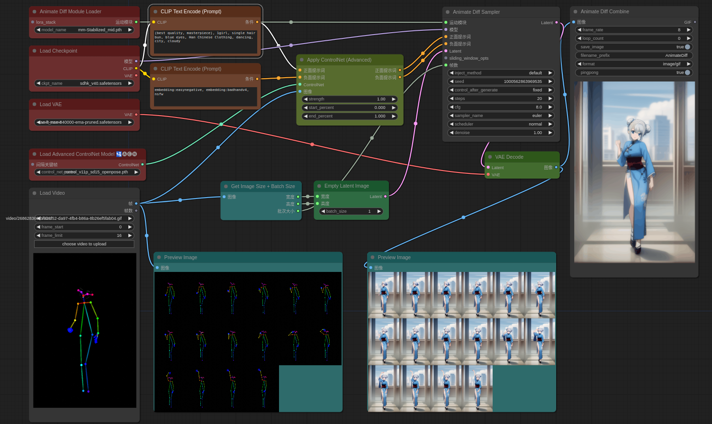
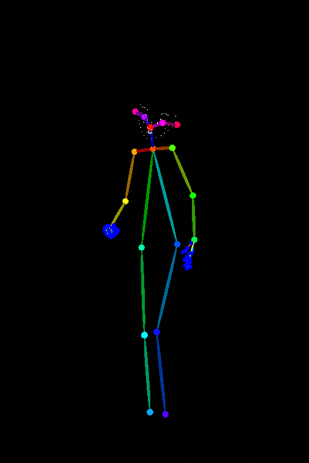
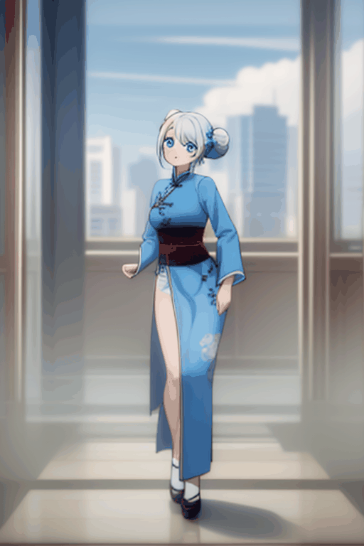
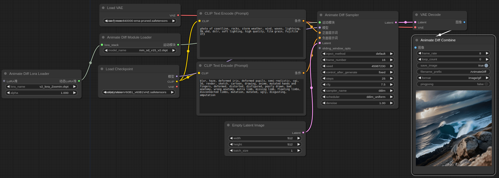
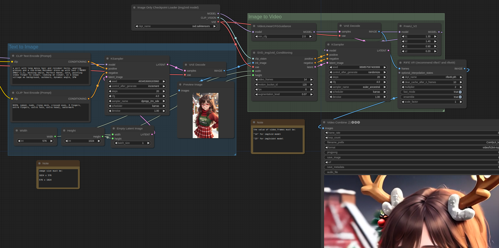
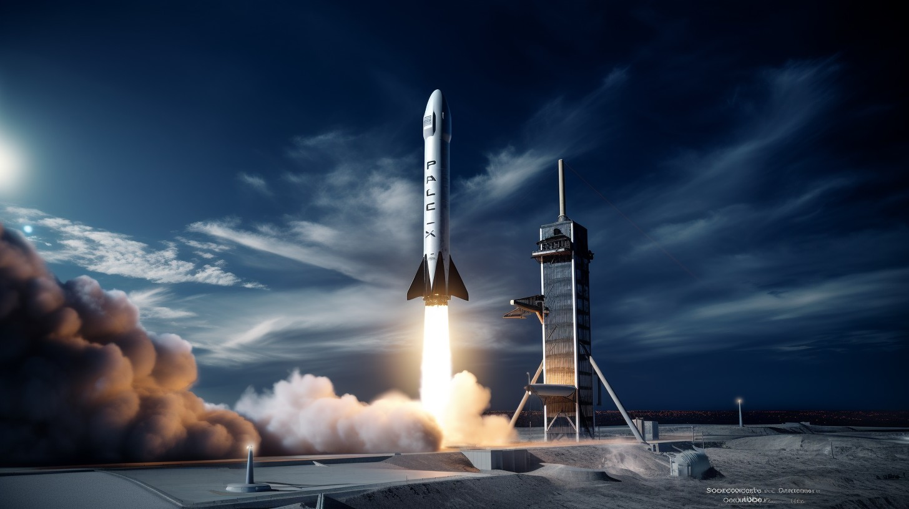

---
tags:
  - AIGC
  - Text-to-Video
  - Image-to-Video
---

# AI动画
- Gen-1(2023): Runway 公司的Video to Video的AI产品。https://arxiv.org/abs/2302.03011
- Gen-2(2023): Runway 公司的Text/Image to Video的AI产品。  [Paper Coming Soon](https://research.runwayml.com/gen2)
- Animate Diff: [open source](https://github.com/guoyww/AnimateDiff/), 结合Stable Diffusion的开源视频生成模型。 需要12G显存）https://arxiv.org/abs/2307.04725
- Deforum: open source, 使用 Stable Diffusion 创建动画视频的工具。
- Kaiber.ai: AI创作者平台，输入图片/视频/prompt生成视频，Audioreactivity。
- Pika Labs: Text-to-Video，Discord上通过聊天机器人使用

## Text-to-Video

### Gen-2

给一个图片和一段Prompt生成视频，也可以只给文字。

[体验入口](http://app.runwayml.com/)

### Pika Labs

### AnimateDiff
#### AnimateDiff & ControlNet & Pose

将AnimateDiff、动作序列和ControlNet并入一个工作流，实现文生视频（和Animate Anyone相比，效果稍微差一些，但Animate Anyone是图生视频）



#### AnimateDiff + 动态LoRA实现视角控制
将AnimateDiff在原有算法的基础上结合视角控制的LoRA并入一个工作流


#### AnimateDiff-Lightning

[Demo](https://huggingface.co/spaces/ByteDance/AnimateDiff-Lightning) | [Model & Workflow](https://huggingface.co/ByteDance/AnimateDiff-Lightning)

### 文生图 + SVD

*通过文字生成视频序列工作流*

### Sora
Sora is a diffusion model, which generates a video by starting off with one that looks like static noise and gradually transforms it by removing the noise over many steps.

Similar to GPT models, Sora uses a transformer architecture, unlocking superior scaling performance.

Sora builds on past research in DALL·E and GPT models. It uses the recaptioning technique from DALL·E 3, which involves generating highly descriptive captions for the visual training data.

Sora is a diffusion model; given input noisy patches (and conditioning information like text prompts), it’s trained to predict the original “clean” patches. Importantly, Sora is a diffusion transformer.


高斯模型转换，将生成的视频分解成29个图片一个文件夹的形式，使用[gaussian-splatting](https://github.com/graphdeco-inria/gaussian-splatting)库训练。

Sora的一个复现项目 [Project(已失效)](https://pku-yuangroup.github.io/Open-Sora-Plan/blog_cn.html) | [Code](https://github.com/PKU-YuanGroup/Open-Sora-Plan) | [Demo](https://huggingface.co/spaces/LanguageBind/Open-Sora-Plan-v1.0.0) | [Report](https://github.com/PKU-YuanGroup/Open-Sora-Plan/blob/main/docs/Report-v1.0.0.md)

## Image-to-Video
可以分为两类，一类是给图片(可附加文字)生成视频，另一类是给图片和对应的特征(语义，关节点，normal map等)生成视频，如果每一帧都能提供特征，理论上可以使视频的长度很长，不受限制。

### Gen-2

给一个图片和一段Prompt生成视频，也可以只给图片，如果不想视频和图片差异太大就只给图片。

[体验入口](http://app.runwayml.com/)

### Animate Anyone
[Project](https://humanaigc.github.io/animate-anyone/) | [Code](https://github.com/HumanAIGC/AnimateAnyone/tree/main)

复刻项目：
- https://github.com/novitalabs/AnimateAnyone
- https://github.com/MooreThreads/Moore-AnimateAnyone

Animate Anyone 是阿里提出的用于人物动画场景的图生视频的方法，只需一张人物照片，再配合骨骼动画引导，就能生成动画视频。

### MusePose
[Code](https://github.com/TMElyralab/MusePose)

### Magic Animate

- diffusion model

[Project](https://showlab.github.io/magicanimate/) | [Code](https://github.com/magic-research/magic-animate)

新加坡国立大学与字节合作推出MagicAnimate框架，可以通过一张照片和一组语义分割图像生成动画视频。

### ToonCrafter
我草这啥玩意儿
https://github.com/ToonCrafter/ToonCrafter | [Model](https://huggingface.co/Doubiiu/ToonCrafter)

ToonCrafter can interpolate two cartoon images by leveraging the pre-trained image-to-video diffusion priors.

#### Install
```shell
conda create -n tooncrafter python=3.8.5
conda activate tooncrafter
pip install -r requirements.txt

mkdir checkpoints
mkdir checkpoints/tooncrafter_512_interp_v1
mkdir laion
mkdir CLIP-ViT-H-14-laion2B-s32B-b79K
```

- Download pretrained [ToonCrafter_512](https://huggingface.co/Doubiiu/ToonCrafter/tree/main) and put the `model.ckpt` in `checkpoints/tooncrafter_512_interp_v1/model.ckpt`.
- 【本地加载CLIP-ViT-H-14-laion2B-s32B-b79K】下载 https://huggingface.co/laion/CLIP-ViT-H-14-laion2B-s32B-b79K/tree/main 的`open_clip_pytorch_model.bin`，放入刚创建的`laion/CLIP-ViT-H-14-laion2B-s32B-b79K`，修改`lvdm/modules/encoders/condition.py`
```python
class FrozenOpenCLIPEmbedder(AbstractEncoder):
    """
    Uses the OpenCLIP transformer encoder for text
    """
    LAYERS = [
        # "pooled",
        "last",
        "penultimate"
    ]

    def __init__(self, arch="ViT-H-14", version="laion2b_s32b_b79k", device="cuda", max_length=77,
                 freeze=True, layer="last"):
        super().__init__()
        assert layer in self.LAYERS
        model, _, _ = open_clip.create_model_and_transforms(arch, device=torch.device('cpu'), pretrained=version) # [!code --]
        model, _, _ = open_clip.create_model_and_transforms(arch, device=torch.device('cpu'), pretrained="laion/CLIP-ViT-H-14-laion2B-s32B-b79K/open_clip_pytorch_model.bin") # [!code ++]
        ......

class FrozenOpenCLIPImageEmbedderV2(AbstractEncoder):
    """
    Uses the OpenCLIP vision transformer encoder for images
    """

    def __init__(self, arch="ViT-H-14", version="laion2b_s32b_b79k", device="cuda",
                 freeze=True, layer="pooled", antialias=True):
        super().__init__()
        model, _, _ = open_clip.create_model_and_transforms(arch, device=torch.device('cpu'), pretrained=version) # [!code --]
        model, _, _ = open_clip.create_model_and_transforms(arch, device=torch.device('cpu'), pretrained="laion/CLIP-ViT-H-14-laion2B-s32B-b79K/open_clip_pytorch_model.bin") # [!code ++]
```

#### Run
```shell
CUDA_VISIBLE_DEVICES=0 python3 gradio_app.py
```

### MegActor
[Project](https://megvii-research.github.io/MegFaceAnimate/)

通过人像说话的视频驱动照片

### Stable Video Diffusion

*通过任意一张图片生成视频序列工作流*


*原始图片*


*SVD生成视频*


*加入补帧算法后效果*

### Sora

## Video-to-Video
### Gen-1
[体验入口](http://app.runwayml.com/)

### Sora
主要功能有：
- 修改风格和环境
- **Connecting videos:** 输入两个video，生成一个新视频包含有两个视频的内容和过渡

## 名词解释

- **Toon**
TOONは漫画・アニメ。
さてtoonという英単語には、漫画やアニメを表すcartoonの簡略表記の意味がある。

