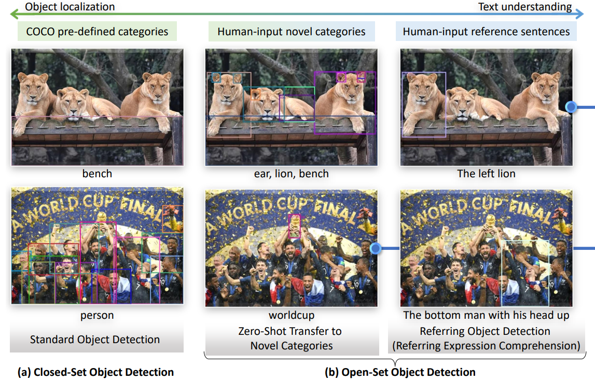
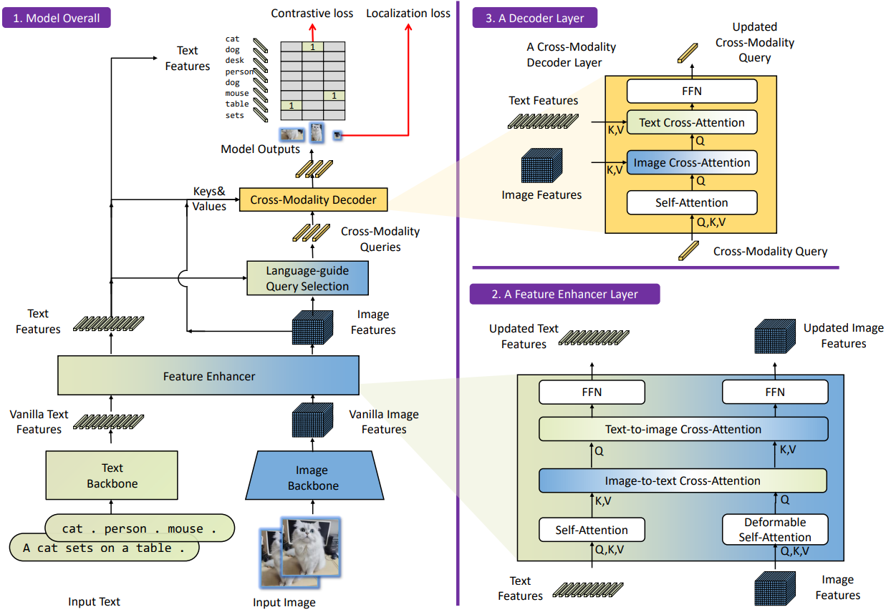
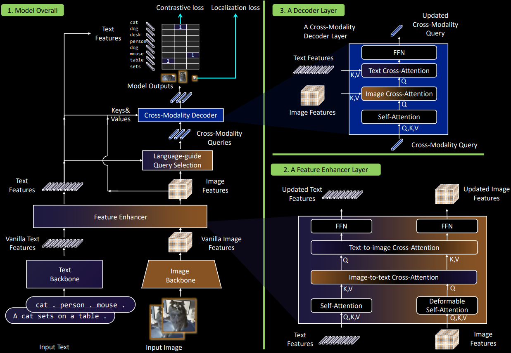

---
tags:
  - 机器视觉
  - Computer Vision
---

# Grounding DINO

[Paper](https://arxiv.org/pdf/2303.05499) | [grounding-dino-tiny](https://huggingface.co/IDEA-Research/grounding-dino-tiny/tree/main)
| [grounding-dino-base](https://huggingface.co/IDEA-Research/grounding-dino-base)

Open set object detection



<style>
html.dark .light-mode {
  display: none;
}

html.dark .dark-mode {
  display: block;
}

html:not(.dark) .light-mode {
  display: block;
}

html:not(.dark) .dark-mode {
  display: none;
}
</style>

Framework
<div class="theme-image">
  
  
</div>


## Install

要使用较新版本的`transformers`(4.39版本不行)
```shell
pip install transformers==4.41.1
```

## 用例
```python
import os
os.environ["all_proxy"] = ""

import cv2
import numpy as np
import requests

import torch
from PIL import Image
from transformers import AutoProcessor, AutoModelForZeroShotObjectDetection

model_id = "IDEA-Research/grounding-dino-tiny"

device = "cuda"
#device = "cpu"

processor = AutoProcessor.from_pretrained(model_id)
model = AutoModelForZeroShotObjectDetection.from_pretrained(model_id).to(device)  # 这个语句会使imshow失效

image_url = "http://images.cocodataset.org/val2017/000000039769.jpg"
image = Image.open(requests.get(image_url, stream=True).raw)
# Check for cats and remote controls
text = "a cat. a remote control."

inputs = processor(images=image, text=text, return_tensors="pt").to(device)
with torch.no_grad():
    outputs = model(**inputs)

results = processor.post_process_grounded_object_detection(
    outputs,
    inputs.input_ids,
    box_threshold=0.4,
    text_threshold=0.3,
    target_sizes=[image.size[::-1]]
)

name = results[0]['labels']
xyxy = results[0]['boxes'].cpu().numpy().astype(np.float16)

# 将 PIL 图像转换为 OpenCV 格式
image_cv = cv2.cvtColor(np.array(image), cv2.COLOR_RGB2BGR)

# 在图像上绘制边界框和标签
for box, label in zip(xyxy, name):
    # 绘制边界框
    x1, y1, x2, y2 = map(int, box)
    cv2.rectangle(image_cv, (x1, y1), (x2, y2), (0, 255, 0), 2)

    # 绘制标签
    label_text = label
    cv2.putText(image_cv, label_text, (x1, y1 - 10), cv2.FONT_HERSHEY_SIMPLEX, 0.9, (0, 255, 0), 2)


# Save图像
cv2.imwrite("output.jpg", image_cv)

```

