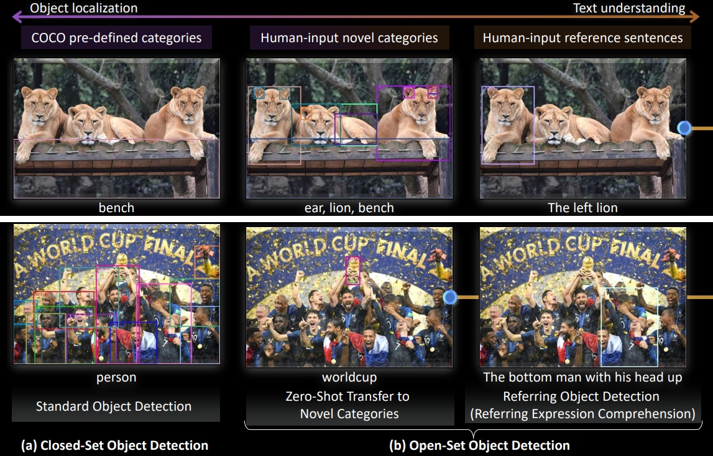

---
tags:
  - 机器视觉
  - Computer Vision
---

<style>
html.dark .light-mode {
  display: none;
}

html.dark .dark-mode {
  display: block;
}

html:not(.dark) .light-mode {
  display: block;
}

html:not(.dark) .dark-mode {
  display: none;
}
</style>

# Grounding DINO

[Paper](https://arxiv.org/pdf/2303.05499) | [grounding-dino-tiny](https://huggingface.co/IDEA-Research/grounding-dino-tiny/tree/main)
| [grounding-dino-base](https://huggingface.co/IDEA-Research/grounding-dino-base)

Open set object detection
<div class="theme-image">
  
  
</div>


Framework
<div class="theme-image">
  
  
</div>


## Install

要使用较新版本的`transformers`(4.39版本不行)
```shell
pip install transformers==4.41.1
```

## 用例
```python
import os
os.environ["all_proxy"] = ""

import cv2
import numpy as np
import requests

import torch
from PIL import Image
from transformers import AutoProcessor, AutoModelForZeroShotObjectDetection

model_id = "IDEA-Research/grounding-dino-tiny"

device = "cuda"
#device = "cpu"

processor = AutoProcessor.from_pretrained(model_id)
model = AutoModelForZeroShotObjectDetection.from_pretrained(model_id).to(device)  # 这个语句会使imshow失效

image_url = "http://images.cocodataset.org/val2017/000000039769.jpg"
image = Image.open(requests.get(image_url, stream=True).raw)
# Check for cats and remote controls
text = "a cat. a remote control."

inputs = processor(images=image, text=text, return_tensors="pt").to(device)
with torch.no_grad():
    outputs = model(**inputs)

results = processor.post_process_grounded_object_detection(
    outputs,
    inputs.input_ids,
    box_threshold=0.4,
    text_threshold=0.3,
    target_sizes=[image.size[::-1]]
)

name = results[0]['labels']
xyxy = results[0]['boxes'].cpu().numpy().astype(np.float16)

# 将 PIL 图像转换为 OpenCV 格式
image_cv = cv2.cvtColor(np.array(image), cv2.COLOR_RGB2BGR)

# 在图像上绘制边界框和标签
for box, label in zip(xyxy, name):
    # 绘制边界框
    x1, y1, x2, y2 = map(int, box)
    cv2.rectangle(image_cv, (x1, y1), (x2, y2), (0, 255, 0), 2)

    # 绘制标签
    label_text = label
    cv2.putText(image_cv, label_text, (x1, y1 - 10), cv2.FONT_HERSHEY_SIMPLEX, 0.9, (0, 255, 0), 2)


# Save图像
cv2.imwrite("output.jpg", image_cv)

```

### 基于DINO实现的自动化标注
```python
import os
os.environ["all_proxy"] = ""

import cv2
import numpy as np

import torch
from PIL import Image
from transformers import AutoProcessor, AutoModelForZeroShotObjectDetection

from xml.etree import ElementTree as ET
from xml.dom import minidom
import tqdm

prompt = ["person", "car"]
model_id = "IDEA-Research/grounding-dino-tiny"

img_label_path = "XXXXX"
verbose = False
thr = 0.42

device = "cuda"
#device = "cpu"

processor = AutoProcessor.from_pretrained(model_id)
model = AutoModelForZeroShotObjectDetection.from_pretrained(model_id).to(device)  # 这个语句会使imshow失效


def remove_empty_lines(file_path):
    try:
        # 读取文件内容
        with open(file_path, 'r') as file:
            lines = file.readlines()

        # 删除空行
        non_empty_lines = [line for line in lines if line.strip()]

        # 保存修改后的内容
        with open(file_path, 'w') as file:
            file.writelines(non_empty_lines)

        #print(f"Empty lines removed from {file_path}")
    except Exception as e:
        print(f"Error: {e}")


def prettify(elem):
    """Return a pretty-printed XML string for the Element."""
    rough_string = ET.tostring(elem, 'utf-8')
    reparsed = minidom.parseString(rough_string)
    return reparsed.toprettyxml(indent="  ")


def add_object_to_annotation(xml_path, predictions, class_names, img_shape, fname):
    tree = ET.parse("template.xml")
    root = tree.getroot()

   # print(root.findall('path')[0].text)
    size_element = root.find('size')
    width_element = size_element.find('width')
    width_element.text = str(img_shape[0])
    height_element = size_element.find('height')
    height_element.text = str(img_shape[1])

    file_name_element = root.find('filename')
    file_name_element.text = fname


    for prediction, class_name in zip(predictions, class_names):
        if True:
            obj = ET.Element('object')

            name = ET.Element('name')
            name.text = class_name
            obj.append(name)

            bndbox = ET.Element('bndbox')
            xmin = ET.Element('xmin')
            xmin.text = str(prediction[0])
            bndbox.append(xmin)

            ymin = ET.Element('ymin')
            ymin.text = str(prediction[1])
            bndbox.append(ymin)

            xmax = ET.Element('xmax')
            xmax.text = str(prediction[2])
            bndbox.append(xmax)

            ymax = ET.Element('ymax')
            ymax.text = str(prediction[3])
            bndbox.append(ymax)

            obj.append(bndbox)

            root.append(obj)

   # save_file = xml_path[:-len('.xml')]+'_new.xml'
    save_file = xml_path
    # Save the updated XML with pretty formatting
    with open(save_file, 'w+') as file:
        file.write(prettify(root))

    remove_empty_lines(save_file)


files = os.listdir(img_label_path)
img_list = [f for f in files if '.jpg' in f]
img_list.sort()
text = ". ".join(prompt) + '.'

for i in tqdm.tqdm(range(len(img_list))[:]):
    img_file = os.path.join(img_label_path, img_list[i])
    image = Image.open(img_file)

    inputs = processor(images=image, text=text, return_tensors="pt").to(device)
    with torch.no_grad():
        outputs = model(**inputs)

    results = processor.post_process_grounded_object_detection(
        outputs,
        inputs.input_ids,
        box_threshold=thr,
        text_threshold=0.3,
        target_sizes=[image.size[::-1]]
    )

    # Update the corresponding XML annotation
    annotation_path = os.path.join(img_label_path, img_list[i].replace('.jpg', '.xml'))
    predictions = results[0]['boxes'].cpu().numpy().astype(np.float16)
    class_names = results[0]['labels']
    add_object_to_annotation(annotation_path, predictions, class_names, image.size, img_list[i])
```
