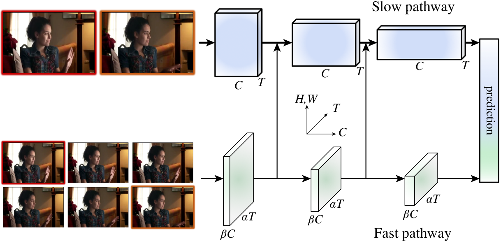
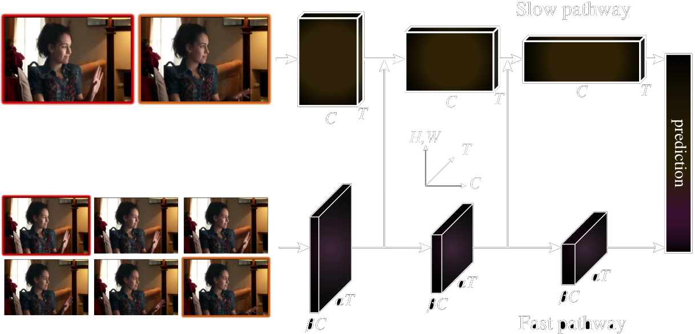

---
tags:
  - 机器视觉
  - Computer Vision
---

<style>
html.dark .light-mode {
  display: none;
}

html.dark .dark-mode {
  display: block;
}

html:not(.dark) .light-mode {
  display: block;
}

html:not(.dark) .dark-mode {
  display: none;
}
</style>

# Motion

https://github.com/facebookresearch/SlowFast/blob/main/INSTALL.md

## SlowFast算法
[Paper](https://arxiv.org/abs/1812.03982v1) | [Code](https://github.com/facebookresearch/SlowFast)

### 原理

SlowFast是Facebook一篇视频识别论文，受到灵长类动物的视网膜神经细胞种类的启发（大约80%的细胞（P-cells）以低频运作，可以识别细节信息；而大约20%的细胞（M-cells）则以高频运作，对时间的变化敏感）
<div class="theme-image">
  
  
</div>

### Install
```shell
git clone https://github.com/facebookresearch/slowfast
export PYTHONPATH=/path/to/SlowFast/slowfast:$PYTHONPATH
cd slowfast
python3 setup.py build develop
pip install iopath simplejson av pytorchvideo

pip install 'git+https://github.com/facebookresearch/fairscale'

git clone https://github.com/facebookresearch/pytorchvideo.git
cd pytorchvideo
pip install -e .

git clone https://github.com/facebookresearch/detectron2 detectron2_repo
pip install -e detectron2_repo
```

### YOLO v5 & DeepSORT & SlowFast
先使用YOLO做Object detection，然后使用DeepSORT进行MOT。连续多帧之后，Slowfast算法对每一个Tracklet图片的时间序列分类

numpy 1.23.5

项目地址：https://github.com/Whiffe/yolov5-slowfast-deepsort-PytorchVideo
