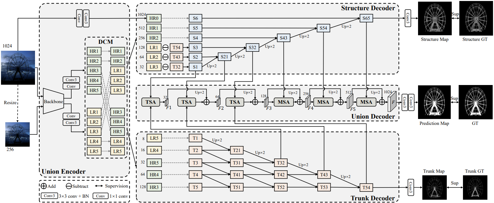
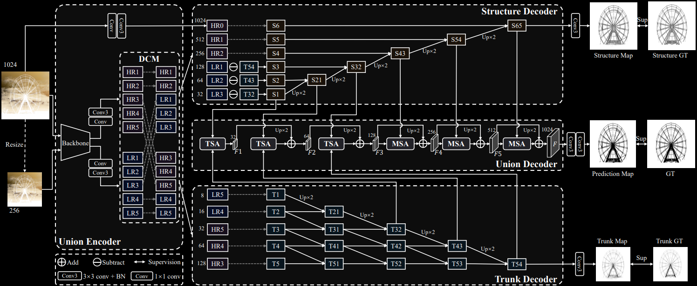

---
tags:
  - 机器视觉
  - Computer Vision
  - 图像语义分割
  - 实例分割
---
# Segment

<style>
html.dark .light-mode {
  display: none;
}

html.dark .dark-mode {
  display: block;
}

html:not(.dark) .light-mode {
  display: block;
}

html:not(.dark) .dark-mode {
  display: none;
}
</style>

## Segment Anything Model

[Base Model DL](https://github.com/ultralytics/assets/releases/download/v8.1.0/sam_b.pt) | [Paper](https://arxiv.org/pdf/2304.02643)

SAM2: [Project](https://ai.meta.com/sam2/) | [Demo](https://huggingface.co/spaces/junma/MedSAM2) | [Paper](https://arxiv.org/abs/2408.00714) | [Code](https://github.com/facebookresearch/segment-anything-2) | [HF，他们居然保留了Facebook作为帐号名](https://huggingface.co/facebook/sam2-hiera-tiny) | [u版](https://docs.ultralytics.com/models/sam-2/#segment-everything)

## 自动标注
```python
from ultralytics.data.annotator import auto_annotate

auto_annotate(data="path/to/images", det_model="yolov8x.pt", sam_model="sam_b.pt")
```

## DepthAnything
https://huggingface.co/depth-anything/Depth-Anything-V2-Small-hf

```python
import os
os.environ["all_proxy"] = ""
from transformers import pipeline
from PIL import Image

# load pipe
pipe = pipeline(task="depth-estimation", model="depth-anything/Depth-Anything-V2-Small-hf")

# load image
url = 'http://images.cocodataset.org/val2017/000000039769.jpg'
#image = Image.open(requests.get(url, stream=True).raw)
image = Image.open("crop.jpg")

# inference
depth = pipe(image)["depth"]

import numpy as np
depth_threshold = 100
depth_array = np.array(depth)

# 生成深度掩膜
mask = (depth_array > depth_threshold).astype(np.uint8) * 255

# 保存图像到文件
depth.save('output.jpg')
print("Done")
```

## UDUN

[Paper](https://arxiv.org/abs/2307.14052) | [Code](https://github.com/PJLallen/UDUN)

<div class="theme-image">
  
  
</div>

## Segment and Track Anything
[Code](https://github.com/z-x-yang/Segment-and-Track-Anything) | [Paper](https://arxiv.org/abs/2305.06558)

## RLE编码
rle编码的具体的读取代码如下：
```python
import numpy as np
import pandas as pd
import cv2

# 将图片编码为rle格式
def rle_encode(im):
    '''
    im: numpy array, 1 - mask, 0 - background
    Returns run length as string formated
    '''
    pixels = im.flatten(order = 'F')
    pixels = np.concatenate([[0], pixels, [0]])
    runs = np.where(pixels[1:] != pixels[:-1])[0] + 1
    runs[1::2] -= runs[::2]
    return ' '.join(str(x) for x in runs)

# 将rle格式进行解码为图片
def rle_decode(mask_rle, shape=(512, 512)):
    '''
    mask_rle: run-length as string formated (start length)
    shape: (height,width) of array to return
    Returns numpy array, 1 - mask, 0 - background

    '''
    s = mask_rle.split()
    starts, lengths = [np.asarray(x, dtype=int) for x in (s[0:][::2], s[1:][::2])]
    starts -= 1
    ends = starts + lengths
    img = np.zeros(shape[0]*shape[1], dtype=np.uint8)
    for lo, hi in zip(starts, ends):
        img[lo:hi] = 1
    return img.reshape(shape, order='F')

```
读取样例：
```python
# 读取第一张图，并将对于的rle解码为mask矩阵
img = cv2.imread('image_name')
mask = rle_decode(rle_code)

print(rle_encode(mask) == rle_code)
# 结果为True
```
