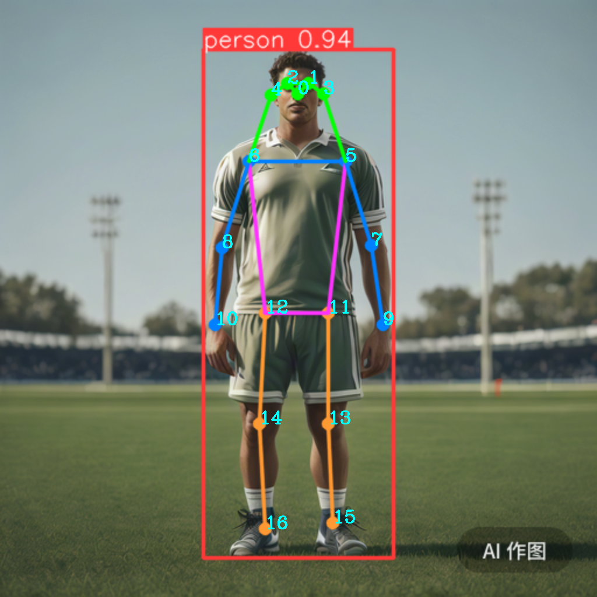
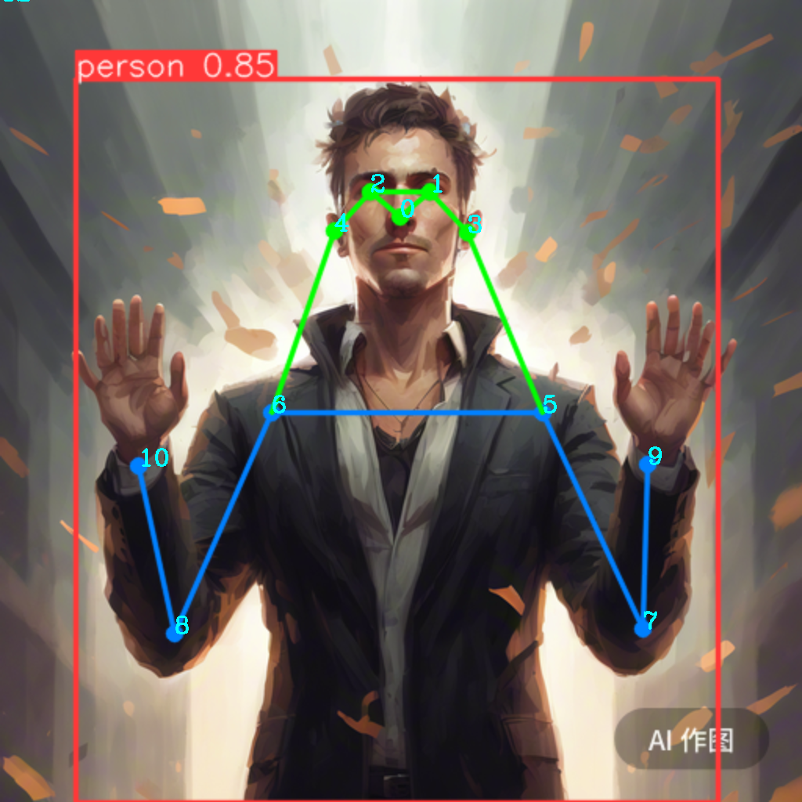

---
tags:
  - 机器视觉
  - Computer Vision
  - YOLO
---
# YOLO

YOLO: A Brief History
YOLO (You Only Look Once), a popular object detection and image segmentation model, was developed by Joseph Redmon and Ali Farhadi at the University of Washington. Launched in 2015, YOLO quickly gained popularity for its high speed and accuracy.

- YOLOv2, released in 2016, improved the original model by incorporating batch normalization, anchor boxes, and dimension clusters.
- YOLOv3, launched in 2018, further enhanced the model's performance using a more efficient backbone network, multiple anchors and spatial pyramid pooling.
- YOLOv4 was released in 2020, introducing innovations like Mosaic data augmentation, a new anchor-free detection head, and a new loss function.
- YOLOv5 further improved the model's performance and added new features such as hyperparameter optimization, integrated experiment tracking and automatic export to popular export formats.
- YOLOv6 was open-sourced by Meituan in 2022 and is in use in many of the company's autonomous delivery robots.
- YOLOv7 added additional tasks such as pose estimation on the COCO keypoints dataset.
- YOLOv8 is the latest version of YOLO by Ultralytics. As a cutting-edge, state-of-the-art (SOTA) model, YOLOv8 builds on the success of previous versions, introducing new features and improvements for enhanced performance, flexibility, and efficiency. YOLOv8 supports a full range of vision AI tasks, including detection, segmentation, pose estimation, tracking, and classification. This versatility allows users to leverage YOLOv8's capabilities across diverse applications and domains.
- YOLOv9 Introduces innovative methods like Programmable Gradient Information (PGI) and the Generalized Efficient Layer Aggregation Network (GELAN).

YOLO-NAS: YOLO Neural Architecture Search (NAS) Models.
Realtime Detection Transformers (RT-DETR): Baidu's PaddlePaddle Realtime Detection Transformer (RT-DETR) models.

YOLO-World: Real-time Open Vocabulary Object Detection models from Tencent AI Lab.

## YOLO v8
https://docs.ultralytics.com/models/yolov8/ | https://github.com/ultralytics/ultralytics

原理分C：https://mmyolo.readthedocs.io/zh-cn/latest/recommended_topics/algorithm_descriptions/yolov8_description.html

### Deploy
#### Python
```shell
pip install ultralytics
```

#### Docker

### Pose
#### 关节定义
```python
KEYPOINTS_NAMES = [
    "nose",  # 0
    "eye(L)",  # 1
    "eye(R)",  # 2
    "ear(L)",  # 3
    "ear(R)",  # 4
    "shoulder(L)",  # 5
    "shoulder(R)",  # 6
    "elbow(L)",  # 7
    "elbow(R)",  # 8
    "wrist(L)",  # 9
    "wrist(R)",  # 10
    "hip(L)",  # 11
    "hip(R)",  # 12
    "knee(L)",  # 13
    "knee(R)",  # 14
    "ankle(L)",  # 15
    "ankle(R)",  # 16
]
```



输出
```
0 [510 160]
1 [528 142]
2 [492 142]
3 [554 160]
4 [464 162]
5 [592 276]
6 [426 276]
7 [636 420]
8 [380 424]
9 [656 556]
10 [368 556]
11 [562 536]
12 [454 536]
13 [562 726]
14 [444 726]
15 [570 896]
16 [454 906]
```

图片中骨骼不全的情况


```
0 [510 276]
1 [548 244]
2 [472 244]
3 [596 296]
4 [426 294]
5 [692 526]
6 [346 526]
7 [820 802]
8 [222 808]
9 [826 592]
10 [176 594]
11 [0 0]
12 [0 0]
13 [0 0]
14 [0 0]
15 [0 0]
16 [0 0]
```

可知，当没有对应骨骼时，输出为0

#### 动作识别规划
使用normalize数据运算

输入向量：
$inputs = [k_5, k_6, k_7, k_8, k_9, k_{10}]$

batch设为历史中的10个数据，如果能可变任意长度那么训练数据为历史中的8-20个数据

如果某个值为0,那么就不检测。

输出向量：
动作类别`['打招呼', '过来', '停止', '无']`


#### Code
```python
from ultralytics import YOLO
import cv2

# Load a model
model = YOLO('yolov8s-pose.pt')  # load an official model

# Predict with the model
results = model('body2.png')  # predict on an image

# Process results list
for result in results:
    keypoints = result.keypoints.xy.cpu().numpy()  # Keypoints object for pose outputs
    keypoints = keypoints.astype('int') * 2

    im_array = result.plot()  # plot a BGR numpy array of predictions

    # 获取图像的高度和宽度
    height, width = im_array.shape[:2]

    # 将图像放大 1 倍
    im_array = cv2.resize(im_array, (2 * width, 2 * height))

    # 遍历所有骨架
    for person_keypoints in keypoints:
        # 遍历每个骨架下的所有关键点
        for keypoint_id, point in enumerate(person_keypoints):
            print(keypoint_id, point)
            cv2.putText(im_array, str(keypoint_id), point,
                                     cv2.FONT_HERSHEY_COMPLEX, 1, (255, 255,  0), 2)

    cv2.imshow('im_array', im_array)
    cv2.imwrite('result_pose.png', im_array)
    cv2.waitKey()
    cv2.destroyAllWindows()
```

## YOLO-World

https://docs.ultralytics.com/models/yolo-world/

Computer vision projects often involve spending a lot of time annotating data and training **object detection** models.
But, that might soon be a thing of the past. Tencent’s AI Lab released **YOLO-World**, a real-time, open-vocabulary object detection model, on January 31st, 2024.
YOLO-World is a zero-shot model, meaning you can run object detection inferences on images without having to train it.

### Install
```shell
pip install openai-clip
```

### Using
```python
# Import YOLOWorld class from ultralytics module
from ultralytics import YOLOWorld

# Initialize the model with pre-trained weights
model = YOLOWorld('yolov8m-worldv2.pt')

# Set the classes you'd like to find in your image
model.set_classes(["person"])

# Run object detection for your custom classes on your image
results = model.predict('00260-70362828.png', max_det=100, iou=0.01, conf=0.01)

# Save the results
results[0].save(filename='result.jpg')

```
散了吧，没那么神。都区分不了女人，男人，还是用YOLO v8吧

### 基于YOLO实现的自动化标注
```python
from ultralytics import YOLO
import numpy as np
import os
from xml.etree import ElementTree as ET
from xml.dom import minidom
import tqdm

img_label_path = "XXXXX"
verbose = False

def remove_empty_lines(file_path):
    try:
        # 读取文件内容
        with open(file_path, 'r') as file:
            lines = file.readlines()

        # 删除空行
        non_empty_lines = [line for line in lines if line.strip()]

        # 保存修改后的内容
        with open(file_path, 'w') as file:
            file.writelines(non_empty_lines)

        #print(f"Empty lines removed from {file_path}")
    except Exception as e:
        print(f"Error: {e}")


def prettify(elem):
    """Return a pretty-printed XML string for the Element."""
    rough_string = ET.tostring(elem, 'utf-8')
    reparsed = minidom.parseString(rough_string)
    return reparsed.toprettyxml(indent="  ")


def add_object_to_annotation(xml_path, predictions, class_names):
    tree = ET.parse(xml_path)
    root = tree.getroot()

    for prediction, class_name in zip(predictions, class_names):
        if class_name == 'person':
            obj = ET.Element('object')

            name = ET.Element('name')
            name.text = class_name
            obj.append(name)

            bndbox = ET.Element('bndbox')
            xmin = ET.Element('xmin')
            xmin.text = str(prediction[0])
            bndbox.append(xmin)

            ymin = ET.Element('ymin')
            ymin.text = str(prediction[1])
            bndbox.append(ymin)

            xmax = ET.Element('xmax')
            xmax.text = str(prediction[2])
            bndbox.append(xmax)

            ymax = ET.Element('ymax')
            ymax.text = str(prediction[3])
            bndbox.append(ymax)

            obj.append(bndbox)

            root.append(obj)

   # save_file = xml_path[:-len('.xml')]+'_new.xml'
    save_file = xml_path
    # Save the updated XML with pretty formatting
    with open(save_file, 'w') as file:
        file.write(prettify(root))

    remove_empty_lines(save_file)


if __name__ == '__main__':
    files = os.listdir(img_label_path)
    img_list = [f for f in files if '.jpg' in f]
    annotation_list = [f for f in files if '.xml' in f and 'new' not in f]
    img_list.sort()
    annotation_list.sort()
    print(len(img_list), len(annotation_list))

    # Load a model
    model = YOLO('yolov8x.pt')  # load an official model

    for i in tqdm.tqdm(range(len(img_list))[27:]):
        img_file = os.path.join(img_label_path, img_list[i])
        # Predict with the model
        result = model(img_file, verbose=verbose)[0]  # predict on an image

        # Update the corresponding XML annotation
        annotation_path = os.path.join(img_label_path, annotation_list[i])
        predictions = [(int(box[0]), int(box[1]), int(box[2]), int(box[3])) for box in result.boxes.xyxy.cpu().numpy()]
        class_names = [result.names[cls] for cls in result.boxes.cls.cpu().numpy()]
        add_object_to_annotation(annotation_path, predictions, class_names)

        if verbose:
            #boxes = result.boxes.data.cpu().numpy().astype(np.uint16)  # Boxes object for bbox outputs
            xyxy = result.boxes.xyxy.cpu().numpy().astype(np.uint16)
            cls = result.boxes.cls.cpu().numpy().astype(np.uint16)
            h = result.boxes.orig_shape[0]
            w = result.boxes.orig_shape[1]
            print("Processing", annotation_list[i])
            print("width:%d, height:%d" % (w, h))
            for i in range(len(xyxy)):
                # person
                if cls[i] == 0:
                    print(xyxy[i], result.names[cls[i]])

```
