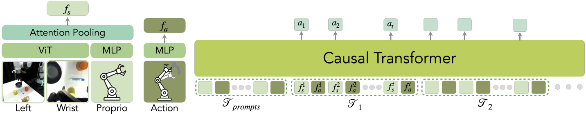
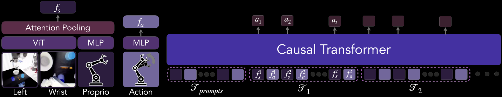
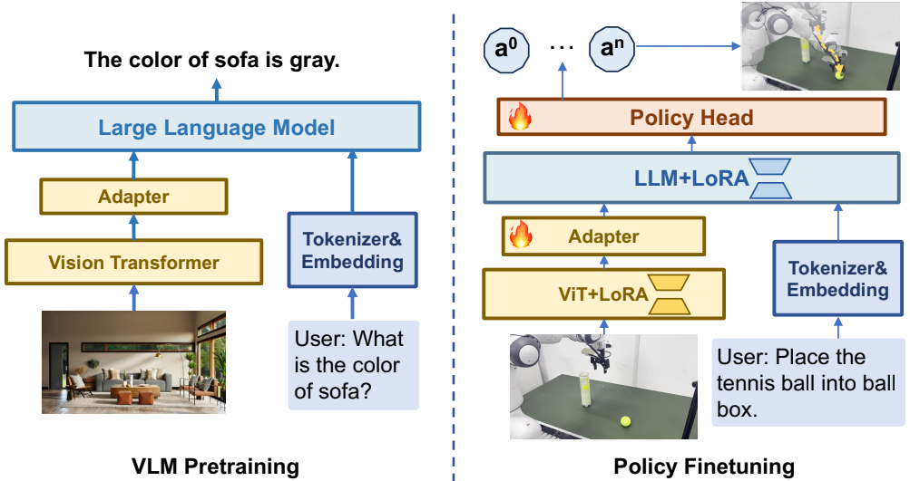

---
tags:
  - 机器人
  - 机械臂
---

# LLM机器人学

## ICRT

[model](https://github.com/Max-Fu/icrt/tree/main?tab=readme-ov-file)

  
  

这个方法属于一种”In-Context learning”机制，使用一组完整的数据（图像序列和动作）作为Prompt。然后在使用阶段输入观测的图像数据，（通过模仿promot）生成动作，整个过程不需要重新训练模型。

设计这样一个模型需要解决多模态问题，图像和动作是两种不同的模态，ICRT算法利用Vision Transformer(ViT)获取图像特征，机器人的动作通过一个普通的神经网络获取特征，将这两种特征混合在一起后输入给Transformer（7B大模型/简化版大模型），最终输出动作。

（和ACT结构很类似，图像使用ViT提取特征，而不用ResNet）

## TinyVLA

[Project](https://tiny-vla.github.io/) | [Github](https://github.com/lesjie-wen/tinyvla) | [Paper](https://arxiv.org/abs/2409.12514)

首先Backbone用公开数据集训练一个Vision-LLM，使其能够理解图像和语言。然后通过LoRA技术微调，使其适配机器人，并且微调不用重新训练整个大模型。
最后在Head部分不同与以往的action的discrete tokenization方法（训练很难，需要大量数据，tends to converge to a single state），这里使用了一种policy head去学习action space.
这里使用的是diffusion policy和Denoising Diffusion Probabilistic Models(DDPMs).（实际上就是一个去除噪声的过程）

机器人数据微调VLA模型: 用训练好的VLM权重来初始化，但是VLM只能生成语言，无法直接生成动作；OpenVLA和RT-2采用将动作离散化的方式，将动作预测任务转变成next token prediction任务，但这种方式会使得模型的训练难度大大增加；因此我们采取用policy head 网络替换原有的llm head，从而在不破坏动作连续性的同时，使得模型训练更加简单。我们采取Diffusion policy网络来预测动作。为了增加动作的一致性以及提升动作预测效率，TinyVLA一次性会预测未来16步的动作（没有找到依据）

