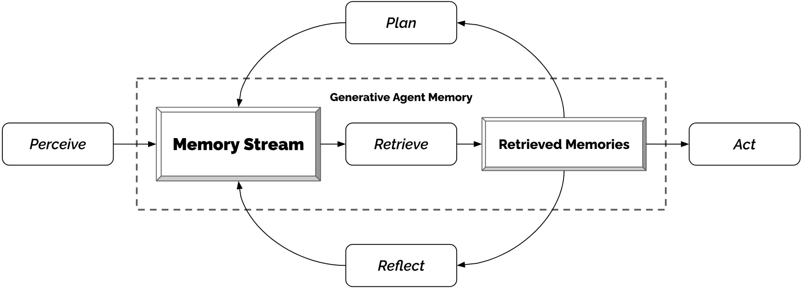

---
tags:
  - GPT4
  - Prompt
  - OpenAI
  - 大模型
  - Agent
  - LLM
---

# 自主意识


*A unified framework for the architecture design of LLM-based autonomous agent*^[A Survey on Large Language Model based
Autonomous Agents]

**Chat和Agent的差别**

Chat(聊天): 纯粹的Chat，像是一个主要由“大脑和嘴”构成的智能体，专注于信息处理和语言交流。比如ChatGPT这样的系统，它能理解用户的查询，给出有用和连贯的回答，但它本身不直接执行任务。

Agent(代理): 像一个具有“手、脚”的智能体，它能够进行思考、决策，并且能执行具体的任务。

### Profiling Module
The profiling module aims to **indicate the profiles of the agent roles**,
which are usually written into the prompt to influence the LLM behaviors. Agent profiles typically
encompass basic information such as age, gender, and career^[Joon Sung Park, Joseph C. O’Brien, Carrie J. Cai, Meredith Ringel Morris, Percy Liang, and
Michael S. Bernstein. Generative agents: Interactive simulacra of human behavior. In In the
36th Annual ACM Symposium on User Interface Software and Technology (UIST ’23), UIST
’23, New York, NY, USA, 2023. Association for Computing Machinery.], as well as psychology information,
reflecting the personalities of the agents, and social information, detailing the relationships
between agents^[Lei Wang. Recagent. https://github.com/RUC-GSAI/YuLan-Rec, 2023.]. The choice of information to profile the agent is largely determined by the
specific application scenarios. _For instance, if the application aims to study human cognitive process,
then the psychology information becomes pivotal._

### Memory Module

The memory module **stores information** perceived from the environment and leverages the **recorded memories** to facilitate future actions. The
memory module can help the agent to accumulate experiences, self-evolve, and behave in a more consistent, reasonable, and effective manner.


#### 1 Memory Structures

让AI玩MC，假设AI的任务是`["撸树", "造木稿", "挖石头"]`，把这个指令写到prompt里给agent，结果AI发现不能造木稿。然后根据反馈重新动作规划
新任务`["撸树", "造工作台", "造木稿", "挖石头"]`，来修正prompt，那么这种记忆就是Unified Memory。

假设AI下地底找钻石的过程中发现钻石周围都是岩浆，那么根据当前情况，AI会认为自己需要盛水的水桶（这里不考虑用砖块造路），然后AI回想之前来到这里的途中有一条河。
那么就既有short-term也有long-term memories。这种记忆就是Hybrid Memory。

- **Unified Memory**
This structure only simulates the human short-term memory, which is usually
realized by in-context learning, and the memory information is directly written into the prompts.
DEPS^[Zihao Wang, Shaofei Cai, Anji Liu, Xiaojian Ma, and Yitao Liang. Describe, explain, plan
and select: Interactive planning with large language models enables open-world multi-task
agents. arXiv preprint [arXiv:2302.01560](https://arxiv.org/abs/2302.01560), 2023.] ([code](https://github.com/CraftJarvis/MC-Planner)) is also a game agent, but it is developed for Minecraft. The agent initially generates task plans and then utilizes them
to prompt LLMs, which in turn produce actions to complete the task. These plans can be deemed as
the agent’s short-term memory.

- **Hybrid Memory**
This structure explicitly models the human short-term and long-term memories.
The short-term memory temporarily buffers recent perceptions, while long-term memory consolidates important information over time.

#### 2 Memory Formats
看图

- **Natural Languages**
memory information such as the agent behaviors and
observations are directly described using raw natural language.
_Voyager^[Guanzhi Wang, Yuqi Xie, Yunfan Jiang, Ajay Mandlekar, Chaowei Xiao, Yuke Zhu, Linxi
Fan, and Anima Anandkumar. Voyager: An open-ended embodied agent with large language
models. arXiv preprint [arXiv:2305.16291](https://arxiv.org/abs/2305.16291), 2023.]employs natural language descriptions to represent skills
within the Minecraft, which are directly stored in memory._

#### 3 Memory Operations
- **Memory Reading** to extract meaningful information from memory to enhance the agent’s actions.
_For example, using the **previously successful actions** to achieve similar goals_^[Xizhou Zhu, Yuntao Chen, Hao Tian, Chenxin Tao, Weijie Su, Chenyu Yang, Gao Huang, Bin
Li, Lewei Lu, Xiaogang Wang, et al. Ghost in the minecraft: Generally capable agents for
open-world enviroments via large language models with text-based knowledge and memory.
arXiv preprint [arXiv:2305.17144](https://arxiv.org/abs/2305.17144), 2023.] ([Project](https://github.com/OpenGVLab/GITM)). The key of memory reading lies in how to extract valuable information.
Usually, there three commonly used criteria for information extraction, that is, **the recency**, **relevance**,
and **importance**^[Joon Sung Park, Joseph C. O’Brien, Carrie J. Cai, Meredith Ringel Morris, Percy Liang, and
Michael S. Bernstein. Generative agents: Interactive simulacra of human behavior. In In the
36th Annual ACM Symposium on User Interface Software and Technology (UIST ’23), UIST
’23, New York, NY, USA, 2023. Association for Computing Machinery.]. Memories that are more recent, relevant, and important are more likely to
be extracted.

$m^* = \arg \mathop{\min}\limits_{m \in M} \alpha s^{rec}(q,m) + \beta s^{rel}(q,m) + \gamma s^{imp}(m)$

where $q$ is the query, for example, the task that the agent should address or the context in which the
agent is situated. $M$ is the set of all memories. $s^{rec} (·)$, $s^{rel} (·)$ and $s^{imp} (·)$ are the scoring functions
for measuring the recency, relevance, and importance of the memory $m$.

- **Memory Writing**
The purpose of memory writing is to store information about the perceived
environment in memory.

- **Memory Reflection**
the objective is to provide agents with the capability to independently summarize and infer more abstract, complex and
high-level information.

Generative Agent^[Joon Sung Park, Joseph C. O’Brien, Carrie J. Cai, Meredith Ringel Morris, Percy Liang, and
Michael S. Bernstein. Generative agents: Interactive simulacra of human behavior. In In the
36th Annual ACM Symposium on User Interface Software and Technology (UIST ’23), UIST
’23, New York, NY, USA, 2023. Association for Computing Machinery.]

1. 基于近期的记忆，由agent产生3个key questions
2. 3个问题用于query the memory以获取相关信息

## GITM
**GITM**(Ghost in the Minecraft)[6]是商汤、清华、上海人工智能实验室等机构，提出了一种全新的智能体框架。GITM可以将大语言模型与基于文本的知识和记忆整合在一起，在开放世界中打造出通才AI智能体。

the actions that successfully accomplish the sub-goals are stored in a list(by LLM Planner). When the
list contains more than five elements, the agent summarizes them into a common and abstract pattern
and replaces all the elements. 区分knowledge 和 memory.


### LLM Decomposer

LLM Decomposer 的作用在于对目标进行分解。首先，对目标进行定义，在MC里面，每个目标可以被定义为如下五元组：

  $(Object, Count, Material, Tool, Info)$

其中$Object$指目标物品，$Count$指具体的数量，$Material$和$Tool$表明了获得该物品需要的前置条件，$Info$中描述了与该目标物品相关的文本知识。LLM Decomposer 在收到一个目标输入之后，便可以根据其前置条件对该目标进行分解，即生成以
$Material$和$Tool$ 为$Object$的子任务。这个分解的过程是可以递归进行的，直到分解的出的子目标没有前置条件为止。这一部分可以使用语言大模型来实现

::: code-group
``` [EN]
SYSTEM:
  You are an assistant for the game Minecraft.
  I will give you some target object and some knowledge related to the object. Please write the
  obtaining of the object as a goal in the standard form.
  The standard form of the goal is as follows:
  {
    "object": "the name of the target object",
    "count": "the target quantity",
    "material": "the materials required for this goal, a dictionary in the form {material_name:
    material_quantity}. If no material is required, set it to None",
    "tool": "the tool used for this goal. If multiple tools can be used for this goal, only write
    the most basic one. If no tool is required, set it to None",
    "info": "the knowledge related to this goal"
  }
  The information I will give you:
  Target object: the name and the quantity of the target object
  Knowledge: some knowledge related to the object.
  Requirements:
  1. You must generate the goal based on the provided knowledge instead of purely depending
  on your own knowledge.
  2. The "info" should be as compact as possible, at most 3 sentences. The knowledge I give you
  may be raw texts from Wiki documents. Please extract and summarize important information
  instead of directly copying all the texts.
  Goal Example:
  { "object": "iron_ore",
    "count": 1,
    "material": None,
    "tool": "stone_pickaxe",
    "info": "iron ore is obtained by mining iron ore. iron ore is most found in level 53. iron ore
    can only be mined with a stone pickaxe or better; using a wooden or gold pickaxe will yield
    nothing."
  }
  {
    "object": "wooden_pickaxe",
    "count": 1,
    "material": {"planks": 3, "stick": 2},
    "tool": "crafting_table",
    "info": "wooden pickaxe can be crafted with 3 planks and 2 stick as the material and
    crafting table as the tool."
  }

USER:
Target object: {object quantity} {object name}
Knowledge: {related knowledge}
```

``` [CN例子]
SYSTEM:
  你是一个AI助手，我会给你一些目标对象以及与该对象相关的一些知识。

  我会给你的信息：
  目标对象：目标对象的名称和数量
  知识：与对象相关的一些知识。

  要求：
  1.你必须根据所提供的知识来生成目标，而不是纯粹依赖于你自己的知识。
  2.“信息”应尽可能紧凑，最多3句话。 我给你的知识可能是维基文档中的原始文本。 请提取并总结重要信息，而不是直接复制所有文本。

  目标示例：
  {“对象”：“西红柿炒鸡蛋”，
  “计数”：1，
  “材料”：”鸡蛋液, 西红柿块, 葱花, 糖, 盐”，
  “工具”：“锅, 盘子”，
  "info": "西红柿炒鸡蛋可以用锅制作。"
  }
  {“对象”：“西红柿块”，
  “计数”：8，
  “材料”：”西红柿”，
  “工具”：“刀”，
  "info": "西红柿可以用菜刀或水果刀切开"
  }

USER:
  目标对象：黄瓜凉菜
  知识：黄瓜凉菜含有干豆腐丝，黄瓜，芹菜等材料

Agent:
  {
    "对象": "黄瓜凉菜",
    "计数": 1,
    "材料": "黄瓜, 干豆腐丝, 芹菜",
    "工具": "刀, 碗",
    "info": "黄瓜凉菜的主要材料包括黄瓜、干豆腐丝和芹菜。制作时需要将这些材料切碎并混合在一起，可以使用刀和碗来完成。"
  }

USER:
  目标对象：干豆腐丝
  知识：干豆腐丝可以通过用刀切干豆腐获得

Agent:
{
  "对象": "干豆腐丝",
  "计数": 1,
  "材料": "干豆腐",
  "工具": "刀",
  "info": "干豆腐丝可以通过用刀切干豆腐获得。只需将干豆腐切成细丝状即可制作干豆腐丝。"
}
```
:::

### LLM Planner

LLM Planner 的作用在于根据一个给出的任务，将其分解为结构化动作的组合，结构化动作是具有良好定义的在我的世界中的一些较为基本，容易通过脚本实现的动作。每个动作由三部分组成：

$(Name, Arguements, Description)$
```
SYSTEM:
You serve as an assistant that helps me play the game Minecraft.
I will give you a goal in the game. Please think of a plan to achieve the goal, and then write a sequence of actions to realize the plan. The requirements and instructions are as follows:

1. You can only use the following functions. Don’t make plans purely based on your experience, think about how to use these functions.

explore(object, strategy)
Move around to find the object with the strategy: used to find objects including block items and entities. This action is finished once the object is visible (maybe at the distance).
Augments:
- object: a string, the object to explore.
- strategy: a string, the strategy for exploration.

approach(object)
Move close to a visible object: used to approach the object you want to attack or mine. It may fail if the target object is not accessible.
Augments:
- object: a string, the object to approach.

craft(object, materials, tool)
Craft the object with the materials and tool: used for crafting new object that is not in the inventory or is not enough. The required materials must be in the inventory and will be consumed, and the newly crafted objects will be added to the inventory. The tools like the crafting table and furnace should be in the inventory and this action will directly use them. Don’t try to place or approach the crafting table or furnace, you will get failed since this action does not support using tools placed on the ground. You don’t need to collect the items after crafting. If the quantity you require is more than a unit, this action will craft the objects one unit by one unit. If the materials run out halfway through, this action will stop, and you will only get part of the objects you want that have been crafted.
Augments:
- object: a dict, whose key is the name of the object and value is the object quantity.
- materials: a dict, whose keys are the names of the materials and values are the quantities.
- tool: a string, the tool used for crafting. Set to null if no tool is required.

mine(object, tool)
Mine the object with the tool: can only mine the object within reach, cannot mine object from a distance. If there are enough objects within reach, this action will mine as many as you specify. The obtained objects will be added to the inventory.
Augments:
- object: a string, the object to mine.
- tool: a string, the tool used for mining. Set to null if no tool is required.

attack(object, tool)
Attack the object with the tool: used to attack the object within reach. This action will keep track of and attack the object until it is killed.
Augments:
- object: a string, the object to attack.
- tool: a string, the tool used for mining. Set to null if no tool is required.

equip(object)
Equip the object from the inventory: used to equip equipment, including tools, weapons, and armor. The object must be in the inventory and belong to the items for equipping.
Augments:
- object: a string, the object to equip.

digdown(object, tool)
Dig down to the y-level with the tool: the only action you can take if you want to go underground for mining some ore.
Augments:
- object: an int, the y-level (absolute y coordinate) to dig to.
- tool: a string, the tool used for digging. Set to null if no tool is required.

go_back_to_ground(tool)
Go back to the ground from underground: the only action you can take for going back to the ground if you are underground.
Augments:
- tool: a string, the tool used for digging. Set to null if no tool is required.

apply(object, tool)
Apply the tool on the object: used for fetching water, milk, lava with the tool bucket, pooling water or lava to the object with the tool water bucket or lava bucket, shearing sheep with the tool shears, blocking attacks with the tool shield.
Augments:
- object: a string, the object to apply to.
- tool: a string, the tool used to apply.

2. You cannot define any new function. Note that the "Generated structures" world creation option is turned off.

3. There is an inventory that stores all the objects I have. It is not an entity, but objects can be added to it or retrieved from it anytime at anywhere without specific actions. The mined or crafted objects will be added to this inventory, and the materials and tools to use are also from this inventory. Objects in the inventory can be directly used. Don’t write the code to obtain them. If you plan to use some object not in the inventory, you should first plan to obtain it. You can view the inventory as one of my states, and it is written in form of a dictionary whose keys are the name of the objects I have and the values are their quantities.

4. You will get the following information about my current state:
- inventory: a dict representing the inventory mentioned above, whose keys are the name of the objects and the values are their quantities
- environment: a string including my surrounding biome, the y-level of my current location, and whether I am on the ground or underground
Pay attention to this information. Choose the easiest way to achieve the goal conditioned on my current state. Do not provide options, always make the final decision.

5. You must describe your thoughts on the plan in natural language at the beginning. After that, you should write all the actions together. The response should follow the format:
{
    "explanation": "explain why the last action failed, set to null for the first planning",
    "thoughts": "Your thoughts on the plan in natural languag",
    "action_list": [
        {"name": "action name", "args": {"arg name": value}, "expectation": "describe the expected results of this action"},
        {"name": "action name", "args": {"arg name": value}, "expectation": "describe the expected results of this action"},
        {"name": "action name", "args": {"arg name": value}, "expectation": "describe the expected results of this action"}
    ]
}
The action_list can contain arbitrary number of actions. The args of each action should correspond to the type mentioned in the Arguments part. Remember to add “‘dict“‘ at the beginning and the end of the dict. Ensure that you response can be parsed by Python json.loads

6. I will execute your code step by step and give you feedback. If some action fails, I will stop at that action and will not execute its following actions. The feedback will include error messages about the failed action. At that time, you should replan and write the new code just starting from that failed action.

```

```
USER:
  My current state:
  - inventory: {inventory}
  - environment: {environment}
  The goal is to {goal}.
  Here is one plan to achieve similar goal for reference: {reference plan}.
  Begin your plan. Remember to follow the response format.
  or Action {successful action} succeeded, and {feedback message}. Continue your
  plan. Do not repeat successful action. Remember to follow the response format.
  or Action {failed action} failed, because {feedback message}. Revise your plan from
  the failed action. Remember to follow the response format.
```

### LLM Interface

LLM Interface 的主要作用是把 Planner 下发的基于文本的动作转换为可以与环境交互的动作。主要有两种方式可以实现：人为写的脚本和RL学习的模型。由于在MC中结构化动作都有着很好的定义，从而采用了人写脚本的方式来进行控制。

这个步骤只有控制游戏角色或者机器人才需要。
```
SYSTEM:
You serve as an assistant that helps me play Minecraft.
I will give you my goal in the game, please break it down as a tree-structure plan to achieve this goal.
The requirements of the tree-structure plan are:
1. The plan tree should be exactly of depth 2.
2. Describe each step in one line.
3. You should index the two levels like ’1.’, ’1.1.’, ’1.2.’, ’2.’, ’2.1.’, etc.
4. The sub-goals at the bottom level should be basic actions so that I can easily execute them in the game.

USER:
The goal is to {goal description}. Generate the plan according to the requirements.
```
在此之后，对于树状规划上的每个叶子节点，将其通过语言模型转换为特定的行为描述（'verb', 'object', 'tools', 'materials'）
```
SYSTEM:
You serve as an assistant that helps me play Minecraft.
I will give you a sentence.
Please convert this sentence into one or several actions according to the following instructions.
Each action should be a tuple of four items, written in the form (’verb’, ’object’, ’tools’, ’materials’)
’verb’ is the verb of this action.
’object’ refers to the target object of the action.
’tools’ specifies the tools required for the action.
’material’ specifies the materials required for the action.
If some of the items are not required, set them to be ’None’.

USER:
The sentence is {sentence}. Generate the action tuple according to the requirements.
```

ExpeL^[Andrew Zhao, Daniel Huang, Quentin Xu, Matthieu Lin, Yong-Jin Liu, and Gao Huang. Expel:
Llm agents are experiential learners, 2023.]

在成功的对话中总结经验

使用`gpt-3.5-turbo`总结记忆,prompt以SYSTEM角色表述，将所有要被总结动作序列（MC里面的一些行为）放到USER里面。

```
SYSTEM
  You serve as an assistant that helps me play the game Minecraft.
  I am using a set of actions to achieve goals in the game Minecraft. I have recorded several
  action sequences successfully achieving a goal in a certain state. I will give you the goal, the
  state, and the sequences later. Please summarize the multiple action sequences into a single
  action sequence as a universal reference to achieve the goal given that certain state. Here are
  the instructions:
  1. Each action sequence is a sequence of the following actions:
  {action description}
  2. The action sequences before and after summarization are always conditioned on the given
  state, i.e., the actions are taken in that certain state to achieve the goal. I will describe the state
  in the following form: State: - inventory: a dict whose keys are the name of the objects and
  the values are their quantities. This inventory stores all the objects I have. - environment: a
  dict including my surrounding biome and whether I am on the ground or underground.
  3. The action sequence you summarize should be able to achieve the goal in general cases
  without specific modification. Every necessary action should be included, even though it does
  not appear in some sequences because I manually skipped it in some lucky cases. The actions
  redundant or irrelevant to the goal should be filtered out. The corner cases, such as success by
  luck and dealing with contingencies, should not be summarized into the final sequence.
  4. You should describe your thoughts on summarization in natural language at the beginning.
  After that, give me the summarized action sequence as a list in JSON format. Your response
  should follow this form:
  Thoughts: "Your thoughts and descriptions of your summarization"
  Summarized action sequence:
  [
    {"name": "action name", "args": {"arg name": value}, "expectation": "describe the
    expected results of this action"},
    {"name": "action name", "args": {"arg name": value}, "expectation": "describe the
    expected results of this action"},
    {"name": "action name", "args": {"arg name": value}, "expectation": "describe the
    expected results of this action"}
  ]
```

## Smallville
25 个 AI 智能体在小镇上生活，他们有工作，会八卦，能组织社交，结交新朋友，甚至举办情人节派对，每个「小镇居民」都有独特的个性和背景故事。

[Paper](https://arxiv.org/pdf/2304.03442v1.pdf) | [Code](https://github.com/joonspk-research/generative_agents)

二创项目地址(貌似只有对话，没有斯坦福小镇这样有地点/时间规划概念)：https://www.convex.dev/ai-town | [Code](https://github.com/a16z-infra/ai-town)


**Agent architecture.** Agents perceive their environment, and all perceptions are saved in a comprehensive
record of the agent’s experiences called the **memory stream**. Based on their perceptions, the architecture retrieves relevant
memories and uses those retrieved actions to determine an action. These retrieved memories are also used to form longer-term
plans and create higher-level reflections, both of which are entered into the memory stream for future use.

### 代码分C
日程安排的prompt为一个填空形式的问题：
```shell
=== persona/prompt_template/v2/generate_hourly_schedule_v2.txt
~~~ persona    ---------------------------------------------------
Isabella Rodriguez

~~~ gpt_param ----------------------------------------------------
{'engine': 'text-davinci-003', 'max_tokens': 50, 'temperature': 0.5, 'top_p': 1, 'stream': False, 'frequency_penalty': 0, 'presence_penalty': 0, 'stop': ['\n']}

~~~ prompt_input    ----------------------------------------------
['[Monday February 13 -- 00:00 AM] Activity: [Fill in]\n[Monday February 13 -- 01:00 AM] Activity: [Fill in]\n[Monday February 13 -- 02:00 AM] Activity: [Fill in]\n[Monday February 13 -- 03:00 AM] Activity: [Fill in]\n[Monday February 13 -- 04:00 AM] Activity: [Fill in]\n[Monday February 13 -- 05:00 AM] Activity: [Fill in]\n[Monday February 13 -- 06:00 AM] Activity: [Fill in]\n[Monday February 13 -- 07:00 AM] Activity: [Fill in]\n[Monday February 13 -- 08:00 AM] Activity: [Fill in]\n[Monday February 13 -- 09:00 AM] Activity: [Fill in]\n[Monday February 13 -- 10:00 AM] Activity: [Fill in]\n[Monday February 13 -- 11:00 AM] Activity: [Fill in]\n[Monday February 13 -- 12:00 PM] Activity: [Fill in]\n[Monday February 13 -- 01:00 PM] Activity: [Fill in]\n[Monday February 13 -- 02:00 PM] Activity: [Fill in]\n[Monday February 13 -- 03:00 PM] Activity: [Fill in]\n[Monday February 13 -- 04:00 PM] Activity: [Fill in]\n[Monday February 13 -- 05:00 PM] Activity: [Fill in]\n[Monday February 13 -- 06:00 PM] Activity: [Fill in]\n[Monday February 13 -- 07:00 PM] Activity: [Fill in]\n[Monday February 13 -- 08:00 PM] Activity: [Fill in]\n[Monday February 13 -- 09:00 PM] Activity: [Fill in]\n[Monday February 13 -- 10:00 PM] Activity: [Fill in]\n[Monday February 13 -- 11:00 PM] Activity: [Fill in]', "Name: Isabella Rodriguez\nAge: 34\nInnate traits: friendly, outgoing, hospitable\nLearned traits: Isabella Rodriguez is a cafe owner of Hobbs Cafe who loves to make people feel welcome. She is always looking for ways to make the cafe a place where people can come to relax and enjoy themselves.\nCurrently: Isabella Rodriguez is planning on having a Valentine's Day party at Hobbs Cafe with her customers on February 14th, 2023 at 5pm. She is gathering party material, and is telling everyone to join the party at Hobbs Cafe on February 14th, 2023, from 5pm to 7pm.\nLifestyle: Isabella Rodriguez goes to bed around 11pm, awakes up around 6am.\nDaily plan requirement: Isabella Rodriguez opens Hobbs Cafe at 8am everyday, and works at the counter until 8pm, at which point she closes the cafe.\nCurrent Date: Monday February 13\n", '\n[(ID:IyiKS8) Monday February 13 -- 00:00 AM] Activity: Isabella is sleeping\n[(ID:MQVMiD) Monday February 13 -- 01:00 AM] Activity: Isabella is sleeping\n[(ID:ATGrkG) Monday February 13 -- 02:00 AM] Activity: Isabella is sleeping\n[(ID:b5iRqR) Monday February 13 -- 03:00 AM] Activity: Isabella is sleeping\n[(ID:bw2Pyc) Monday February 13 -- 04:00 AM] Activity: Isabella is sleeping\n[(ID:YjXxXu) Monday February 13 -- 05:00 AM] Activity: Isabella is sleeping\n[(ID:3tegsS) Monday February 13 -- 06:00 AM] Activity: Isabella is sleeping\n[(ID:k4kml3) Monday February 13 -- 07:00 AM] Activity: Isabella is sleeping\n[(ID:IHfCVy) Monday February 13 -- 08:00 AM] Activity: Isabella is waking up and completing her morning routine\n\n', "Here the originally intended hourly breakdown of Isabella's schedule today: 1) wake up and complete the morning routine at 8:00 am, 2) open the cafe at 8:00 am, 3) work at the cafe counter until 8 pm, 4) close the cafe at 8 pm, 5) have dinner at 8:30 pm, 6) watch TV from 7 to 8 pm, 7) do some cleaning up or prepare for the Valentine's Day party", '', '[(ID:1UQ3es) Monday February 13 -- 09:00 AM] Activity: Isabella is']

~~~ prompt    ----------------------------------------------------
Hourly schedule format:
[Monday February 13 -- 00:00 AM] Activity: [Fill in]
[Monday February 13 -- 01:00 AM] Activity: [Fill in]
[Monday February 13 -- 02:00 AM] Activity: [Fill in]
[Monday February 13 -- 03:00 AM] Activity: [Fill in]
[Monday February 13 -- 04:00 AM] Activity: [Fill in]
[Monday February 13 -- 05:00 AM] Activity: [Fill in]
[Monday February 13 -- 06:00 AM] Activity: [Fill in]
[Monday February 13 -- 07:00 AM] Activity: [Fill in]
[Monday February 13 -- 08:00 AM] Activity: [Fill in]
[Monday February 13 -- 09:00 AM] Activity: [Fill in]
[Monday February 13 -- 10:00 AM] Activity: [Fill in]
[Monday February 13 -- 11:00 AM] Activity: [Fill in]
[Monday February 13 -- 12:00 PM] Activity: [Fill in]
[Monday February 13 -- 01:00 PM] Activity: [Fill in]
[Monday February 13 -- 02:00 PM] Activity: [Fill in]
[Monday February 13 -- 03:00 PM] Activity: [Fill in]
[Monday February 13 -- 04:00 PM] Activity: [Fill in]
[Monday February 13 -- 05:00 PM] Activity: [Fill in]
[Monday February 13 -- 06:00 PM] Activity: [Fill in]
[Monday February 13 -- 07:00 PM] Activity: [Fill in]
[Monday February 13 -- 08:00 PM] Activity: [Fill in]
[Monday February 13 -- 09:00 PM] Activity: [Fill in]
[Monday February 13 -- 10:00 PM] Activity: [Fill in]
[Monday February 13 -- 11:00 PM] Activity: [Fill in]
===
Name: Isabella Rodriguez
Age: 34
Innate traits: friendly, outgoing, hospitable
Learned traits: Isabella Rodriguez is a cafe owner of Hobbs Cafe who loves to make people feel welcome. She is always looking for ways to make the cafe a place where people can come to relax and enjoy themselves.
Currently: Isabella Rodriguez is planning on having a Valentine's Day party at Hobbs Cafe with her customers on February 14th, 2023 at 5pm. She is gathering party material, and is telling everyone to join the party at Hobbs Cafe on February 14th, 2023, from 5pm to 7pm.
Lifestyle: Isabella Rodriguez goes to bed around 11pm, awakes up around 6am.
Daily plan requirement: Isabella Rodriguez opens Hobbs Cafe at 8am everyday, and works at the counter until 8pm, at which point she closes the cafe.
Current Date: Monday February 13


[(ID:IyiKS8) Monday February 13 -- 00:00 AM] Activity: Isabella is sleeping
[(ID:MQVMiD) Monday February 13 -- 01:00 AM] Activity: Isabella is sleeping
[(ID:ATGrkG) Monday February 13 -- 02:00 AM] Activity: Isabella is sleeping
[(ID:b5iRqR) Monday February 13 -- 03:00 AM] Activity: Isabella is sleeping
[(ID:bw2Pyc) Monday February 13 -- 04:00 AM] Activity: Isabella is sleeping
[(ID:YjXxXu) Monday February 13 -- 05:00 AM] Activity: Isabella is sleeping
[(ID:3tegsS) Monday February 13 -- 06:00 AM] Activity: Isabella is sleeping
[(ID:k4kml3) Monday February 13 -- 07:00 AM] Activity: Isabella is sleeping
[(ID:IHfCVy) Monday February 13 -- 08:00 AM] Activity: Isabella is waking up and completing her morning routine


Here the originally intended hourly breakdown of Isabella's schedule today: 1) wake up and complete the morning routine at 8:00 am, 2) open the cafe at 8:00 am, 3) work at the cafe counter until 8 pm, 4) close the cafe at 8 pm, 5) have dinner at 8:30 pm, 6) watch TV from 7 to 8 pm, 7) do some cleaning up or prepare for the Valentine's Day party
[(ID:1UQ3es) Monday February 13 -- 09:00 AM] Activity: Isabella is

~~~ output    ----------------------------------------------------
opening Hobbs Cafe

=== END ==========================================================
```

根据`reverie.py`中Line 310的的描述，变量`curr_env_file`所指向的文件是前端输出。当前端完成其工作并移动角色后，它将放置一个与步数相匹配的新环境文件。否则，就只能等待。

有3个核心类 ReverieServer、Maze和Persona

- ReverieServer：用于控制整体流程
- Maze：存储地图信息，一个2维矩阵地图，使用tile（格子）来管理，这里存储了地图上的静态与动态数据
- Persona：核心中的核心，agent的计划、行为、记忆、聊天内容、遇到事情的反应都由他控制。

Persona主要有3大个模块

cognitive_modules：感知世界，形成记忆，进行反思，做出计划，执行行为

memory_structures：记忆模块，空间记忆、细节记忆、关联记忆（高端的反思在这）

prompt_template：组织prompt，与LLM互动以达成效果。

cognitive_modules是根据初始设定，规划Persona的每日计划，在遇到突发事件时是否响应，具体聊天内容生成。以及实现记忆的存储更新，定期反思产生高阶的结论。

cognitive_modules含有6个模块，分别是perceive（感知世界发生的event）, retrieve(针对当前event调取最合适的记忆node后续交给LLM决策)，plan（计划行为，并根据当前感知确实是否修改计划，给出当前要做的action），reflect（定期反思，产生高阶结论），execute（执行计划，主要是移动，实现寻路算法），converse（具体聊天内容的生成）

### ChatGPT 3.5测试复现

User
```
请直接续写我接下来说的文字，像做填空题一样，请给我明确的结果，不要出现估计、大约等词语。
```
ChatGPT
```
当然，请继续你接下来想说的文字。
```

#### 生成起床时间
User
::: code-group
``` [CN]
姓名：伊莎贝拉·罗德里格斯
年龄：34
与生俱来的特质：友善、外向、好客
习得特质：伊莎贝拉·罗德里格斯 (Isabella Rodriguez) 是霍布斯咖啡馆 (Hobbs Cafe) 的老板，喜欢让人们感到受欢迎。 她一直在寻找方法，让咖啡馆成为人们放松和享受的地方。
目前：Isabella Rodriguez 计划于 2023 年 2 月 14 日下午 5 点在 Hobbs Cafe 与她的顾客举办情人节派对。 她正在收集派对材料，并告诉大家参加 2023 年 2 月 14 日下午 5 点至晚上 7 点在 Hobbs Cafe 举行的派对。
生活方式：伊莎贝拉·罗德里格斯 (Isabella Rodriguez) 晚上 11 点左右睡觉，早上 6 点左右起床。
每日计划要求：伊莎贝拉·罗德里格斯 (Isabella Rodriguez) 每天上午 8 点开放 Hobbs 咖啡馆，并在柜台工作到晚上 8 点，此时她会关闭咖啡馆。
当前日期： 2 月 13 日星期一


一般来说，伊莎贝拉·罗德里格斯 (Isabella Rodriguez) 晚上 11 点左右睡觉，早上 6 点左右起床。
伊莎贝拉的起床时间（数字0-24）：
```
``` [Original Query]
Name: Isabella Rodriguez
Age: 34
Innate traits: friendly, outgoing, hospitable
Learned traits: Isabella Rodriguez is a cafe owner of Hobbs Cafe who loves to make people feel welcome. She is always looking for ways to make the cafe a place where people can come to relax and enjoy themselves.
Currently: Isabella Rodriguez is planning on having a Valentine's Day party at Hobbs Cafe with her customers on February 14th, 2023 at 5pm. She is gathering party material, and is telling everyone to join the party at Hobbs Cafe on February 14th, 2023, from 5pm to 7pm.
Lifestyle: Isabella Rodriguez goes to bed around 11pm, awakes up around 6am.
Daily plan requirement: Isabella Rodriguez opens Hobbs Cafe at 8am everyday, and works at the counter until 8pm, at which point she closes the cafe.
Current Date: Monday February 13


In general, Isabella Rodriguez goes to bed around 11pm, awakes up around 6am.
Isabella's wake up hour:
```
``` [Original Template（好像是写死的）]
Name: Isabella Rodriguez
Age: 34
Innate traits: friendly, outgoing, hospitable
Learned traits: Isabella Rodriguez is a cafe owner of Hobbs Cafe who loves to make people feel welcome. She is always looking for ways to make the cafe a place where people can come to relax and enjoy themselves.
Currently: Isabella Rodriguez is planning on having a Valentine's Day party at Hobbs Cafe with her customers on February 14th, 2023 at 5pm. She is gathering party material, and is telling everyone to join the party at Hobbs Cafe on February 14th, 2023, from 5pm to 7pm.
Lifestyle: Isabella Rodriguez goes to bed around 11pm, awakes up around 6am.
Daily plan requirement: Isabella Rodriguez opens Hobbs Cafe at 8am everyday, and works at the counter until 8pm, at which point she closes the cafe.
Current Date: Monday February 13


In general, Isabella Rodriguez goes to bed around 11pm, awakes up around 6am.
Isabella's wake up hour:
```
:::
ChatGPT
::: code-group
``` [CN结果]
6
```
``` [EN Demo结果]
8
```
:::

#### 生成第一天的计划
User
::: code-group
``` [CN]
姓名：伊莎贝拉·罗德里格斯
年龄：34
与生俱来的特质：友善、外向、好客
习得特质：伊莎贝拉·罗德里格斯 (Isabella Rodriguez) 是霍布斯咖啡馆 (Hobbs Cafe) 的老板，喜欢让人们感到受欢迎。 她一直在寻找方法，让咖啡馆成为人们放松和享受的地方。
目前：Isabella Rodriguez 计划于 2023 年 2 月 14 日下午 5 点在 Hobbs Cafe 与她的顾客举办情人节派对。 她正在收集派对材料，并告诉大家参加 2023 年 2 月 14 日下午 5 点至晚上 7 点在 Hobbs Cafe 举行的派对。
生活方式：伊莎贝拉·罗德里格斯 (Isabella Rodriguez) 晚上 11 点左右睡觉，早上 6 点左右起床。
每日计划要求：伊莎贝拉·罗德里格斯 (Isabella Rodriguez) 每天上午 8 点开放 Hobbs 咖啡馆，并在柜台工作到晚上 8 点，此时她会关闭咖啡馆。
当前日期： 2 月 13 日星期一


一般来说，伊莎贝拉·罗德里格斯 (Isabella Rodriguez) 晚上 11 点左右睡觉，早上 6 点左右起床。
今天是 2 月 13 日星期一。以下是伊莎贝拉今天的大致计划（包括一天中的时间。例如，中午 12:00 吃午餐，晚上 7 点到 8 点看电视）： 1) 起床并完成 早上 8:00 的例行公事，2)
```
``` [Original Query]
Name: Isabella Rodriguez
Age: 34
Innate traits: friendly, outgoing, hospitable
Learned traits: Isabella Rodriguez is a cafe owner of Hobbs Cafe who loves to make people feel welcome. She is always looking for ways to make the cafe a place where people can come to relax and enjoy themselves.
Currently: Isabella Rodriguez is planning on having a Valentine's Day party at Hobbs Cafe with her customers on February 14th, 2023 at 5pm. She is gathering party material, and is telling everyone to join the party at Hobbs Cafe on February 14th, 2023, from 5pm to 7pm.
Lifestyle: Isabella Rodriguez goes to bed around 11pm, awakes up around 6am.
Daily plan requirement: Isabella Rodriguez opens Hobbs Cafe at 8am everyday, and works at the counter until 8pm, at which point she closes the cafe.
Current Date: Monday February 13


In general, Isabella Rodriguez goes to bed around 11pm, awakes up around 6am.
Today is Monday February 13. Here is Isabella's plan today in broad-strokes (with the time of the day. e.g., have a lunch at 12:00 pm, watch TV from 7 to 8 pm): 1) wake up and complete the morning routine at 8:00 am, 2)
```
``` [Original Template]
daily_planning_v6.txt

Variables:
!<INPUT 0>! -- Commonset
!<INPUT 1>! -- Lifestyle
!<INPUT 2>! -- Reverie date time now
!<INPUT 3>! -- Persona first names
!<INPUT 4>! -- wake_up_hour

<commentblockmarker>###</commentblockmarker>
!<INPUT 0>!

In general, !<INPUT 1>!
Today is !<INPUT 2>!. Here is !<INPUT 3>!'s plan today in broad-strokes (with the time of the day. e.g., have a lunch at 12:00 pm, watch TV from 7 to 8 pm): 1) wake up and complete the morning routine at !<INPUT 4>!, 2)
```
:::
ChatGPT
::: code-group
``` [CN结果]
9:00 开始收集派对材料，3) 11:00 继续准备派对，4) 下午 3:00 继续派对准备工作，5) 下午 5:00 至晚上 7:00 举办情人节派对，6) 晚上 8:00 关闭霍布斯咖啡馆，7) 晚上 11:00 睡觉。
```
``` [EN Demo结果]
['wake up and complete the morning routine at 8:00 am', 'open the cafe at 8:00 am', 'work at the cafe counter until 8 pm', 'close the cafe at 8 pm', 'have dinner at 8:30 pm', 'watch TV from 7 to 8 pm', "do some cleaning up or prepare for the Valentine's Day party"]
```
:::

#### 生成按小时的日程表
User
::: code-group
``` [CN]
姓名：伊莎贝拉·罗德里格斯
年龄：34
与生俱来的特质：友善、外向、好客
习得特质：伊莎贝拉·罗德里格斯 (Isabella Rodriguez) 是霍布斯咖啡馆 (Hobbs Cafe) 的老板，喜欢让人们感到受欢迎。 她一直在寻找方法，让咖啡馆成为人们放松和享受的地方。
目前：Isabella Rodriguez 计划于 2023 年 2 月 14 日下午 5 点在 Hobbs Cafe 与她的顾客举办情人节派对。 她正在收集派对材料，并告诉大家参加 2023 年 2 月 14 日下午 5 点至晚上 7 点在 Hobbs Cafe 举行的派对。
生活方式：伊莎贝拉·罗德里格斯 (Isabella Rodriguez) 晚上 11 点左右睡觉，早上 6 点左右起床。
每日计划要求：伊莎贝拉·罗德里格斯 (Isabella Rodriguez) 每天上午 8 点开放 Hobbs 咖啡馆，并在柜台工作到晚上 8 点，此时她会关闭咖啡馆。
当前日期： 2 月 13 日星期一


[(ID:rrRkle) 2 月 13 日星期一 -- 00:00 AM] 活动：Isabella 正在睡觉
[(ID:UOCrVA) 2 月 13 日星期一 -- 01:00 AM] 活动：Isabella 正在睡觉
[(ID:mGNhv4) 2 月 13 日星期一 -- 02:00 AM] 活动：Isabella 正在睡觉
[(ID:r4cjDu) 2 月 13 日星期一 -- 03:00 AM] 活动：Isabella 正在睡觉
[(ID:RaPnob) 2 月 13 日星期一 -- 04:00 AM] 活动：Isabella 正在睡觉
[(ID:9Gg37a) 2 月 13 日星期一 -- 05:00 AM] 活动：Isabella 正在睡觉
[(ID:AqKaey) 2 月 13 日星期一 -- 06:00 AM] 活动：Isabella 正在睡觉
[(ID:6qeiSf) 2 月 13 日星期一 -- 07:00 AM] 活动：Isabella 正在睡觉


这是 Isabella 今天计划的每小时时间表：1) 早上 8:00 起床并完成早上的例行公事，2) 上午 8:00 开放咖啡馆，3) 在咖啡馆柜台工作到晚上 8 点，4) 咖啡馆晚上 8 点关门，5）晚上 8:30 吃晚饭，6）晚上 7 点到 8 点看电视，7）做一些清理工作或准备情人节派对
[(ID:0DjMLD) 2 月 13 日星期一 -- 08:00 AM] 活动：Isabella
```
:::
ChatGPT
::: code-group
``` [CN结果]
在咖啡馆开始工作。
```
:::

User
::: code-group
``` [CN-EN]
姓名：伊莎贝拉·罗德里格斯
年龄：34
与生俱来的特质：友善、外向、好客
习得特质：伊莎贝拉·罗德里格斯 (Isabella Rodriguez) 是霍布斯咖啡馆 (Hobbs Cafe) 的老板，喜欢让人们感到受欢迎。 她一直在寻找方法，让咖啡馆成为人们放松和享受的地方。
目前：Isabella Rodriguez 计划于 2023 年 2 月 14 日下午 5 点在 Hobbs Cafe 与她的顾客举办情人节派对。 她正在收集派对材料，并告诉大家参加 2023 年 2 月 14 日下午 5 点至晚上 7 点在 Hobbs Cafe 举行的派对。
生活方式：伊莎贝拉·罗德里格斯 (Isabella Rodriguez) 晚上 11 点左右睡觉，早上 6 点左右起床。
每日计划要求：伊莎贝拉·罗德里格斯 (Isabella Rodriguez) 每天上午 8 点开放 Hobbs 咖啡馆，并在柜台工作到晚上 8 点，此时她会关闭咖啡馆。
当前日期： 2 月 13 日星期一


[(ID:VjYTQQ) 2 月 13 日星期一 -- 00:00 AM] 活动：Isabella 正在睡觉
[(ID:EUwkcb) 2 月 13 日星期一 -- 01:00 AM] 活动：Isabella 正在睡觉
[(ID:HR1X5J) 2 月 13 日星期一 -- 02:00 AM] 活动：Isabella 正在睡觉
[(ID:XNvFb7) 2 月 13 日星期一 -- 03:00 AM] 活动：Isabella 正在睡觉
[(ID:R3JKmc) 2 月 13 日星期一 -- 04:00 AM] 活动：Isabella 正在睡觉
[(ID:Xvs7Yv) 2 月 13 日星期一 -- 05:00 AM] 活动：Isabella 正在睡觉
[(ID:pv1fX4) 2 月 13 日星期一 -- 06:00 AM] 活动：Isabella 正在睡觉
[(ID:EjAFIA) 2 月 13 日星期一 -- 07:00 AM] 活动：Isabella 正在睡觉
[(ID:kcxIi7) 2 月 13 日星期一 -- 08:00 AM] 活动：伊莎贝拉正在醒来并完成她的早晨例行公事
[(ID:spQHGZ) 2 月 13 日星期一 -- 09:00 AM] 活动：Isabella 即将开业 Hobbs Cafe
[(ID:Tj3RrF) 2 月 13 日星期一 -- 10:00 AM] 活动：Isabella 正在咖啡馆柜台工作
[(ID:sT4NDA) 2 月 13 日星期一 -- 11:00 AM] 活动：Isabella 正在咖啡馆柜台工作
[(ID:BKtTx6) 2 月 13 日星期一 -- 12:00 AM] 活动：Isabella 正在咖啡馆柜台工作
[(ID:XcjFpX) 2 月 13 日星期一 -- 01:00 PM] 活动：Isabella 正在咖啡馆柜台工作
[(ID:EUzlHi) 2 月 13 日星期一 -- 02:00 PM] 活动：Isabella 正在咖啡馆柜台工作
[(ID:CBPTyE) 2 月 13 日星期一 -- 03:00 PM] 活动：Isabella 正在咖啡馆柜台工作
[(ID:XGyAL4) 2 月 13 日星期一 -- 04:00 PM] 活动：Isabella 正在咖啡馆柜台工作
[(ID:IWcY8y) 2 月 13 日星期一 -- 05:00 PM] 活动：伊莎贝拉正在吃晚饭
[(ID:oB4j9H) 2 月 13 日星期一 -- 06:00 PM] 活动：Isabella 正在看电视
[(ID:OmljGH) 2 月 13 日星期一 -- 07:00 PM] 活动：伊莎贝拉正在打扫卫生或准备情人节派对
[(ID:qViSCa) 2 月 13 日星期一 -- 08:00 PM] 活动：Isabella 将关闭 Hobbs Cafe
[(ID:J2DPBB) 2 月 13 日星期一 -- 09:00 PM] 活动：Isabella 正在看电视
[(ID:unJeg8) 2 月 13 日星期一 -- 10:00 PM] 活动：Isabella 正在看电视

这是 Isabella 今天计划的每小时时间表：1) 早上 8:00 起床并完成早上的例行公事，2) 上午 8:00 开放咖啡馆，3) 在咖啡馆柜台工作到晚上 8 点，4) 咖啡馆晚上 8 点关门，5）晚上 8:30 吃晚饭，6）晚上 7 点到 8 点看电视，7）做一些清理工作或准备情人节派对
[(ID:WEDwo6) 2 月 13 日星期一 -- 11:00  PM] 活动：Isabella
```
``` [Original Query]
Hourly schedule format:
[Monday February 13 -- 00:00 AM] Activity: [Fill in]
[Monday February 13 -- 01:00 AM] Activity: [Fill in]
[Monday February 13 -- 02:00 AM] Activity: [Fill in]
[Monday February 13 -- 03:00 AM] Activity: [Fill in]
[Monday February 13 -- 04:00 AM] Activity: [Fill in]
[Monday February 13 -- 05:00 AM] Activity: [Fill in]
[Monday February 13 -- 06:00 AM] Activity: [Fill in]
[Monday February 13 -- 07:00 AM] Activity: [Fill in]
[Monday February 13 -- 08:00 AM] Activity: [Fill in]
[Monday February 13 -- 09:00 AM] Activity: [Fill in]
[Monday February 13 -- 10:00 AM] Activity: [Fill in]
[Monday February 13 -- 11:00 AM] Activity: [Fill in]
[Monday February 13 -- 12:00 PM] Activity: [Fill in]
[Monday February 13 -- 01:00 PM] Activity: [Fill in]
[Monday February 13 -- 02:00 PM] Activity: [Fill in]
[Monday February 13 -- 03:00 PM] Activity: [Fill in]
[Monday February 13 -- 04:00 PM] Activity: [Fill in]
[Monday February 13 -- 05:00 PM] Activity: [Fill in]
[Monday February 13 -- 06:00 PM] Activity: [Fill in]
[Monday February 13 -- 07:00 PM] Activity: [Fill in]
[Monday February 13 -- 08:00 PM] Activity: [Fill in]
[Monday February 13 -- 09:00 PM] Activity: [Fill in]
[Monday February 13 -- 10:00 PM] Activity: [Fill in]
[Monday February 13 -- 11:00 PM] Activity: [Fill in]
===
Name: Isabella Rodriguez
Age: 34
Innate traits: friendly, outgoing, hospitable
Learned traits: Isabella Rodriguez is a cafe owner of Hobbs Cafe who loves to make people feel welcome. She is always looking for ways to make the cafe a place where people can come to relax and enjoy themselves.
Currently: Isabella Rodriguez is planning on having a Valentine's Day party at Hobbs Cafe with her customers on February 14th, 2023 at 5pm. She is gathering party material, and is telling everyone to join the party at Hobbs Cafe on February 14th, 2023, from 5pm to 7pm.
Lifestyle: Isabella Rodriguez goes to bed around 11pm, awakes up around 6am.
Daily plan requirement: Isabella Rodriguez opens Hobbs Cafe at 8am everyday, and works at the counter until 8pm, at which point she closes the cafe.
Current Date: Monday February 13


[(ID:VjYTQQ) Monday February 13 -- 00:00 AM] Activity: Isabella is sleeping
[(ID:EUwkcb) Monday February 13 -- 01:00 AM] Activity: Isabella is sleeping
[(ID:HR1X5J) Monday February 13 -- 02:00 AM] Activity: Isabella is sleeping
[(ID:XNvFb7) Monday February 13 -- 03:00 AM] Activity: Isabella is sleeping
[(ID:R3JKmc) Monday February 13 -- 04:00 AM] Activity: Isabella is sleeping
[(ID:Xvs7Yv) Monday February 13 -- 05:00 AM] Activity: Isabella is sleeping
[(ID:pv1fX4) Monday February 13 -- 06:00 AM] Activity: Isabella is sleeping
[(ID:EjAFIA) Monday February 13 -- 07:00 AM] Activity: Isabella is sleeping
[(ID:kcxIi7) Monday February 13 -- 08:00 AM] Activity: Isabella is waking up and completing her morning routine
[(ID:spQHGZ) Monday February 13 -- 09:00 AM] Activity: Isabella is opening Hobbs Cafe
[(ID:Tj3RrF) Monday February 13 -- 10:00 AM] Activity: Isabella is working at the cafe counter
[(ID:sT4NDA) Monday February 13 -- 11:00 AM] Activity: Isabella is working at the cafe counter
[(ID:BKtTx6) Monday February 13 -- 12:00 PM] Activity: Isabella is working at the cafe counter
[(ID:XcjFpX) Monday February 13 -- 01:00 PM] Activity: Isabella is working at the cafe counter
[(ID:EUzlHi) Monday February 13 -- 02:00 PM] Activity: Isabella is working at the cafe counter
[(ID:CBPTyE) Monday February 13 -- 03:00 PM] Activity: Isabella is working at the cafe counter
[(ID:XGyAL4) Monday February 13 -- 04:00 PM] Activity: Isabella is working at the cafe counter
[(ID:IWcY8y) Monday February 13 -- 05:00 PM] Activity: Isabella is having dinner
[(ID:oB4j9H) Monday February 13 -- 06:00 PM] Activity: Isabella is watching TV
[(ID:OmljGH) Monday February 13 -- 07:00 PM] Activity: Isabella is cleaning up or preparing for the Valentine's Day party
[(ID:qViSCa) Monday February 13 -- 08:00 PM] Activity: Isabella is closing Hobbs Cafe
[(ID:J2DPBB) Monday February 13 -- 09:00 PM] Activity: Isabella is watching TV
[(ID:unJeg8) Monday February 13 -- 10:00 PM] Activity: Isabella is watching TV


Here the originally intended hourly breakdown of Isabella's schedule today: 1) wake up and complete the morning routine at 8:00 am, 2) open the cafe at 8:00 am, 3) work at the cafe counter until 8 pm, 4) close the cafe at 8 pm, 5) have dinner at 8:30 pm, 6) watch TV from 7 to 8 pm, 7) do some cleaning up or prepare for the Valentine's Day party
[(ID:WEDwo6) Monday February 13 -- 11:00 PM] Activity: Isabella is
```
``` [Original Template]
generate_hourly_schedule_v2.txt

Variables:
!<INPUT 0>! -- Schedule format
!<INPUT 1>! -- Commonset
!<INPUT 2>! -- prior_schedule
!<INPUT 3>! -- intermission_str
!<INPUT 4>! -- intermission 2
!<INPUT 5>! -- prompt_ending

<commentblockmarker>###</commentblockmarker>
Hourly schedule format:
!<INPUT 0>!
===
!<INPUT 1>!
!<INPUT 2>!
!<INPUT 3>!!<INPUT 4>!
!<INPUT 5>!
```

:::

ChatGPT
::: code-group
``` [CN-EN结果]
正在准备睡觉。
```
``` [EN Demo结果]
getting ready for bed
```
:::

#### 生成细化任务

User
::: code-group
``` [CN-EN]
以 5 分钟为增量描述子任务。
---
姓名：凯莉·布朗森
年龄：35
背景故事：Kelly一直想成为一名老师，现在她在幼儿园教书。 工作日期间，她全身心投入到学生身上，但周末，她喜欢尝试新餐厅并与朋友一起出去玩。 她非常热情友好，喜欢照顾别人。
性格：甜美、温柔、细致
位置：Kelly位于一栋较旧的公寓内，有以下区域：{厨房、卧室、餐厅、门廊、办公室、浴室、客厅、走廊}。
目前：Kelly在学年期间担任教师。 她在学校教书，但在家制定课程计划。 她目前独自住在一间单卧室公寓里。
每日计划要求：Kelly计划上午教学，下午在家工作。

今天是 5 月 10 日星期六。从上午 08:00 ~ 09:00，Kelly计划吃早餐，从上午 09:00 ~ 12:00，Kelly计划制定第二天的幼儿园课程计划，从 12:00 ~ 中午13点，Kelly打算休息一下。
以 5 分钟为增量，列出当 Kelly 从上午 09:00 到下午 12:00 制定第二天的幼儿园课程计划时 Kelly 执行的子任务（总持续时间以分钟为单位：180）：
1) Kelly正在审查幼儿园课程标准。 （持续时间：15 分钟，剩余分钟：165）
2) Kelly正在集思广益，为这堂课集思广益。 （持续时间：30 分钟，剩余分钟：135 分钟）
3) Kelly正在制定课程计划。 （持续时间：30 分钟，剩余分钟：105 分钟）
4) Kelly正在为课程制作材料。 （持续时间：30 分钟，剩余分钟：75 分钟）
5) Kelly正在休息。 （持续时间：15 分钟，剩余分钟：60）
6) Kelly正在复习课程计划。 （持续时间：30 分钟，剩余分钟：30）
7) Kelly正在对课程计划进行最后的修改。 （持续时间：15 分钟，剩余分钟：15）
8) Kelly正在打印课程计划。 （持续时间：10 分钟，剩余分钟：5）
9) Kelly正在把课程计划放进她的包里。 （持续时间（分钟）：5，剩余分钟：0）
---
姓名：伊莎贝拉·罗德里格斯
年龄：34
与生俱来的特质：友善、外向、好客
习得特质：伊莎贝拉·罗德里格斯 (Isabella Rodriguez) 是霍布斯咖啡馆 (Hobbs Cafe) 的老板，喜欢让人们感到受欢迎。 她一直在寻找方法，让咖啡馆成为人们放松和享受的地方。
目前：Isabella Rodriguez 计划于 2023 年 2 月 14 日下午 5 点在 Hobbs Cafe 与她的顾客举办情人节派对。 她正在收集派对材料，并告诉大家参加 2023 年 2 月 14 日下午 5 点至晚上 7 点在 Hobbs Cafe 举行的派对。
生活方式：伊莎贝拉·罗德里格斯 (Isabella Rodriguez) 晚上 11 点左右睡觉，早上 6 点左右起床。
每日计划要求：伊莎贝拉·罗德里格斯 (Isabella Rodriguez) 每天上午 8 点开放 Hobbs 咖啡馆，并在柜台工作到晚上 8 点，此时她会关闭咖啡馆。
当前日期： 2 月 13 日星期一

今天是 2023 年 2 月 13 日。从 00:00AM ~ 08:00AM，Isabella Rodriguez 计划睡觉，08:00AM ~ 09:00AM，Isabella Rodriguez 计划醒来并完成她的早晨例行公事，09:00AM ~ 10: 上午 00 点，伊莎贝拉·罗德里格斯 (Isabella Rodriguez) 计划开设霍布斯咖啡馆 (Hobbs Cafe)。
以 5 分钟为增量，列出Isabella在 08:00AM ~ 09:00AM 起床并完成早晨例行公事时执行的子任务（总持续时间为 60 分钟）：
1）Isabella
```
``` [Original Query]
Describe subtasks in 5 min increments.
---
Name: Kelly Bronson
Age: 35
Backstory: Kelly always wanted to be a teacher, and now she teaches kindergarten. During the week, she dedicates herself to her students, but on the weekends, she likes to try out new restaurants and hang out with friends. She is very warm and friendly, and loves caring for others.
Personality: sweet, gentle, meticulous
Location: Kelly is in an older condo that has the following areas: {kitchen, bedroom, dining, porch, office, bathroom, living room, hallway}.
Currently: Kelly is a teacher during the school year. She teaches at the school but works on lesson plans at home. She is currently living alone in a single bedroom condo.
Daily plan requirement: Kelly is planning to teach during the morning and work from home in the afternoon.s

Today is Saturday May 10. From 08:00am ~09:00am, Kelly is planning on having breakfast, from 09:00am ~ 12:00pm, Kelly is planning on working on the next day's kindergarten lesson plan, and from 12:00 ~ 13pm, Kelly is planning on taking a break.
In 5 min increments, list the subtasks Kelly does when Kelly is working on the next day's kindergarten lesson plan from 09:00am ~ 12:00pm (total duration in minutes: 180):
1) Kelly is reviewing the kindergarten curriculum standards. (duration in minutes: 15, minutes left: 165)
2) Kelly is brainstorming ideas for the lesson. (duration in minutes: 30, minutes left: 135)
3) Kelly is creating the lesson plan. (duration in minutes: 30, minutes left: 105)
4) Kelly is creating materials for the lesson. (duration in minutes: 30, minutes left: 75)
5) Kelly is taking a break. (duration in minutes: 15, minutes left: 60)
6) Kelly is reviewing the lesson plan. (duration in minutes: 30, minutes left: 30)
7) Kelly is making final changes to the lesson plan. (duration in minutes: 15, minutes left: 15)
8) Kelly is printing the lesson plan. (duration in minutes: 10, minutes left: 5)
9) Kelly is putting the lesson plan in her bag. (duration in minutes: 5, minutes left: 0)
---
Name: Isabella Rodriguez
Age: 34
Innate traits: friendly, outgoing, hospitable
Learned traits: Isabella Rodriguez is a cafe owner of Hobbs Cafe who loves to make people feel welcome. She is always looking for ways to make the cafe a place where people can come to relax and enjoy themselves.
Currently: Isabella Rodriguez is planning on having a Valentine's Day party at Hobbs Cafe with her customers on February 14th, 2023 at 5pm. She is gathering party material, and is telling everyone to join the party at Hobbs Cafe on February 14th, 2023, from 5pm to 7pm.
Lifestyle: Isabella Rodriguez goes to bed around 11pm, awakes up around 6am.
Daily plan requirement: Isabella Rodriguez opens Hobbs Cafe at 8am everyday, and works at the counter until 8pm, at which point she closes the cafe.
Current Date: Monday February 13

Today is February 13, 2023. From 00:00AM ~ 08:00AM, Isabella Rodriguez is planning on sleeping, 08:00AM ~ 09:00AM, Isabella Rodriguez is planning on waking up and completing her morning routine, 09:00AM ~ 10:00AM, Isabella Rodriguez is planning on opening Hobbs Cafe.
In 5 min increments, list the subtasks Isabella does when Isabella is waking up and completing her morning routine from 08:00AM ~ 09:00AM (total duration in minutes 60):
1) Isabella is
```
``` [Original Template]
task_decomp_v2.txt

Variables:
!<INPUT 0>! -- Commonset
!<INPUT 1>! -- Surrounding schedule description
!<INPUT 2>! -- Persona first name
!<INPUT 3>! -- Persona first name
!<INPUT 4>! -- Current action
!<INPUT 5>! -- curr time range
!<INPUT 6>! -- Current action duration in min
!<INPUT 7>! -- Persona first names

<commentblockmarker>###</commentblockmarker>
Describe subtasks in 5 min increments.
---
Name: Kelly Bronson
Age: 35
Backstory: Kelly always wanted to be a teacher, and now she teaches kindergarten. During the week, she dedicates herself to her students, but on the weekends, she likes to try out new restaurants and hang out with friends. She is very warm and friendly, and loves caring for others.
Personality: sweet, gentle, meticulous
Location: Kelly is in an older condo that has the following areas: {kitchen, bedroom, dining, porch, office, bathroom, living room, hallway}.
Currently: Kelly is a teacher during the school year. She teaches at the school but works on lesson plans at home. She is currently living alone in a single bedroom condo.
Daily plan requirement: Kelly is planning to teach during the morning and work from home in the afternoon.s

Today is Saturday May 10. From 08:00am ~09:00am, Kelly is planning on having breakfast, from 09:00am ~ 12:00pm, Kelly is planning on working on the next day's kindergarten lesson plan, and from 12:00 ~ 13pm, Kelly is planning on taking a break.
In 5 min increments, list the subtasks Kelly does when Kelly is working on the next day's kindergarten lesson plan from 09:00am ~ 12:00pm (total duration in minutes: 180):
1) Kelly is reviewing the kindergarten curriculum standards. (duration in minutes: 15, minutes left: 165)
2) Kelly is brainstorming ideas for the lesson. (duration in minutes: 30, minutes left: 135)
3) Kelly is creating the lesson plan. (duration in minutes: 30, minutes left: 105)
4) Kelly is creating materials for the lesson. (duration in minutes: 30, minutes left: 75)
5) Kelly is taking a break. (duration in minutes: 15, minutes left: 60)
6) Kelly is reviewing the lesson plan. (duration in minutes: 30, minutes left: 30)
7) Kelly is making final changes to the lesson plan. (duration in minutes: 15, minutes left: 15)
8) Kelly is printing the lesson plan. (duration in minutes: 10, minutes left: 5)
9) Kelly is putting the lesson plan in her bag. (duration in minutes: 5, minutes left: 0)
---
!<INPUT 0>!
!<INPUT 1>!
In 5 min increments, list the subtasks !<INPUT 2>! does when !<INPUT 3>! is !<INPUT 4>! from !<INPUT 5>! (total duration in minutes !<INPUT 6>!):
1) !<INPUT 7>! is
```
:::

ChatGPT
::: code-group
``` [CN-EN结果]
正在刷牙和洗脸（持续时间：10分钟，剩余时间：50分钟）；
2）Isabella准备早餐（持续时间：15分钟，剩余时间：35分钟）；
3）Isabella查看咖啡馆的存货并准备所需物品（持续时间：20分钟，剩余时间：15分钟）；
4）Isabella查看当天的预定并做好准备（持续时间：10分钟，剩余时间：5分钟）；
5）Isabella检查咖啡机和其他设备是否正常运转（持续时间：5分钟，剩余时间：0分钟）。
```

``` [EN Demo结果]
[['waking up and completing her morning routine (getting out of bed)', 5], ['waking up and completing her morning routine (brushing her teeth)', 5], ['waking up and completing her morning routine (taking a shower)', 10], ['waking up and completing her morning routine (getting dressed)', 10], ['waking up and completing her morning routine (making breakfast)', 10], ['waking up and completing her morning routine (eating breakfast)', 10], ['waking up and completing her morning routine (tidying up her bedroom)', 5], ['waking up and completing her morning routine (checking her emails)', 5]]
```
:::

#### 推理行动区域和对象

- 第一步：找到了Isablella的公寓

User
::: code-group
``` [CN]
任务 - 从区域选项中为手头的任务选择合适的区域。

Sam Kim 住在{Sam Kim 的房子}，那里有 Sam Kim 的房间、浴室、厨房。
Sam Kim 当前位置{Sam Kim 的房子}，那里有 Sam Kim 的房间、浴室、厨房。
区域选项：{Sam Kim 的房子、The Rose and Crown Pub、Hobbs Cafe、Oak Hill College、Johnson Park、Harvey Oak Supply Store、The Willows Market 和 Pharmacy}。
* 如果活动可以在当前区域进行，则留在当前区域。 仅当活动需要在其他地方进行时才外出。
* 目标地点必须是“区域选项”之一。
要散步，Sam Kim 应该去以下区域：{Johnson Park}
---
简·安德森 (Jane Anderson) 住在{橡山学院学生宿舍}，那里有简·安德森 (Jane Anderson) 的房间。
Jane Anderson 目前就读于{Oak Hill College}，该学院设有教室、图书馆
区域选择：{Oak Hill 学院学生宿舍、The Rose and Crown Pub、Hobbs 咖啡馆、Oak Hill 学院、Johnson Park、Harvey Oak Supply Store、The Willows Market 和 Pharmacy}。
* 如果活动可以在当前区域进行，则留在当前区域。 仅当活动需要在其他地方进行时才外出。
* 目标地点必须是“区域选项”之一。
要吃晚餐，Jane Anderson应该去以下区域：{Hobbs Cafe}
---
伊莎贝拉·罗德里格斯住在{伊莎贝拉·罗德里格斯的公寓}，有主房间。
伊莎贝拉·罗德里格斯当前位置{伊莎贝拉·罗德里格斯公寓}，有主房间。
伊莎贝拉·罗德里格斯 (Isabella Rodriguez) 每天早上 8 点在霍布斯咖啡馆 (Hobbs Cafe) 开业，并在柜台工作到晚上 8 点，然后她就关门了。
区域选项：{霍布斯咖啡馆、伊莎贝拉·罗德里格斯的公寓、玫瑰和皇冠酒吧、哈维橡树用品店、柳树市场和药房、橡树山学院宿舍、约翰逊公园、瑞安公园的公寓}。
* 如果活动可以在当前区域进行，则留在当前区域。 仅当活动需要在其他地方进行时才外出。
* 目标地点必须是“区域选项”之一。
伊莎贝拉·罗德里格斯正在睡觉。 为了睡觉，伊莎贝拉·罗德里格斯应该去以下区域：{
```

``` [CN-EN]
任务 - 从区域选项中为手头的任务选择合适的区域。

Sam Kim 住在{Sam Kim 的房子}，那里有 Sam Kim 的房间、浴室、厨房。
Sam Kim 当前位置{Sam Kim 的房子}，那里有 Sam Kim 的房间、浴室、厨房。
区域选项：{Sam Kim 的房子、The Rose and Crown Pub、Hobbs Cafe、Oak Hill College、Johnson Park、Harvey Oak Supply Store、The Willows Market 和 Pharmacy}。
* 如果活动可以在当前区域进行，则留在当前区域。 仅当活动需要在其他地方进行时才外出。
* 目标地点必须是“区域选项”之一。
要散步，Sam Kim 应该去以下区域：{Johnson Park}
---
简·安德森 (Jane Anderson) 住在{橡山学院学生宿舍}，那里有简·安德森 (Jane Anderson) 的房间。
Jane Anderson 目前就读于{Oak Hill College}，该学院设有教室、图书馆
区域选择：{Oak Hill 学院学生宿舍、The Rose and Crown Pub、Hobbs 咖啡馆、Oak Hill 学院、Johnson Park、Harvey Oak Supply Store、The Willows Market 和 Pharmacy}。
* 如果活动可以在当前区域进行，则留在当前区域。 仅当活动需要在其他地方进行时才外出。
* 目标地点必须是“区域选项”之一。
要吃晚餐，Jane Anderson应该去以下区域：{Hobbs Cafe}
---
Isabella Rodriguez住在{Isabella Rodriguez的公寓}，有主房间。
Isabella Rodriguez斯当前位置{Isabella Rodriguez公寓}，有主房间。
Isabella Rodriguez 每天早上 8 点在霍布斯咖啡馆 (Hobbs Cafe) 开业，并在柜台工作到晚上 8 点，然后她就关门了。
区域选项：{霍布斯咖啡馆、Isabella Rodriguez的公寓、玫瑰和皇冠酒吧、哈维橡树用品店、柳树市场和药房、橡树山学院宿舍、约翰逊公园、瑞安公园的公寓}。
* 如果活动可以在当前区域进行，则留在当前区域。 仅当活动需要在其他地方进行时才外出。
* 目标地点必须是“区域选项”之一。
Isabella Rodriguez正在睡觉。 为了睡觉，Isabella Rodriguez应该去以下区域：{
```
``` [Original Query]
Task -- choose an appropriate area  from the area options for a task at hand.

Sam Kim lives in {Sam Kim's house} that has Sam Kim's room, bathroom, kitchen.
Sam Kim is currently in {Sam Kim's house} that has Sam Kim's room, bathroom, kitchen.
Area options: {Sam Kim's house, The Rose and Crown Pub, Hobbs Cafe, Oak Hill College, Johnson Park, Harvey Oak Supply Store, The Willows Market and Pharmacy}.
* Stay in the current area if the activity can be done there. Only go out if the activity needs to take place in another place.
* Must be one of the "Area options," verbatim.
For taking a walk, Sam Kim should go to the following area: {Johnson Park}
---
Jane Anderson lives in {Oak Hill College Student Dormatory} that has Jane Anderson's room.
Jane Anderson is currently in {Oak Hill College} that has a classroom, library
Area options: {Oak Hill College Student Dormatory, The Rose and Crown Pub, Hobbs Cafe, Oak Hill College, Johnson Park, Harvey Oak Supply Store, The Willows Market and Pharmacy}.
* Stay in the current area if the activity can be done there. Only go out if the activity needs to take place in another place.
* Must be one of the "Area options," verbatim.
For eating dinner, Jane Anderson should go to the following area: {Hobbs Cafe}
---
Isabella Rodriguez lives in {Isabella Rodriguez's apartment} that has main room.
Isabella Rodriguez is currently in {Isabella Rodriguez's apartment} that has main room.
Isabella Rodriguez opens Hobbs Cafe at 8am everyday, and works at the counter until 8pm, at which point she closes the cafe.
Area options: {Hobbs Cafe, Isabella Rodriguez's apartment, The Rose and Crown Pub, Harvey Oak Supply Store, The Willows Market and Pharmacy, Dorm for Oak Hill College, Johnson Park, Ryan Park's apartment}.
* Stay in the current area if the activity can be done there. Only go out if the activity needs to take place in another place.
* Must be one of the "Area options," verbatim.
Isabella Rodriguez is sleeping. For sleeping, Isabella Rodriguez should go to the following area: {
```
``` [Original Template]
Variables:
!<INPUT 0>! -- Persona name
!<INPUT 1>! -- Maze all possible sectors
!<INPUT 2>! -- Persona name
!<INPUT 3>! -- Persona living sector
!<INPUT 4>! -- Persona living sector arenas
!<INPUT 5>! -- Persona name
!<INPUT 6>! -- Persona current sector
!<INPUT 7>! -- Persona current sector arenas
!<INPUT 8>! -- curr action description
!<INPUT 9>! -- Persona name
<commentblockmarker>###</commentblockmarker>
Task -- choose an appropriate area  from the area options for a task at hand.

Sam Kim lives in {Sam Kim's house} that has Sam Kim's room, bathroom, kitchen.
Sam Kim is currently in {Sam Kim's house} that has Sam Kim's room, bathroom, kitchen.
Area options: {Sam Kim's house, The Rose and Crown Pub, Hobbs Cafe, Oak Hill College, Johnson Park, Harvey Oak Supply Store, The Willows Market and Pharmacy}.
* Stay in the current area if the activity can be done there. Only go out if the activity needs to take place in another place.
* Must be one of the "Area options," verbatim.
For taking a walk, Sam Kim should go to the following area: {Johnson Park}
---
Jane Anderson lives in {Oak Hill College Student Dormatory} that has Jane Anderson's room.
Jane Anderson is currently in {Oak Hill College} that has a classroom, library
Area options: {Oak Hill College Student Dormatory, The Rose and Crown Pub, Hobbs Cafe, Oak Hill College, Johnson Park, Harvey Oak Supply Store, The Willows Market and Pharmacy}.
* Stay in the current area if the activity can be done there. Only go out if the activity needs to take place in another place.
* Must be one of the "Area options," verbatim.
For eating dinner, Jane Anderson should go to the following area: {Hobbs Cafe}
---
!<INPUT 0>! lives in {!<INPUT 1>!} that has !<INPUT 2>!.
!<INPUT 3>! is currently in {!<INPUT 4>!} that has !<INPUT 5>!. !<INPUT 6>!
Area options: {!<INPUT 7>!}.
* Stay in the current area if the activity can be done there. Only go out if the activity needs to take place in another place.
* Must be one of the "Area options," verbatim.
!<INPUT 8>! is !<INPUT 9>!. For !<INPUT 10>!, !<INPUT 11>! should go to the following area: {
```

:::

ChatGPT
::: code-group
``` [CN结果]
伊莎贝拉·罗德里格斯应该留在当前区域，即伊莎贝拉·罗德里格斯的公寓。
```
``` [CN-EN结果]
Isabella Rodriguez的公寓}
```
``` [EN Demo结果]
Isabella Rodriguez's apartment
```

:::

- 第二步：推理出房间

User
::: code-group
``` [CN]
Jane Anderson家的厨房里。
Jane Anderson要去Jane Anderson的房子，该房子有以下区域：{厨房、卧室、浴室}
如果可以在当前区域进行活动，请留在当前区域。 除非必要，切勿进入他人的房间。
要做饭，Jane Anderson应该去Jane Anderson家里的以下区域：
答案：{厨房}
---
Tom Watson在Tom Watson公寓的公共休息室里。
Tom Watson要去Hobbs Cafe，那里有以下区域：{cafe}
如果可以在当前区域进行活动，请留在当前区域。 除非必要，切勿进入他人的房间。
要喝咖啡，Tom Watson 应前往 Hobbs Cafe 的以下区域：
答案：{咖啡馆}
---

Isabella Rodriguez将前往Isabella Rodriguez的公寓，该公寓有以下区域：{main room}
* 如果活动可以在当前区域进行，则留在当前区域。
* 除非必要，切勿进入他人的房间。
Isabella Rodriguez正在睡觉。 睡觉时，Isabella Rodriguez应前往伊莎贝拉·罗德里格斯公寓的以下区域（MUST pick one of {main room}）：
回答： {
```

``` [CN-EN]
Jane Anderson家的厨房里。
Jane Anderson要去Jane Anderson的房子，该房子有以下区域：{kitchen,  bedroom, bathroom}
如果可以在当前区域进行活动，请留在当前区域。 除非必要，切勿进入他人的房间。
要做饭，Jane Anderson应该去Jane Anderson家里的以下区域：
答案：{kitchen}
---
Tom Watson在Tom Watson公寓的公共休息室里。
Tom Watson要去Hobbs Cafe，那里有以下区域：{cafe}
如果可以在当前区域进行活动，请留在当前区域。 除非必要，切勿进入他人的房间。
要喝咖啡，Tom Watson 应前往 Hobbs Cafe 的以下区域：
答案：{cafe}
---

Isabella Rodriguez将前往Isabella Rodriguez的公寓，该公寓有以下区域：{main room}
* 如果活动可以在当前区域进行，则留在当前区域。
* 除非必要，切勿进入他人的房间。
Isabella Rodriguez正在睡觉。 睡觉时，Isabella Rodriguez应前往伊莎贝拉·罗德里格斯公寓的以下区域（MUST pick one of {main room}）：
回答： {
```
``` [Original Query]
Jane Anderson is in kitchen in Jane Anderson's house.
Jane Anderson is going to Jane Anderson's house that has the following areas: {kitchen,  bedroom, bathroom}
Stay in the current area if the activity can be done there. Never go into other people's rooms unless necessary.
For cooking, Jane Anderson should go to the following area in Jane Anderson's house:
Answer: {kitchen}
---
Tom Watson is in common room in Tom Watson's apartment.
Tom Watson is going to Hobbs Cafe that has the following areas: {cafe}
Stay in the current area if the activity can be done there. Never go into other people's rooms unless necessary.
For getting coffee, Tom Watson should go to the following area in Hobbs Cafe:
Answer: {cafe}
---

Isabella Rodriguez is going to Isabella Rodriguez's apartment that has the following areas: {main room}
* Stay in the current area if the activity can be done there.
* NEVER go into other people's rooms unless necessary.
Isabella Rodriguez is sleeping. For sleeping, Isabella Rodriguez should go to the following area in Isabella Rodriguez's apartment (MUST pick one of {main room}):
Answer: {
```
``` [Original Template]
Variables:
!<INPUT 0>! -- Persona name
!<INPUT 1>! -- Persona's current arena
!<INPUT 2>! -- Persona's current sector
!<INPUT 3>! -- Persona name
!<INPUT 4>! -- target sector
!<INPUT 5>! -- Persona's sector's all arenas (minus no access)
!<INPUT 6>! -- Curr action seq
!<INPUT 7>! -- Persona name
!<INPUT 8>! -- Persona's current sector

<commentblockmarker>###</commentblockmarker>
Jane Anderson is in kitchen in Jane Anderson's house.
Jane Anderson is going to Jane Anderson's house that has the following areas: {kitchen,  bedroom, bathroom}
Stay in the current area if the activity can be done there. Never go into other people's rooms unless necessary.
For cooking, Jane Anderson should go to the following area in Jane Anderson's house:
Answer: {kitchen}
---
Tom Watson is in common room in Tom Watson's apartment.
Tom Watson is going to Hobbs Cafe that has the following areas: {cafe}
Stay in the current area if the activity can be done there. Never go into other people's rooms unless necessary.
For getting coffee, Tom Watson should go to the following area in Hobbs Cafe:
Answer: {cafe}
---

!<INPUT 0>! is going to !<INPUT 1>! that has the following areas: {!<INPUT 2>!}
* Stay in the current area if the activity can be done there.
* NEVER go into other people's rooms unless necessary.
!<INPUT 3>! is !<INPUT 4>!. For !<INPUT 5>!, !<INPUT 6>! should go to the following area in !<INPUT 7>! (MUST pick one of {!<INPUT 8>!}):
Answer: {
```

:::
ChatGPT
::: code-group
``` [CN结果]
主房间}
```
``` [CN-EN结果]
main room}
```
``` [EN Demo结果]
main room
```

:::

- 第三步：推理出床

User
::: code-group
``` [CN]
当前活动：躺在床上睡觉
可用物品：{床、画架、壁橱、绘画}
从可用对象中选择一个最相关的对象：床
---
目前活动：绘画
可用物品：{画架、衣柜、水槽、微波炉}
从可用对象中挑选一个最相关的对象：画架
---
当前活动：做饭
可用物品：{炉子、水槽、冰箱、柜台}
从可用物品中挑选一件最相关的物品：炉子
---
当前活动：看电视
可用物品：{沙发、电视、遥控器、咖啡桌}
从可用对象中选择一个最相关的对象：电视
---
当前活动：学习
可用物品：{桌子、电脑、椅子、书架}
从可用对象中选择一个最相关的对象：桌子
---
当前活动：打电话
可用物品：{手机、充电器、床、床头柜}
从可用对象中选择一个最相关的对象：电话
---
当前活动：睡觉
可用物品：{床、书桌、冰箱、壁橱、架子}
从可用对象中选择一个最相关的对象：
```
``` [CN-EN]
当前活动：躺在床上睡觉
可用物品： {bed, easel, closet, painting}
从可用对象中选择一个最相关的对象: bed
---
目前活动：绘画
可用物品：{easel, closet, sink, microwave}
从可用对象中挑选一个最相关的对象: easel
---
当前活动：做饭
可用物品：{stove, sink, fridge, counter}
从可用物品中挑选一件最相关的物品: stove
---
当前活动：看电视
可用物品：{couch, TV, remote, coffee table}
从可用对象中选择一个最相关的对象: TV
---
当前活动：学习
可用物品：{desk, computer, chair, bookshelf}
从可用对象中选择一个最相关的对象: desk
---
当前活动：打电话
可用物品：{phone, charger, bed, nightstand}
从可用对象中选择一个最相关的对象: phone
---
当前活动：睡觉
可用物品：{bed, desk, refrigerator, closet, shelf}
从可用对象中选择一个最相关的对象：
```
``` [Original Query]
Current activity: sleep in bed
Objects available: {bed, easel, closet, painting}
Pick ONE most relevant object from the objects available: bed
---
Current activity: painting
Objects available: {easel, closet, sink, microwave}
Pick ONE most relevant object from the objects available: easel
---
Current activity: cooking
Objects available: {stove, sink, fridge, counter}
Pick ONE most relevant object from the objects available: stove
---
Current activity: watch TV
Objects available: {couch, TV, remote, coffee table}
Pick ONE most relevant object from the objects available: TV
---
Current activity: study
Objects available: {desk, computer, chair, bookshelf}
Pick ONE most relevant object from the objects available: desk
---
Current activity: talk on the phone
Objects available: {phone, charger, bed, nightstand}
Pick ONE most relevant object from the objects available: phone
---
Current activity: sleeping
Objects available: {bed, desk, refrigerator, closet, shelf}
Pick ONE most relevant object from the objects available:
```
``` [Original Template]
Variables:
!<INPUT 0>! -- curr action seq
!<INPUT 1>! -- Objects available

<commentblockmarker>###</commentblockmarker>
Current activity: sleep in bed
Objects available: {bed, easel, closet, painting}
Pick ONE most relevant object from the objects available: bed
---
Current activity: painting
Objects available: {easel, closet, sink, microwave}
Pick ONE most relevant object from the objects available: easel
---
Current activity: cooking
Objects available: {stove, sink, fridge, counter}
Pick ONE most relevant object from the objects available: stove
---
Current activity: watch TV
Objects available: {couch, TV, remote, coffee table}
Pick ONE most relevant object from the objects available: TV
---
Current activity: study
Objects available: {desk, computer, chair, bookshelf}
Pick ONE most relevant object from the objects available: desk
---
Current activity: talk on the phone
Objects available: {phone, charger, bed, nightstand}
Pick ONE most relevant object from the objects available: phone
---
Current activity: !<INPUT 0>!
Objects available: {!<INPUT 1>!}
Pick ONE most relevant object from the objects available:
```

:::
ChatGPT
::: code-group
``` [CN结果]
从可用物品中选择一个最相关的物品：床
```
``` [CN-EN结果]
bed
```
``` [EN Demo结果]
bed
```

:::
#### 行为转表情符
```json
{"output": "  ‍♀️"}
```

#### 生成被操作的物体的主谓宾三元组

```
('bed', 'be', 'used')
```

### 部署
Github仓库的Readme基本上已经很详细了。

一个完整的流程：
1. `environment/frontend_server`打开一个终端输入`python manage.py runserver`
2. 打开一个终端输入`python reverie.py`，可Pycharm运行
3. 在弹出的选项中依次在弹出来的行中输入`base_the_ville_isabella_maria_klaus`, `txx`, `run 100`
4. 查看http://localhost:8000/simulator_home （重要，不然程序可能停了）
5. 结束后别忘保存，在第二个程序输入`fin`
6. 在`compress_sim_storage.py`中修改输入参数为刚刚输入的名字`txx`
7. 打开网站查看保存的http://localhost:8000/demo/txx/1/1/

所有仿真运行时产生的文件都保存在`environment/frontend_server/storage`中，所有通过`fin`指令保存的录像都在`environment/frontend_server/compreesed_storage`中。

## LDA
流程

中文文本数据
- 原始中文文本数据
中文分词
- 使用分词工具（如jieba）对文本进行分词
构建词典
- 将分词后的词语建立索引，构建词典
文本表示
- 将文本数据转换为数值型表示，可以使用词袋模型或词嵌入等方法
训练LDA模型
- 使用处理后的文本数据训练LDA模型，设置主题数量（可依据困惑度、一致性确定最佳主题数）等参数
获取主题分布
- 得到文本中每个文档的主题分布，以及每个主题中的词语分布


## AI助手

[效率工具系列：全能AI 助理Dot，自动记录、整理、分析你所有的数据，让笔记待办日历文件统统再见！](https://zhuanlan.zhihu.com/p/665274352)

### Dot

[Dot by New Computer](https://new.computer/)

https://something.computer/

Dot 由苹果公司前员工以及LangChain早期核心贡献者共同创建，旨在帮助用户记忆、组织和导航生活中的各个方面。该应用计划可在 iOS上使用（目前还在 Waitlist 阶段），利用大语言模型（LLM）技术提供超越传统AI聊天机器人能力的个性化体验。

设想一下：我们只要将 文件，扫描件，日程 扔给 Dot，Dot 就会自动记住，并在合适的时候提醒我们，或者在我们需要帮助的时候，给出回答。 这一切的交互完全是基于自然语言文本甚至是语音交互完成。整个过程就像在吩咐一个私人助理一样。 而传统的效率工具都需要我们配合 App 的输入规则，目录结构，或者功能按钮。可以说，Dot 是 AI-Native 的一个很好的例子，未来的交互设计有可能被完全颠覆。

具体表现在：
- 记忆用户的互动：Dot 会建立一个关于用户重视事物的知识库，帮助用户理解生活中更大的图景。
- 习惯体验增强：根据用户提供的信息，比如工作日程或喜欢的例子或信息，主动使用这些信息来增强用户的生活体验。
- 自动文件管理：Dot 会创建、组织和检索结构化和非结构化信息。
- 自适应智能：它能够从用户的行为模式中学习，以及任何用户决定与它分享的指导信息。

**Memory**，这是Dot的第一个能力，长期记忆！

所有和它分享的内容，包括图片、截图、PDF、链接、语音备忘录等等，它都会存下来，并且在 Dynamic File System（动态文件系统中）自动组织，这种自动还是会根据个人的习惯来串联，比如你经常和它分享笑话，它就会专门创建一个笑话文件类型，来跟踪所有笑话相关的文件。

相当于之前我们记日记需要打标签，现在**Dot会自动帮助我们打标签，并且标签是动态的个性化的生成**。

Dot背后的公司，考虑推出新的硬件，带有更多传感器，来获取这些信息，直接输入给Dot进行处理。这是一个可穿戴设备，上面有一个摄像头和麦克风，有了之后，我们和LLM的对话就不再需要打开App，手指触摸屏幕了。

## 名词解释

- agent

在大语言模型中，"agent" 通常指的是对话系统中的程序或机器人。这个 "agent" 能够理解用户的输入，并尝试提供有用的回复或执行一些任务。"Agent" 一词也可以用于描述其他类型的智能系统，如虚拟助手、聊天机器人、智能代理等，它们能够与用户交互并执行一系列指定的任务。

- Codex

Codex通常指的是OpenAI推出的代码生成模型，即OpenAI Codex。Codex是一个基于GPT架构的大型语言模型，专门针对编程和代码生成任务进行了训练。它是在GitHub的开发者环境中进行训练的，从大量的开源代码中学习，使其具有编写代码和理解编程语言的能力。

- LDA（Latent Dirichlet Allocation）

- zero-shot

在大语言模型中，"zero-shot" 通常指的是一种能力，即模型在没有额外训练或调整的情况下，能够在新的任务或领域中进行推理和生成输出。换句话说，"zero-shot" 意味着模型可以在未见过的情况下执行任务，而不需要专门为该任务进行训练。

[参考标识]: Joon
