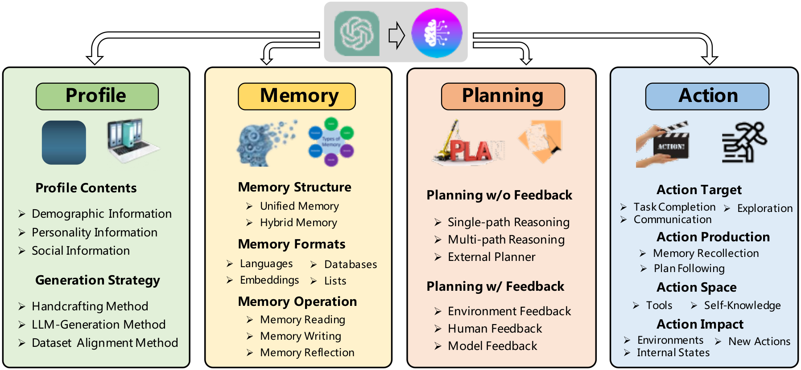
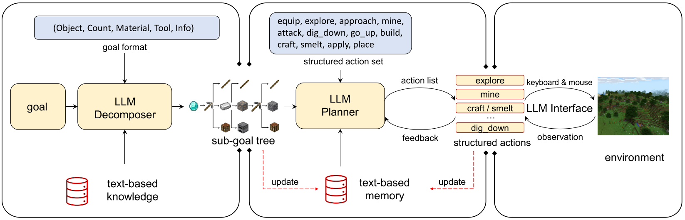

---
tags:
  - GPT4
  - Prompt
  - OpenAI
  - 大模型
---

# 自主意识



*A unified framework for the architecture design of LLM-based autonomous agent*^[A Survey on Large Language Model based
Autonomous Agents]

### Profiling Module
The profiling module aims to **indicate the profiles of the agent roles**,
which are usually written into the prompt to influence the LLM behaviors. Agent profiles typically
encompass basic information such as age, gender, and career^[Joon Sung Park, Joseph C. O’Brien, Carrie J. Cai, Meredith Ringel Morris, Percy Liang, and
Michael S. Bernstein. Generative agents: Interactive simulacra of human behavior. In In the
36th Annual ACM Symposium on User Interface Software and Technology (UIST ’23), UIST
’23, New York, NY, USA, 2023. Association for Computing Machinery.], as well as psychology information,
reflecting the personalities of the agents, and social information, detailing the relationships
between agents^[Lei Wang. Recagent. https://github.com/RUC-GSAI/YuLan-Rec, 2023.]. The choice of information to profile the agent is largely determined by the
specific application scenarios. _For instance, if the application aims to study human cognitive process,
then the psychology information becomes pivotal._

### Memory Module

The memory module **stores information** perceived from the environment and leverages the **recorded memories** to facilitate future actions. The
memory module can help the agent to accumulate experiences, self-evolve, and behave in a more consistent, reasonable, and effective manner.


#### 1 Memory Structures

让AI玩MC，假设AI的任务是`["撸树", "造木稿", "挖石头"]`，把这个指令写到prompt里给agent，结果AI发现不能造木稿。然后根据反馈重新动作规划
新任务`["撸树", "造工作台", "造木稿", "挖石头"]`，来修正prompt，那么这种记忆就是Unified Memory。

假设AI下地底找钻石的过程中发现钻石周围都是岩浆，那么根据当前情况，AI会认为自己需要盛水的水桶（这里不考虑用砖块造路），然后AI回想之前来到这里的途中有一条河。
那么就既有short-term也有long-term memories。这种记忆就是Hybrid Memory。

- **Unified Memory**
This structure only simulates the human short-term memory, which is usually
realized by in-context learning, and the memory information is directly written into the prompts.
DEPS^[Zihao Wang, Shaofei Cai, Anji Liu, Xiaojian Ma, and Yitao Liang. Describe, explain, plan
and select: Interactive planning with large language models enables open-world multi-task
agents. arXiv preprint [arXiv:2302.01560](https://arxiv.org/abs/2302.01560), 2023.] ([code](https://github.com/CraftJarvis/MC-Planner)) is also a game agent, but it is developed for Minecraft. The agent initially generates task plans and then utilizes them
to prompt LLMs, which in turn produce actions to complete the task. These plans can be deemed as
the agent’s short-term memory.

- **Hybrid Memory**
This structure explicitly models the human short-term and long-term memories.
The short-term memory temporarily buffers recent perceptions, while long-term memory consolidates important information over time.

#### 2 Memory Formats
看图

- **Natural Languages**
memory information such as the agent behaviors and
observations are directly described using raw natural language.
_Voyager^[Guanzhi Wang, Yuqi Xie, Yunfan Jiang, Ajay Mandlekar, Chaowei Xiao, Yuke Zhu, Linxi
Fan, and Anima Anandkumar. Voyager: An open-ended embodied agent with large language
models. arXiv preprint [arXiv:2305.16291](https://arxiv.org/abs/2305.16291), 2023.]employs natural language descriptions to represent skills
within the Minecraft, which are directly stored in memory._

#### 3 Memory Operations
- **Memory Reading** to extract meaningful information from memory to enhance the agent’s actions.
_For example, using the **previously successful actions** to achieve similar goals_^[Xizhou Zhu, Yuntao Chen, Hao Tian, Chenxin Tao, Weijie Su, Chenyu Yang, Gao Huang, Bin
Li, Lewei Lu, Xiaogang Wang, et al. Ghost in the minecraft: Generally capable agents for
open-world enviroments via large language models with text-based knowledge and memory.
arXiv preprint [arXiv:2305.17144](https://arxiv.org/abs/2305.17144), 2023.] ([Project](https://github.com/OpenGVLab/GITM)). The key of memory reading lies in how to extract valuable information.
Usually, there three commonly used criteria for information extraction, that is, **the recency**, **relevance**,
and **importance**^[Joon Sung Park, Joseph C. O’Brien, Carrie J. Cai, Meredith Ringel Morris, Percy Liang, and
Michael S. Bernstein. Generative agents: Interactive simulacra of human behavior. In In the
36th Annual ACM Symposium on User Interface Software and Technology (UIST ’23), UIST
’23, New York, NY, USA, 2023. Association for Computing Machinery.]. Memories that are more recent, relevant, and important are more likely to
be extracted.

$m^* = \arg \mathop{\min}\limits_{m \in M} \alpha s^{rec}(q,m) + \beta s^{rel}(q,m) + \gamma s^{imp}(m)$

where $q$ is the query, for example, the task that the agent should address or the context in which the
agent is situated. $M$ is the set of all memories. $s^{rec} (·)$, $s^{rel} (·)$ and $s^{imp} (·)$ are the scoring functions
for measuring the recency, relevance, and importance of the memory $m$.

- **Memory Writing**
The purpose of memory writing is to store information about the perceived
environment in memory.

- **Memory Reflection**
the objective is to provide agents with the capability to independently summarize and infer more abstract, complex and
high-level information.

Generative Agent^[Joon Sung Park, Joseph C. O’Brien, Carrie J. Cai, Meredith Ringel Morris, Percy Liang, and
Michael S. Bernstein. Generative agents: Interactive simulacra of human behavior. In In the
36th Annual ACM Symposium on User Interface Software and Technology (UIST ’23), UIST
’23, New York, NY, USA, 2023. Association for Computing Machinery.]

1. 基于近期的记忆，由agent产生3个key questions
2. 3个问题用于query the memory以获取相关信息

**GITM**(Ghost in the Minecraft)[6]

the actions that successfully accomplish the sub-goals are stored in a list(by LLM Planner). When the
list contains more than five elements, the agent summarizes them into a common and abstract pattern
and replaces all the elements. 区分knowledge 和 memory.



ExpeL^[Andrew Zhao, Daniel Huang, Quentin Xu, Matthieu Lin, Yong-Jin Liu, and Gao Huang. Expel:
Llm agents are experiential learners, 2023.]

在成功的对话中总结经验

使用`gpt-3.5-turbo`总结记忆,prompt以SYSTEM角色表述，将所有要被总结动作序列（MC里面的一些行为）放到USER里面。

```
SYSTEM
  You serve as an assistant that helps me play the game Minecraft.
  I am using a set of actions to achieve goals in the game Minecraft. I have recorded several
  action sequences successfully achieving a goal in a certain state. I will give you the goal, the
  state, and the sequences later. Please summarize the multiple action sequences into a single
  action sequence as a universal reference to achieve the goal given that certain state. Here are
  the instructions:
  1. Each action sequence is a sequence of the following actions:
  {action description}
  2. The action sequences before and after summarization are always conditioned on the given
  state, i.e., the actions are taken in that certain state to achieve the goal. I will describe the state
  in the following form: State: - inventory: a dict whose keys are the name of the objects and
  the values are their quantities. This inventory stores all the objects I have. - environment: a
  dict including my surrounding biome and whether I am on the ground or underground.
  3. The action sequence you summarize should be able to achieve the goal in general cases
  without specific modification. Every necessary action should be included, even though it does
  not appear in some sequences because I manually skipped it in some lucky cases. The actions
  redundant or irrelevant to the goal should be filtered out. The corner cases, such as success by
  luck and dealing with contingencies, should not be summarized into the final sequence.
  4. You should describe your thoughts on summarization in natural language at the beginning.
  After that, give me the summarized action sequence as a list in JSON format. Your response
  should follow this form:
  Thoughts: "Your thoughts and descriptions of your summarization"
  Summarized action sequence:
  [
    {"name": "action name", "args": {"arg name": value}, "expectation": "describe the
    expected results of this action"},
    {"name": "action name", "args": {"arg name": value}, "expectation": "describe the
    expected results of this action"},
    {"name": "action name", "args": {"arg name": value}, "expectation": "describe the
    expected results of this action"}
  ]
```

## LDA
流程

中文文本数据
- 原始中文文本数据
中文分词
- 使用分词工具（如jieba）对文本进行分词
构建词典
- 将分词后的词语建立索引，构建词典
文本表示
- 将文本数据转换为数值型表示，可以使用词袋模型或词嵌入等方法
训练LDA模型
- 使用处理后的文本数据训练LDA模型，设置主题数量（可依据困惑度、一致性确定最佳主题数）等参数
获取主题分布
- 得到文本中每个文档的主题分布，以及每个主题中的词语分布


## 名词解释

- agent

在大语言模型中，"agent" 通常指的是对话系统中的程序或机器人。这个 "agent" 能够理解用户的输入，并尝试提供有用的回复或执行一些任务。"Agent" 一词也可以用于描述其他类型的智能系统，如虚拟助手、聊天机器人、智能代理等，它们能够与用户交互并执行一系列指定的任务。

- Codex

Codex通常指的是OpenAI推出的代码生成模型，即OpenAI Codex。Codex是一个基于GPT架构的大型语言模型，专门针对编程和代码生成任务进行了训练。它是在GitHub的开发者环境中进行训练的，从大量的开源代码中学习，使其具有编写代码和理解编程语言的能力。

- LDA（Latent Dirichlet Allocation）

- zero-shot

在大语言模型中，"zero-shot" 通常指的是一种能力，即模型在没有额外训练或调整的情况下，能够在新的任务或领域中进行推理和生成输出。换句话说，"zero-shot" 意味着模型可以在未见过的情况下执行任务，而不需要专门为该任务进行训练。

[参考标识]: Joon
