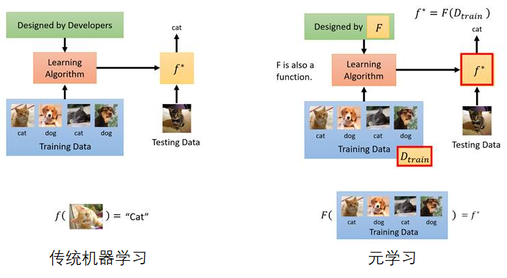

# 元学习

元学习(Meta Learning, メタ学習)

**学习预处理数据集**： 对数据进行预处理的时候，数据增强会增加模型的鲁棒性，一般的数据增强方式比较死板，只是对图像进行旋转，颜色变换，伸缩变换等。元学习可以自动地，多样化地为数据进行增强，相关的代表作为 DADA。
https://arxiv.org/pdf/2003.03780v1.pdf

**学习初始化参数**： 权重参数初始化的好坏可以影响模型最后的分类性能，元学习可以通过学出一个较好的权重初始化参数有助于模型在新的任务上进行学习。元学习学习初始化参数的代表作是 MAML（Model-Agnostic-Meta-Learning）。它专注于提升模型整体的学习能力，而不是解决某个具体问题的能力，训练时，不停地在不同的任务上切换，从而达到初始化网络参数的目的，最终得到的模型，面对新的任务时可以学习得更快。
https://arxiv.org/pdf/1703.03400.pdf

**学习网络结构** ：神经网络的结构设定是一个很头疼的问题，网络的深度是多少，每一层的宽度是多少，每一层的卷积核有多少个，每个卷积核的大小又该怎么定，需不需要 dropout 等等问题，到目前为止没有一个定论或定理能够清晰准确地回答出以上问题，所以神经网络结构搜索 NAS 应运而生。归根结底，神经网络结构其实是元学习地一个子类领域。值得注意的是，网络结构的探索不能通过梯度下降法来获得，这是一个不可导问题，一般情况下会采用强化学习或进化算法来解决。
https://arxiv.org/abs/1611.01578

**学习选择优化器** ：神经网络训练的过程中很重要的一环就是优化器的选取，不同的优化器会对优化参数时对梯度的走向有很重要的影响。熟知的优化器有Adam，RMsprop，SGD，NAG等，元学习可以帮我们在训练特定任务前选择一个好的的优化器。
https://arxiv.org/pdf/1606.04474.pdf

## 机器人
https://bair.berkeley.edu/blog/2018/06/28/daml/

论文主要工作是输入人和机器人执行任务的视频作训练，然后再来一个新的视频后，机器人可以只根据这一个视频，学习出里面的内容。

根据系统流程图可知，这项工作是开发一个模型来"learn how to infer a policy from one human demo"，而不是学习具体让机器人执行某一项任务。（可以看出这是一个标准的元学习思维）
